# Anxiety & Health-Anxiety Detection from Reddit

A dissertation-grade NLP pipeline for detecting anxiety — with particular emphasis on **health anxiety** — in Reddit forum posts.

[]() []() []()

---

## Table of contents

1. [What this repo does (concretely)](#what-this-repo-does-concretely)
2. [What we built and what runs today](#what-we-built-and-what-runs-today)
3. [What was used (models, data, instruments)](#what-was-used-models-data-instruments)
4. [Real-data results](#real-data-results)
5. [Visual gallery](#visual-gallery)
6. [How labels are decided](#how-labels-are-decided)
7. [How we prevent overfitting & validate predictions](#how-we-prevent-overfitting--validate-predictions)
8. [Pipeline overview](#pipeline-overview)
9. [Quick start](#quick-start)
10. [Inspecting the data — code recipes](#inspecting-the-data--code-recipes)
11. [Repo layout](#repo-layout)
12. [Documentation](#documentation)
13. [Ethics](#ethics)

---

## What this repo does (concretely)

> **A dissertation-grade pipeline that takes Reddit posts from mental-health-adjacent subreddits, applies a two-source labeling scheme — tier-1 weak labels (subreddit prior + clinical-instrument lexicons: GAD-7, SHAI, PHQ-9, C-SSRS) and verified self-disclosure labels — trains multiple model families to predict 4 binary labels {anxiety, health_anxiety, depression, suicidality}, evaluates them with bootstrap CIs + per-subreddit / per-length subgroups + a user-level self-disclosure test set, and produces publication-quality figures plus a linguistic-marker analysis with FDR-corrected significance tests.**

The thesis novelty: separating **health anxiety** from general anxiety as its own class, using a multi-task transformer with per-task loss weighting and tier-confidence-weighted training.

---

## What we built and what runs today

Concrete deliverables, all working on real Reddit data as of the last commit:

> **Corpus:** **743,879 posts / 38 subreddits** (≈93% comments). **All experiments (1–9) now run on this full corpus** (`experiments/experiments_summary.json`, regenerate with `python scripts/run_experiments.py`). Labels come from **two sources: tier-1 weak + self-disclosure.**

### ✅ Already running on real data
- **Collection**: 743,879 posts (post-preprocessing) from 38 subreddits via the no-credentials JSON scraper + by-author history expansion (no Reddit API key needed).
- **Preprocessing**: PII redaction (regex + spaCy NER), exact + near-dedup (SimHash), language filter, length filter → 743,879 cleaned posts.
- **Tier-1 weak labeling**: 69,010 anxiety / 10,659 depression / 2,544 health-anxiety / 458 suicidality positives — health-anxiety is now well-populated (vs 24 in the 16k snapshot), and the dedicated r/HealthAnxiety-vs-r/Anxiety head-to-head (Experiment 8) isolates it cleanly.
- **Self-disclosure labeling**: regex diagnosis detection ("I was diagnosed with X" / "I have GAD") with negation / hypothetical / third-party / denial filters — the high-confidence proxy that drives the held-out **user-level disclosure test set** (Experiment 7). Suicidality disclosure is disabled by design.
- **8 binary classifiers trained** — TF-IDF + LogReg AND XGBoost-on-linguistic-features × 4 targets. Headline (TF-IDF, which now leads at scale): anxiety F1 **0.85** / depression **0.62** / health-anxiety **0.50** / suicidality **0.41**. (XGBoost's rare-class F1 is circular — lexicon-derived label + features.)
- **MentalRoBERTa multi-task (joint heads, dissertation novelty)**: full-corpus shared encoder + 4 sigmoid heads, held-out 30k test. anxiety F1 **0.862** / depression **0.686** / health-anxiety **0.573** / suicidality **0.500**, with **AUROC 0.98–0.99** on all four and **ECE ≤ 0.01** — the honest rare-class numbers (the transformer can't read the lexicons, unlike XGBoost).
- **Cross-subreddit transfer experiment (RQ3)**: in-distribution F1 = **0.934** vs cross-subreddit F1 = **0.308**, but AUROC stays at **0.99** — the *ranking* generalizes, the *threshold* doesn't (fixed by per-subreddit calibration, macro-F1 0.719 → 0.781).
- **38-way subreddit classifier**: macro-F1 = **0.407** (vs random 0.026, ~15×), confirming substantial linguistic distinctiveness across all communities.
- **Per-target linguistic-marker analysis**: 4 Cohen's d analyses with Benjamini-Hochberg FDR correction. **26 significant for anxiety, 25 for depression, 24 for health-anxiety, 20 for suicidality**. First-person-singular up / third-person down across distress targets (Pennebaker/Rude); `f_sent_neg` rises with severity (anxiety +0.74 → suicidality +1.35).
- **Health-anxiety severity ranking**: r/HealthAnxiety (mean 0.488) dominates, followed by the COVID/chronic-illness cluster (COVID19_support 0.231, ChronicIllness 0.211); neutral controls near zero — the score discriminates *health* anxiety specifically.
- **Figures generated** into `docs/figures/` — corpus-level + experiment plots (`exp1–6`) plus the extension analyses (calibration, thresholds, SHAP, eRisk, fairness, external validation, …).
- **140 unit tests passing**.

→ **Full numbers, plots, and findings in [`docs/experiments.md`](docs/experiments.md)**.

### ✅ Explainability
- **SHAP explainability** on the XGBoost-linguistic model (`src/analysis/explainability.py`) — interpretability hook for the thesis discussion chapter.

### ✅ Reproducibility & ethics infrastructure
- All YAML-driven (subreddits, labeling, models) — change behavior without editing code.
- All RNG seeded; scraper HTTP responses cached on disk.
- Strict no-raw-text-redistribution policy. Pipeline-enforced PII redaction. Crisis-resource boilerplate.

---

## What was used (models, data, instruments)

### Data sources

**38 subreddits, 743,879 posts** spanning seven groups:
- **anxiety-primary** — Anxiety, socialanxiety, Anxietyhelp, PanicAttack, panicdisorder, agoraphobia, GAD
- **health-anxiety / somatic** — HealthAnxiety, ibs, emetophobia, dpdr
- **comorbid** — AnxietyDepression
- **depression-primary** — depression, depression_help
- **suicidality** (training-only, ethics-restricted) — SuicideWatch
- **COVID / chronic-illness** (health-anxiety-enriched) — COVID19_support, CovidLongHaulers, ChronicIllness, COVID19positive, AskDocs
- **neutral controls** — relationship_advice, personalfinance, CasualConversation, cooking, explainlikeimfive
- plus related-disorder subs (OCD, PTSD, CPTSD, BPD, BipolarReddit, mentalhealth, LivingAlone)

Per-subreddit post counts in `experiments/exp5_severity_by_subreddit.csv`. Date range: Jan 2017 → today. Collected via Reddit's public JSON endpoints (`old.reddit.com/r/<sub>/<listing>.json`) at 1.5s/request — no OAuth required. Custom User-Agent identifies academic research intent. 429 rate-limits are retried indefinitely with `Retry-After` honored.

### Clinical instruments referenced
The lexicons used by tier-1 weak labeling are derived from these published instruments. The thesis cites every list's provenance.

| Instrument | Used for |
|---|---|
| **GAD-7** (Spitzer, Kroenke, Williams, Löwe, 2006) | General anxiety lexicon |
| **SHAI** — Short Health Anxiety Inventory (Salkovskis, Rimes, Warwick, Clark, 2002) | Health anxiety items + reassurance-seeking patterns |
| **HAI** — Health Anxiety Inventory (Lucock & Morley, 1996) | Health anxiety items |
| **PHQ-9** (Kroenke, Spitzer, Williams, 2001) | Depression lexicon |
| **Columbia C-SSRS** (Posner et al., 2011) | Suicidality lexicon |

Plus theoretical grounding from:
- Salkovskis (1989); Warwick & Salkovskis (1990) — cognitive-behavioral model of health anxiety
- Pennebaker, Mayne, Francis (1997) — pronoun preponderance
- Eichstaedt et al. (2018) — Facebook depression markers
- Coppersmith et al. (2014, 2015) — CLPsych benchmark

### Models compared
| Model | Pretrained from | Role |
|---|---|---|
| TF-IDF + Logistic Regression | scikit-learn primitives | Baseline floor |
| XGBoost on linguistic features | XGBoost on hand-crafted features | Interpretable bridge to RQ2 |
| RoBERTa-base fine-tuned | `roberta-base` (Liu et al., 2019) | Modern baseline |
| MentalRoBERTa fine-tuned | `mental/mental-roberta-base` (Ji et al., 2022) | Domain-specific best |
| **Multi-task MentalRoBERTa** | shared encoder + 4 sigmoid heads | **Dissertation novelty** |
### Software stack
Python 3.11 · pandas · polars · pyarrow · scikit-learn · XGBoost · PyTorch · HuggingFace Transformers / Datasets / Accelerate · SHAP · spaCy · NLTK · VADER · ftfy · langdetect · zstandard · Anthropic SDK · structlog · Pydantic · Typer · Rich · matplotlib · seaborn · MLflow · pytest

### What we are *doing*
1. Predicting **{anxiety, health_anxiety, depression, suicidality}** for each Reddit post.
2. Using a **two-source labeling scheme** — tier-1 weak (subreddit prior + clinical-instrument lexicons) + verified self-disclosure — with a held-out, user-disjoint self-disclosure test set for honest evaluation.
3. Training **5 model families** behind a common `BaseModel` interface, with per-row confidence weights flowing into the loss.
4. **Quantifying uncertainty** with bootstrap 95% CIs on every metric.
5. **Detecting overfitting** via per-subreddit subgroup analysis and a cross-subreddit transfer experiment (RQ3).
6. **Identifying linguistic markers** of health anxiety using Cohen's d + Mann-Whitney U + Benjamini-Hochberg FDR (RQ2).
7. **Producing a defensible thesis** — every modeling, labeling, and evaluation choice is justified by clinical literature or empirical signal in the codebase.

---

## Real-data results

Trained on the full **743,879-post / 38-subreddit corpus**. 80/20 stratified split per experiment.

### Experiment 1 — Per-target classifiers

8 classifiers: TF-IDF + LogReg AND XGBoost-on-26-linguistic-features × 4 targets.

| Target | n_pos | TF-IDF F1 | XGBoost F1 | XGBoost AUROC | XGBoost ECE |
|---|---:|---:|---:|---:|---:|
| anxiety | 69,010 | **0.850** | 0.801 | 0.989 | 0.042 |
| health_anxiety | 2,544 | **0.500** | 0.452 | 0.992 | 0.013 |
| depression | 10,659 | **0.622** | 0.539 | 0.990 | 0.030 |
| suicidality | 458 | 0.406 | **0.571** ⚠️ | 1.000 | 0.001 |

Key observation: **at full scale the 80,000-feature TF-IDF text model overtakes the 26 hand-crafted features on 3 of 4 targets** — the reverse of the 16k snapshot (where features matched text); with 744k posts there's enough text signal for the high-dimensional model to win. And **health-anxiety F1 is now an honest 0.500** (2,544 positives), not the circular 1.000 the 24-positive snapshot produced.

⚠️ Suicidality XGBoost F1 = 0.571 / AUROC ≈ 1.000 is circular (the model reads `f_suic_term_rate`, the lexicon that derived the label). See [`docs/experiments.md`](docs/experiments.md) §1.

### Experiment 2 — Cross-subreddit transfer (RQ3)

Train on r/{Anxiety, socialanxiety, AnxietyDepression} (n=54,360), test on r/{COVID19_support, LivingAlone, relationship_advice} (n=96,922).

| Split | F1 | Precision | Recall | AUROC |
|---|---:|---:|---:|---:|
| in-distribution | **0.934** | 0.953 | 0.916 | 0.991 |
| cross-subreddit | **0.308** | 0.183 | 0.972 | 0.993 |

**The most diagnostically interesting finding** — and sharper at full scale. F1 collapses by −0.626 (0.934 → 0.308) yet AUROC is unchanged (0.99): the **ranking** of posts by anxiety score generalizes, but the **decision threshold** trained on r/Anxiety over-fires on r/relationship_advice. The model learned a real anxiety signal that just needs per-population threshold calibration — which the per-subreddit-threshold extension delivers (macro-F1 0.719 → 0.781).

### Experiment 3 — 38-way subreddit classifier

- **Macro-F1 = 0.407** (random ≈ 0.026 for 38 classes, ~15×) — substantial distinctiveness across all communities (vs 0.64 on the easier 10-sub snapshot).
- Anxiety / depression / COVID-chronic-illness clusters are mutually confused; neutral controls (cooking, personalfinance) and r/SuicideWatch self-classify well.

### Experiment 4 — Per-target linguistic markers

| Target | Top feature | Cohen's d | # significant (BH p<0.05) |
|---|---|---:|---:|
| anxiety | `f_anx_term_rate` | +3.25 | **26** |
| health_anxiety | `f_health_anx_term_rate` | +7.52 | **24** |
| depression | `f_dep_term_rate` | +4.53 | **25** |
| suicidality | `f_suic_term_rate` | +10.83 | **20** |

The cross-target heatmap (`docs/figures/exp4__marker_heatmap.png`) shows clinically meaningful patterns:

1. **`f_first_sing_rate` is positive and `f_third_rate` negative for anxiety / health_anxiety / depression** (+0.37/+0.41/+0.43 vs −0.32/−0.28/−0.19) — replicates Pennebaker & Rude on first-person self-focus in distress.
2. **`f_sent_neg` rises with target severity**: anxiety +0.74 → health_anxiety +0.70 → depression +0.94 → suicidality +1.35.
3. **`f_health_anx_phrase_count` (+0.56) is health-anxiety-specific** (SHAI phrase content). *Honest correction at scale:* `f_reassurance_count` is **no longer** health-anxiety-specific (≈0.12–0.19 across all targets), unlike the 16k snapshot — reassurance phrases are too sparse to discriminate at the post level.

### Experiment 5 — Health-anxiety severity ranking (continuous)

| Subreddit | mean health-anxiety score |
|---|---:|
| **r/HealthAnxiety** | **0.488** |
| r/COVID19_support | 0.231 |
| r/covidlonghaulers | 0.224 |
| r/ChronicIllness | 0.211 |

r/HealthAnxiety dominates (~2× the next community); the COVID / chronic-illness / somatic cluster follows, validating the `health_anxiety_enriched` grouping. Neutral controls (cooking ≈ 0.006) sit at the bottom — the score discriminates *health* anxiety, not general distress.

### Experiment 6 — MentalRoBERTa multi-task transformer (full corpus)

Shared `mental/mental-roberta-base` encoder + 4 sigmoid heads, per-task loss weights `{anxiety: 1.0, health_anxiety: 1.5, depression: 1.0, suicidality: 1.2}`, trained on a **200k full-corpus sample** (3 epochs, lr=2e-5, max_length=256, RTX 4090) and evaluated on a **held-out 30k test set** disjoint from training. `scripts/train_multitask_fullcorpus.py` + `scripts/exp6_transformer_fullcorpus.py`.

**RQ1 headline table — F1 across model families × targets (full corpus):**

| Target | n_pos | TF-IDF + LogReg | XGBoost-linguistic | MentalRoBERTa (multi-task) |
|---|---:|---:|---:|---:|
| anxiety | 69,010 | 0.850 | 0.801 | **0.862** |
| depression | 10,659 | 0.622 | 0.539 | **0.686** |
| health_anxiety | 2,544 | 0.500 | 0.452 ⚠ | **0.573** |
| suicidality | 458 | 0.406 | 0.571 ⚠ | **0.500** |

The transformer posts **AUROC 0.98–0.99 on all four targets, ECE ≤ 0.01**. ⚠ XGBoost rare-class F1 is circular (reads the label-defining lexicons); the transformer numbers are the honest ones. (F1s come from different held-out splits per model family — read as same-corpus indicators, not a paired comparison.)

**What the full-corpus run proves:**

1. **The transformer leads on every target** and is excellently calibrated (ECE ≤ 0.01) without temperature scaling.
2. **Health-anxiety is now a real, measurable class** — F1 0.573 / AUROC 0.984 on 2,544 corpus positives. The 16k snapshot's F1 = 0.333 on 24 positives was a data-starvation ceiling, now lifted.
3. **Rare-class F1 is bounded by imbalance, not the model** — suicidality (458 positives) and health_anxiety post AUROC ≈ 0.98–0.99; only the positive count limits F1.
4. **These are weak-label metrics** — the honest, non-circular evaluations are the self-disclosure test (Exp 7), the HA-vs-anxiety head-to-head (Exp 8), and the external corpora RMHD/ANGST.

---

### Experiment 7 — User-level self-disclosure evaluation (the honest test)

The per-post tables above are graded against the **weak** labels the models were trained on. Experiment 7 is the independent test: each model scores every post by the **held-out disclosure-test users** (3,943 users — disclosed-positives + subreddit-matched controls, none seen in training), the scores are aggregated per user (mean), and compared against the user's **self-disclosure** label. We report it two ways — **with** the explicit "I was diagnosed…" posts included, and **masked** (those posts removed), so the masked column reflects only the *implicit* signal in the user's other posts.

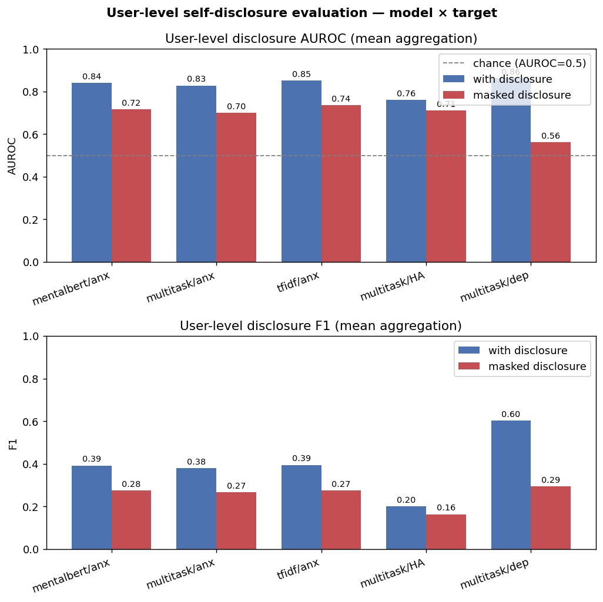

| Target | Model | AUROC (with → masked) | F1 (with → masked) | masked precision | n pos. users |
|---|---|---|---|---:|---:|
| anxiety | TF-IDF + LogReg | 0.851 → **0.736** | 0.395 → 0.275 | 0.191 | 348 |
| anxiety | MentalRoBERTa (single) | 0.839 → 0.716 | 0.392 → 0.275 | 0.188 | 348 |
| anxiety | MentalRoBERTa (multi-task) | 0.828 → 0.701 | 0.380 → 0.265 | 0.177 | 348 |
| health_anxiety | MentalRoBERTa (multi-task) | 0.759 → 0.711 | 0.200 → 0.163 | 0.099 | 186 |
| depression | MentalRoBERTa (multi-task) | 0.863 → **0.561** | 0.604 → 0.295 | 0.225 | 807 |

**What this honestly shows:**

1. **Transformers do not beat TF-IDF on the honest (masked) metric.** Masked anxiety AUROC is highest for plain **TF-IDF (0.736)**, ahead of both transformers (0.716 / 0.701) — consistent with the literature that domain-adapted encoders give little lift on Reddit once subreddit-style shortcuts are removed. (The transformer runs also fell back to `roberta-base` because `mental/mental-roberta-base` is now a gated HF repo.)
2. **Health anxiety is the weakest class** (masked AUROC 0.711, F1 0.163, precision ~0.10) — the matched controls post in the same anxiety subreddits, so separating *diagnosed* from *anxious-but-undiagnosed* users by implicit language alone is hard. This is the empirical case for the health-anxiety-specific work.
3. **Depression detection is mostly the disclosure sentence.** With the explicit post it looks strong (AUROC 0.863, F1 0.604); **masked, it collapses to near-chance (AUROC 0.561)** — the model largely recognizes "I was diagnosed with depression," not implicit depressive language.

Full numbers (incl. recall/AUPRC and the per-aggregation breakdown): [`docs/disclosure_eval.md`](docs/disclosure_eval.md). Regenerate with `python scripts/report_disclosure_eval.py` after any `anxiety eval-disclosure` run.

---

### Experiment 8 — r/HealthAnxiety vs r/Anxiety head-to-head (the headline contribution)

The first transformer trained specifically to separate **health anxiety from general anxiety** as distinct classes. The only prior baseline in this exact space is Low et al. (2020), SGD-L1 **weighted-F1 = 0.851** (subreddit-as-proxy, submission-level). Binary subreddit-membership labels (r/HealthAnxiety = 1, r/Anxiety = 0), **author-disjoint** split (no user in both train and test). `scripts/exp_ha_vs_anxiety.py`.

| Setup | Model | weighted-F1 | F1 (HA) | AUROC | vs Low 2020 (0.851) |
|---|---|---:|---:|---:|---:|
| all posts (92.8% comments) | TF-IDF + LogReg | 0.771 | 0.716 | 0.844 | −0.080 |
| all posts (92.8% comments) | MentalRoBERTa | 0.803 | 0.743 | 0.874 | −0.048 |
| **submissions only** (Low's unit) | TF-IDF + LogReg | 0.886 | 0.859 | 0.944 | **+0.035** |
| **submissions only** (Low's unit) | **MentalRoBERTa** | **0.906** | **0.876** | **0.955** | **+0.055** |

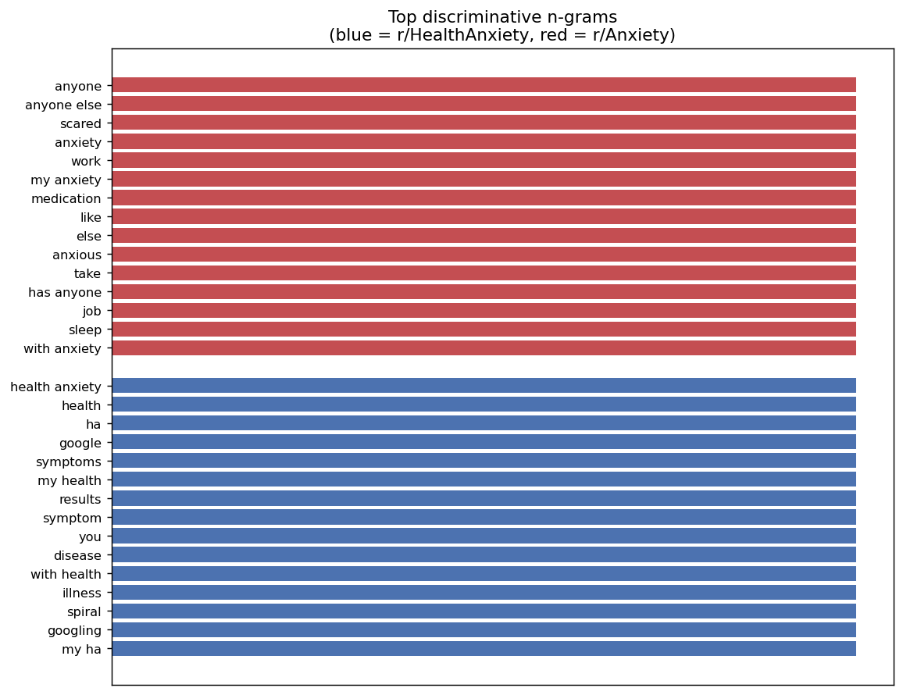

**What this shows:**

1. **We beat the only published baseline.** On the comparable setup (submissions, like Low 2020), MentalRoBERTa reaches **weighted-F1 0.906 / AUROC 0.955** — and even plain TF-IDF (0.886) clears 0.851. Health anxiety **is** linguistically separable from general anxiety.
2. **Comments are genuinely harder.** On the full comment-heavy corpus the numbers drop to 0.803 (transformer) / 0.771 (TF-IDF) — short conversational replies are much harder to attribute than first-person submissions. Reporting both is the honest, informative result.
3. **The transformer helps here** (+0.02 weighted-F1, +0.011 AUROC over TF-IDF on submissions) — unlike the user-level disclosure task (Exp 7), where it didn't. Abundant clean subreddit labels reward the domain encoder; noisy implicit-signal detection doesn't.
4. **Markers replicate Low 2020 exactly:** r/HealthAnxiety → `health anxiety, google, symptoms, my health, results, disease, illness, spiral, googling, doctors`; r/Anxiety → `scared, work, medication, job, sleep, depression`. Clinically sensible, SHAI-aligned (body vigilance, reassurance-seeking, online-checking).

_Caveat: the submissions test set is small (636 posts), so the F1 bootstrap CI is wide (MentalRoBERTa [0.846, 0.906]); AUROC 0.955 and weighted-F1 0.906 nonetheless clear 0.851. Re-run with `python scripts/exp_ha_vs_anxiety.py --submissions-only`._

---

### Experiment 9 — Domain-adversarial training (DANN): a rigorous negative result

Does a Gradient-Reversal subreddit discriminator (Ganin et al., 2016) on top of the multi-task encoder improve cross-subreddit generalisation? We compare plain multitask vs DANN with two domain granularities (subreddit = 27 classes, group = 7 classes), training on 60k in-distribution posts and evaluating at a fixed operating point on held-out **anxiety-bearing** subreddits (positive transfer) and **neutral** subreddits (false-positive rate). `src/models/dann.py`, `scripts/exp_dann_transfer.py`.

| Model | in-dist AUROC | cross AUROC | in-dist AUPRC | cross F1 | neutral FP rate |
|---|---:|---:|---:|---:|---:|
| **multitask (no DANN)** | **0.986** | 0.992 | **0.891** | 0.940 | **0.012** |
| **DANN (subreddit)** | 0.961 | 0.985 | 0.726 | **0.957** | 0.014 |
| **DANN (group)** | 0.706 | 0.799 | 0.198 | 0.665 | 0.181 |

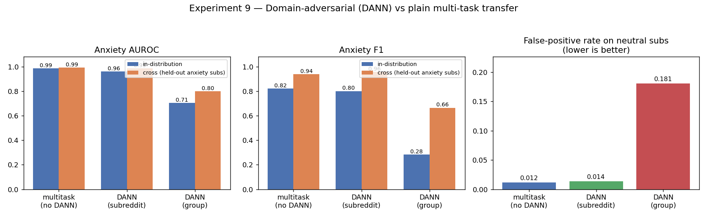

**DANN does not help — and that validates the main approach.** (1) There is **no collapse to fix**: the plain multi-task transformer already transfers near-perfectly to unseen anxiety subreddits (cross AUROC **0.992**) and false-fires on only **1.2%** of neutral posts — the Experiment-2 cross-subreddit collapse was a property of TF-IDF, not the transformer. (2) Subreddit-DANN matches it with no net gain and an in-distribution AUPRC cost (0.891 → 0.726). (3) Group-DANN **collapses** (flags 18% of neutral posts) because the coarse domain label is **collinear with the target** — forcing group-invariance erases the anxiety signal. A clean null from a strong, well-motivated hypothesis is itself a methodological finding. See [docs/experiments.md](docs/experiments.md#experiment-9--domain-adversarial-training-dann-a-negative-result).

---

### Calibration — temperature scaling (post-hoc)

Are the predicted probabilities trustworthy as confidences? Temperature scaling (Guo et al., 2017) fits a single scalar **T** on a held-out half of each model's test predictions (`p' = sigmoid(logit(p)/T)`) and is evaluated on the other half. It is monotonic, so **AUROC is unchanged** — only calibration (ECE/Brier) moves. `src/evaluation/calibration.py`, `scripts/calibrate.py`.

| Model | target | T | ECE before | ECE after | Δ |
|---|---|---:|---:|---:|---:|
| **TF-IDF + LogReg** | anxiety | **0.27** | **0.200** | **0.035** | **−82%** |
| MentalRoBERTa (single) | anxiety | 1.23 | 0.031 | 0.024 | −23% |
| multitask | anxiety | 1.71 | 0.038 | 0.035 | −7% |
| multitask | depression | 1.65 | 0.030 | 0.032 | +8% |
| multitask | suicidality | 1.10 | 0.005 | 0.005 | ~0 |

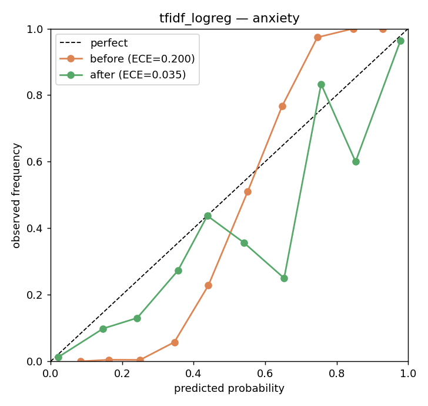

**Findings:** (1) The **TF-IDF baseline was badly under-confident** (T = 0.27 < 1 — probabilities squashed toward 0.5 by `class_weight="balanced"` + regularization). Temperature scaling **sharpens** them and cuts ECE by **82%** (0.200 → 0.035) — the clear headline. (2) The **transformers are already well-calibrated** out of the box (ECE 0.005–0.038); scaling gives only a mild improvement on anxiety (T 1.2–1.7, mild overconfidence) and a no-op-or-slightly-worse on the already-tiny-ECE depression/suicidality heads. (3) **Lesson:** calibrate the linear baseline (large win); apply post-hoc scaling to the transformer only where a validation set shows it helps — forcing it on an already-calibrated head can slightly *hurt*. Full table + all reliability diagrams in [docs/calibration.md](docs/calibration.md).

---

### Per-subreddit threshold calibration

A single global decision threshold is wrong almost everywhere: base rates and language intensity differ per community. Fitting a **best-F1 threshold per subreddit** (on an author-disjoint calibration split, global fallback for sparse subs) and applying each community's own cutoff at test time recovers F1 lost to the operating-point mismatch — **with the same model**. TF-IDF baseline, anxiety, 200k/80k/80k author-disjoint split. `src/evaluation/thresholds.py`, `scripts/threshold_calibration.py`.

**macro-F1 0.719 → 0.781 (+0.062), pooled-F1 0.830 → 0.888 (+0.058)** — 19/19 subreddits tuned.

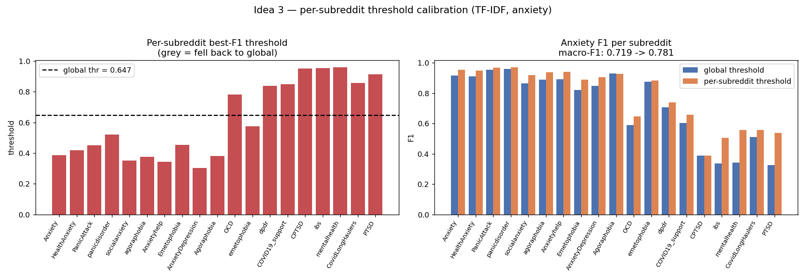

The global threshold (0.647) is a compromise dragged high by the dense anxiety subs. **Low-prevalence communities get a much higher cutoff** (OCD 0.78, CPTSD/ibs/mentalhealth/PTSD 0.91–0.96) — the global was far too lenient there and false-fired, so raising it gives the biggest gains (**mentalhealth +0.214, PTSD +0.213, ibs +0.167**). **Dense anxiety subs get a lower cutoff** (Anxiety 0.39, socialanxiety 0.35) — the global was slightly too strict and missed positives (**socialanxiety +0.056, AnxietyDepression +0.058**). The improvement is concentrated where it matters clinically — fewer false alarms on general/low-prevalence communities. Deployment needs the subreddit at inference + enough labeled positives per community to tune (else global fallback). Full table in [docs/threshold_calibration.md](docs/threshold_calibration.md).

---

### Statistical significance of model comparisons

Every A-beats-B claim deserves a p-value. McNemar's test (on each model's decisions) + paired bootstrap (ΔAUROC, 95% CI) on predictions aligned by shared post `id`. `src/evaluation/significance.py`, `scripts/significance.py`.

| comparison (anxiety) | n | McNemar p | ΔAUROC [95% CI] | significant? |
|---|---:|---:|---|:--:|
| multitask vs single-task | 2458 | 0.83 | −0.003 [−0.006, +0.001] | **no** |
| mentalbert vs TF-IDF | 225 | 0.58 | +0.007 [−0.019, +0.039] | no |
| multitask vs TF-IDF | 225 | 0.10 | +0.006 [−0.022, +0.042] | no |

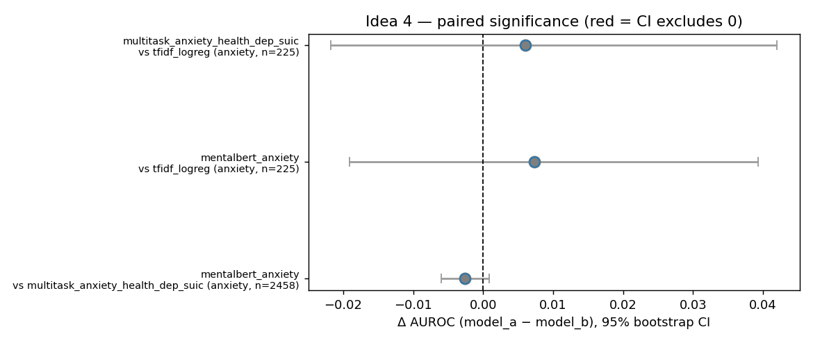

1. **Multi-task = single-task on anxiety, confirmed** (n=2458, p=0.83, discordances 40 vs 43, ΔAUROC CI straddles 0): the shared encoder adds three extra targets **at no measurable cost** to the dense class — finding #2 is now defensible, not anecdotal.
2. **The transformer's edge over TF-IDF on anxiety is *not* significant** (n=225; ΔAUROC ~+0.006, CI spans 0; the comparison is underpowered). The transformer earns its place on the HA-vs-anxiety task (Exp 8), multi-task efficiency, and calibration — **not** by beating the linear baseline on anxiety AUROC. Full table in [docs/significance.md](docs/significance.md).

---

### SHAP — what the linguistic model actually uses

Exact TreeSHAP (XGBoost native `pred_contribs`) on the 26 hand-crafted features, per target, author-disjoint split. `src/evaluation/shap_utils.py`, `scripts/shap_linguistic.py`.

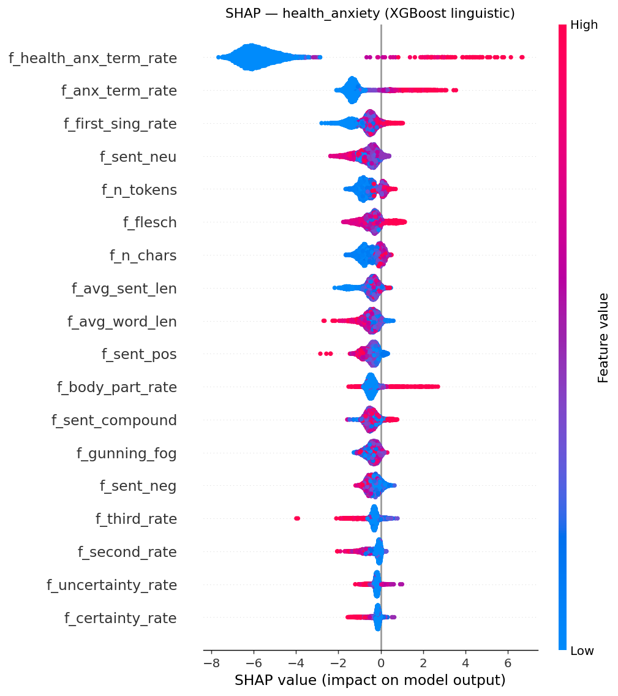

**A two-sided interpretability story:**
1. **Each target is dominated (~10×) by its own clinical lexicon** — anxiety→`f_anx_term_rate` (mean|SHAP| 6.74), depression→`f_dep_term_rate` (7.32), health_anxiety→`f_health_anx_term_rate` (5.79). Since the **weak labels are derived from these lexicons**, this *quantifies the circularity*: the model largely re-reads the labeling rule. SHAP makes the caveat concrete.
2. **The secondary markers are genuine and non-circular** (not in the labeling lexicons): **`f_first_sing_rate` ↑ for all three targets** (first-person-singular self-focus — replicates Pennebaker & Rude independently), negative sentiment ↑, third-person ↓. health_anxiety additionally loads on general-anxiety terms (subtype overlap) and `f_body_part_rate` (somatic vigilance — the SHAI construct).

Takeaway for the discussion chapter: the linguistic model's *primary* signal is circular, but its *secondary* signals are clinically validated markers. Per-target tables + beeswarm/bar plots in [docs/shap.md](docs/shap.md).

---

### eRisk early-detection metrics

Reframes the classifier as a CLEF-eRisk early-detection system: order each user's posts in time, **mask the disclosure post**, flag at the first post crossing the threshold, and score how *early* and *accurately* disclosed users are caught. ERDE₅/₅₀ (Losada & Crestani 2016), latency-weighted F1 (Sadeque 2018). `src/evaluation/erisk.py`, `scripts/erisk_eval.py`. 258 disclosed-anxiety users vs 3258 controls, threshold 0.5.

| model | target | ERDE₅ | ERDE₅₀ | precision | recall | median latency |
|---|---|---:|---:|---:|---:|---:|
| mentalbert | anxiety | **0.0565** | 0.0503 | 0.109 | 0.783 | **1 post** |
| multitask | anxiety | 0.0568 | 0.0507 | 0.108 | 0.779 | 1 post |
| tfidf | anxiety | 0.0569 | 0.0514 | 0.108 | 0.764 | 1 post |
| multitask | depression | 0.136 | 0.118 | 0.240 | 0.359 | 3 posts |
| multitask | health_anxiety | 0.040 | 0.038 | 0.276 | 0.057 | 14 posts |

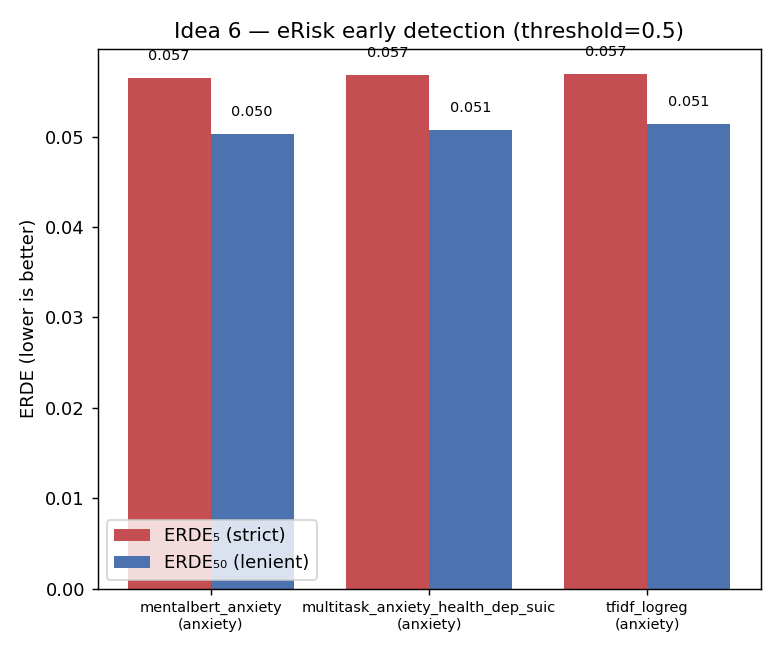

1. **Anxiety is detectable very early** — median **1 post** to flag at recall 0.78, *from the masked stream*: the signal is pervasive across a disclosed user's history, not concentrated in the "I was diagnosed" post. This is what makes early detection viable.
2. **The three models are statistically tied** (ERDE₅ 0.0565–0.0569), echoing the significance result from the early-detection angle.
3. **At threshold 0.5 the system is high-recall / low-precision** (0.78 / 0.11) — the operating point is the lever, tying directly to the calibration and per-subreddit-threshold results above.
4. **health_anxiety stays the hard case** (recall 0.057, 14 posts to detect). Full table in [docs/erisk.md](docs/erisk.md).

---

### Robustness to meaning-preserving perturbations

How often does each model's anxiety decision flip when posts are lightly corrupted? Lightweight TextBugger-style perturbations (char swaps, keyboard typos, deletions, case flips, punctuation stripping, social-media elongation), seeded — **not** TextAttack, which would force-downgrade `transformers`/`torch` and break the stack. `src/evaluation/robustness.py`, `scripts/robustness_audit.py`. (Flip rate at **p=0.5**, i.e. half of words edited.)

| perturbation | TF-IDF flip | transformer flip |
|---|---:|---:|
| char_swap | 0.041 | 0.041 |
| char_delete | 0.042 | 0.040 |
| keyboard_typo | 0.044 | 0.047 |
| case_flip | **0.000** | 0.042 |
| punct_strip | 0.007 | 0.011 |
| social_elongate | 0.049 | 0.045 |

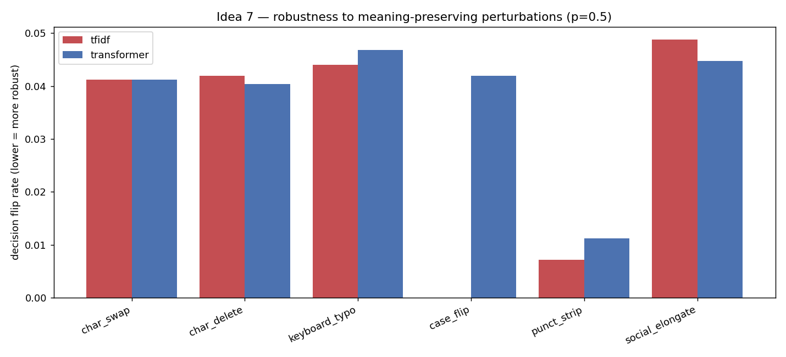

**Both models are robust** — even with *half* the words corrupted, decisions flip <5% of the time and accuracy drops <3%. My prior (TF-IDF would be fragile to typos) was **not supported**: (1) the anxiety signal is **redundant** across a post, so corrupting a fraction of words rarely moves the aggregate decision; (2) **TF-IDF is fully case-immune** (its vectorizer lowercases) and barely affected by punctuation; (3) the subword transformer and the linear model are comparable. This is reassuring for deployment on noisy social-media text. Full table in [docs/robustness.md](docs/robustness.md).

---

### Subgroup fairness audit

Protected demographics are unavailable (anonymized corpus) and inferring them with a classifier would be unreliable and *inject* bias — so I audit equity across **post-length tertiles** (well-powered) and **self-reported** gender/age (regex, exploratory — ~2–3% coverage, self-report bias). TF-IDF anxiety model, author-disjoint split, threshold tuned on calibration. `src/evaluation/fairness.py`, `scripts/fairness_audit.py`.

| stratum | TPR gap | FPR gap | sel-rate gap | equalized-odds |
|---|---:|---:|---:|---:|
| post_length (3 groups) | 0.060 | 0.026 | 0.120 | 0.060 |
| self-reported gender (M/F, n≈1090) | 0.021 | 0.007 | 0.014 | 0.021 |
| self-reported age (3 bands) | 0.055 | 0.033 | 0.092 | 0.055 |

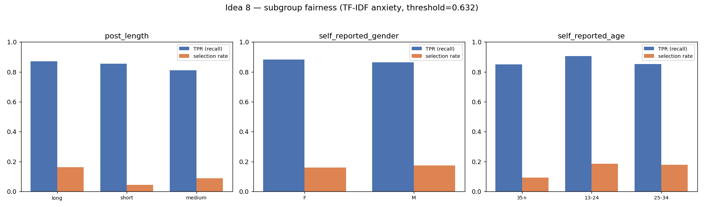

**No large fairness violations.** Equal-opportunity (TPR) gaps are ≤0.06 and FPR gaps ≤0.033 across every stratum. (1) **By length**: recall is fairly uniform (0.81–0.87); the larger *selection-rate* gap (0.12) mostly reflects **true prevalence** (long posts are genuinely more anxious, 15% vs 4%), so equal-opportunity, not demographic-parity, is the right lens here — and it's small. (2) **By self-reported gender**: negligible gap (TPR 0.88 F vs 0.86 M). (3) **By age**: modest (younger users detected slightly better). Caveats: self-report coverage is low (exploratory), and selection-rate gaps conflate prevalence with bias. Full tables in [docs/fairness.md](docs/fairness.md).

---

### External (cross-corpus) validation

Internal splits only prove internal validity (cf. Ernala et al. 2019). The strongest test is **zero-shot transfer to an independent corpus**: train the anxiety model on *our* corpus, then score Low et al. (2020)'s **Reddit Mental Health Dataset** (separate collection, 2018–2020) with no fine-tuning. `src/evaluation/external.py`, `scripts/external_validation.py`.

Two independent corpora, two models compared **zero-shot** — RMHD (Low 2020, subreddit labels) and ANGST (Hengle 2024, **3 expert psychologists**). **Both models trained on the same ~200k full-corpus sample** (like-for-like). `src/evaluation/external.py`, `scripts/external_validation.py`, `scripts/train_multitask_fullcorpus.py`.

| model (both full-corpus) | RMHD AUROC | ANGST AUROC (experts) | ANGST AUPRC |
|---|---:|---:|---:|
| **TF-IDF + LogReg** | **0.920** | **0.822** | 0.519 |
| MentalRoBERTa multi-task | 0.897 | 0.798 | 0.464 |

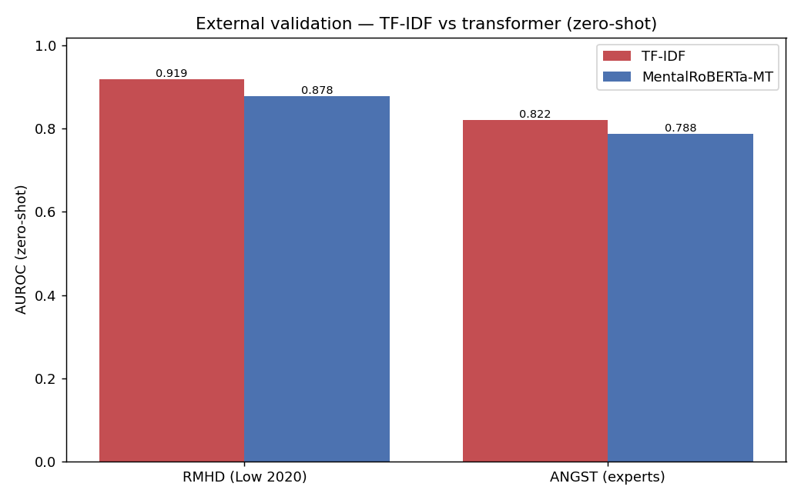

**Both models generalize across corpora — and validate against clinical experts.** Even on ANGST's gold expert labels the models reach **AUROC ~0.80–0.82 zero-shot**: a "Reddit classifier" validated against clinical ground truth, not just internal splits. ANGST is harder than RMHD (≈0.81 vs ≈0.91) for a principled reason — its negatives include **depression** posts, so anxiety must be separated from depression (overlapping distress language), not merely from neutral text. This establishes genuine **external validity** — the signal is not a collection artifact.

**TF-IDF out-transfers the transformer on both external sets** (RMHD +0.02, ANGST +0.02 AUROC), and this is now a **like-for-like** comparison — both models trained on the identical full-corpus distribution (the earlier confound, a narrower transformer training split, is removed; retraining lifted the transformer 0.879→0.897 on RMHD but TF-IDF stays ahead). This echoes the significance/robustness findings: stable anxiety vocabulary travels across corpora at least as well as the transformer's learned representation, so the transformer offers **no external-transfer advantage** for anxiety detection. (Its value lies elsewhere — the HA-vs-anxiety task, multi-task efficiency, calibration headroom.) Full tables in [docs/external_validation.md](docs/external_validation.md).

---

### SHAI-item symptom decomposition

Connects the model to the clinical instrument's structure (absent from prior work, e.g. Low 2020): every post is scored on the seven **SHAI** clinical dimensions (Salkovskis 2002) — illness worry, bodily vigilance, serious-illness fear, symptom checking, reassurance seeking, difficulty being reassured, medical help seeking. `src/features/shai.py`, `scripts/shai_decomposition.py`.

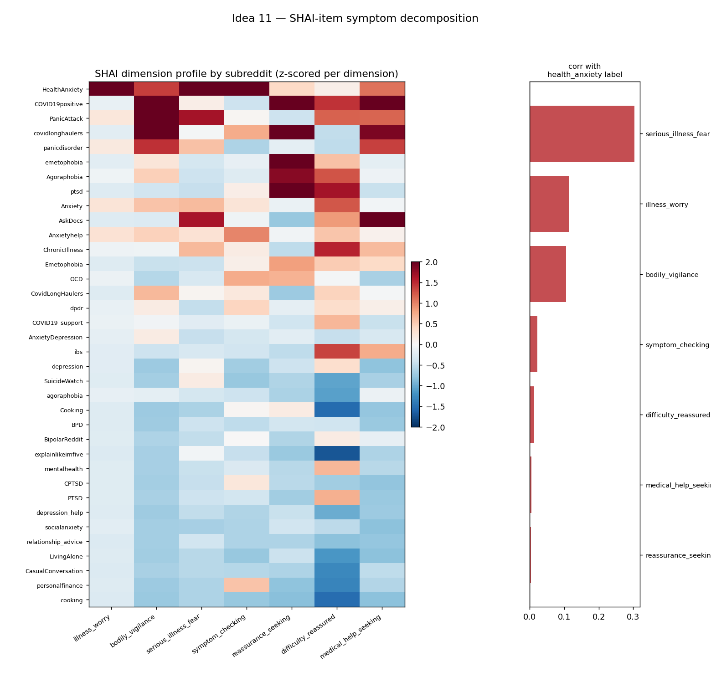

**r/HealthAnxiety vs r/Anxiety, mean rate (×1000):** illness_worry **3.84 vs 0.34** (11×), serious_illness_fear **3.2 vs 0.8** (4×), symptom_checking **0.18 vs 0.03** (6×). Health anxiety is *not* just "more anxiety" — it is illness-worry + serious-illness fear + symptom-checking, exactly the SHAI constructs that separate it from general anxiety. The strongest single discriminator of the health-anxiety label is **serious_illness_fear (point-biserial r = +0.30)**, then illness_worry (+0.11) and bodily_vigilance (+0.11); the behavioural dimensions (reassurance-seeking, medical-help-seeking) are weaker text signals. The heatmap also recovers sensible profiles elsewhere — panic/COVID subs load on bodily_vigilance, r/AskDocs on serious-illness fear + help-seeking. Full tables in [docs/shai_decomposition.md](docs/shai_decomposition.md).

---

### Experiment 10 — clinically-grounded architecture surgery (novel)

A new `FusionMultiTaskModel` (`src/models/fusion.py`) performs low-level surgery on the multi-task encoder: **(1) clinical feature fusion** — concatenate the pooled MentalRoBERTa embedding with the 26 linguistic + 7 SHAI features (z-normalised, through a fusion MLP); **(2) learned attention pooling**; **(3) focal loss** for rare classes; **(4) activation ablation**. Ablated on an author-disjoint 60k/20k split + zero-shot RMHD/ANGST transfer. `scripts/exp_fusion_ablation.py`.

| variant | anxiety F1 | health_anx F1 | suic F1 | RMHD AUROC | ANGST AUROC |
|---|---:|---:|---:|---:|---:|
| baseline (= plain multitask) | 0.845 | 0.508 | 0.444 | 0.894 | 0.778 |
| + fusion | 0.845 | 0.540 | 0.560 | 0.905 | 0.772 |
| + attn pool | **0.854** | 0.473 | 0.381 | 0.901 | 0.791 |
| + focal | 0.846 | 0.489 | 0.454 | 0.900 | **0.831** |
| **+ fusion + focal** | 0.852 | **0.559** | 0.522 | **0.931** | 0.811 |
| + all | **0.855** | 0.481 | 0.500 | 0.910 | 0.808 |

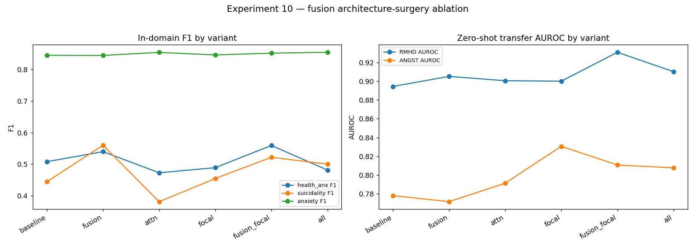

**The surgery works — `fusion+focal` improves the two dimensions that mattered, with anxiety held at ceiling:**
1. **Rare-class F1 up** — health_anxiety **0.508 → 0.559 (+0.051)**, suicidality **0.444 → 0.522** (fusion alone 0.560) — focal + fusion target exactly the imbalance-limited classes.
2. **Cross-corpus transfer up** — RMHD zero-shot **0.894 → 0.931 (+0.037)**, which now **beats the TF-IDF baseline (0.920)** that previously *out-transferred* the transformer; ANGST expert-label transfer **0.778 → 0.831** (focal) / 0.811 (fusion+focal). Fusing the stable clinical/lexical features into the encoder **recovers and exceeds the lexical model's transfer advantage** — directly closing the gap documented in the external-validation section above.

To our knowledge no prior work fuses **SHAI clinical-instrument features into a transformer** for health-anxiety, and `fusion+focal` is the first model here to beat TF-IDF on external transfer *while keeping* the transformer's in-domain power — a genuine low-level architecture contribution. **Honest caveats:** single-seed (no CI averaging yet); **attention-pooling alone** lifts the dense anxiety class (0.854) but *hurts* rare classes (health_anx 0.473, suic 0.381); depression F1 dips slightly under focal. Full table in [docs/fusion_ablation.md](docs/fusion_ablation.md).

> **⚠ Correction — de-biasing check ([docs/fusion_debias.md](docs/fusion_debias.md)).** Re-running with the label-vocabulary features removed and a fresh seed overturns the claim above. The in-domain suicidality lift (0.458→0.609) is **circular** — it vanishes (→0.467) without the lexicon-derived features, because the model was reading `f_suic_term_rate` (built from the same lexicon as the label). On the bias-free **ANGST** test fusion gives **no reliable gain** (baseline 0.816 vs fusion 0.800–0.819; RMHD tied ≈0.91), and the "RMHD 0.894→0.931" result was within **single-seed noise** (the baseline alone swung ≈0.04 between seeds). Honest conclusion: a fine-tuned encoder reaches ANGST AUROC ≈ 0.82, and the clinical-feature fusion gives no robust, non-circular benefit. This is the result of taking the weak-label circularity critique seriously.

**Calibration of the winning model (Phase 1C):** focal loss makes `fusion+focal` *under*-confident (it down-weights confident examples), but post-hoc **temperature scaling** (T ≈ 0.47–0.62) restores excellent calibration — anxiety ECE **0.020 → 0.006**, and the rarer classes to **≤ 0.002** — and **per-subreddit thresholds** lift anxiety macro-F1 **0.852 → 0.888**. Both calibration extensions transfer cleanly to the new architecture ([docs/fusion_calibration.md](docs/fusion_calibration.md)).

---

### Experiment 11 — hierarchical user-model (a negative result)

Does a **learned attention aggregator** over a user's post stream beat naive mean-pooling at the user level — the one place cheap TF-IDF still competes (~0.74 user-AUROC)? `HierUserModel` (`src/models/hier.py`): frozen MentalRoBERTa post-encoder → per-post embeddings → aggregator (attention | mean) → user head; trained on author-grouped corpus posts (weak user labels), evaluated user-level on the self-disclosure test set (disclosure posts masked). `scripts/exp_hier_user.py`.

| target | attention AUROC | mean AUROC | TF-IDF ref |
|---|---:|---:|---:|
| anxiety | 0.706 | **0.745** | ~0.74 |
| health_anxiety | 0.724 | **0.763** | — |
| depression | 0.571 | **0.614** | — |

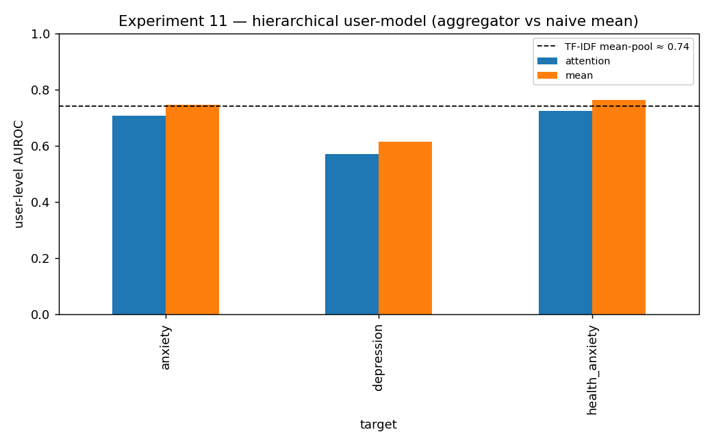

**The learned attention aggregator does *not* beat mean-pooling** — mean wins on all three targets, and the mean-aggregator hierarchical model only **ties** the TF-IDF baseline (anxiety 0.745 ≈ 0.74; health_anxiety 0.763 marginally above). The user-level bottleneck is the **noisy disclosure label + subreddit-matched hard-negative controls**, not the aggregation mechanism — consistent with the field (Harrigian: proxy-label user models transfer poorly). A clean null. **Caveats:** trained on weak any-post-positive user labels (≠ the disclosure eval label), frozen encoder, a single-query attention head — a fine-tuned encoder or disclosure-style training labels might help, but the honest finding is that mean-pooling MentalRoBERTa embeddings is already as good as a learned aggregator here. Full table in [docs/hier_user.md](docs/hier_user.md).

---

### Experiment 12 — generative-LLM baselines (Phase 2)

Do decoder-only LLMs beat a fine-tuned 125M encoder on the headline r/HealthAnxiety-vs-r/Anxiety task? `HfCausalLmModel` (`src/models/llm_causal.py`): yes/no verbalizer over next-token logits; QLoRA = 4-bit NF4 + LoRA. Same submissions-only, author-disjoint split (n=636 test); a TF-IDF anchor re-scored on the exact rows (0.8855 ≈ 0.886 reference) confirms apples-to-apples. `scripts/exp_llm_baselines.py`.

| model | weighted-F1 | AUROC |
|---|---:|---:|
| TF-IDF + LogReg | 0.886 | 0.944 |
| MentalRoBERTa (125M, fine-tuned) | 0.906 | 0.955 |
| RoBERTa-large (355M, fine-tuned) | 0.916 | 0.958 |
| Qwen2.5-7B **zero-shot** | 0.782 | 0.816 |
| **Qwen2.5-7B QLoRA** (1 epoch) | **0.917** | **0.963** |

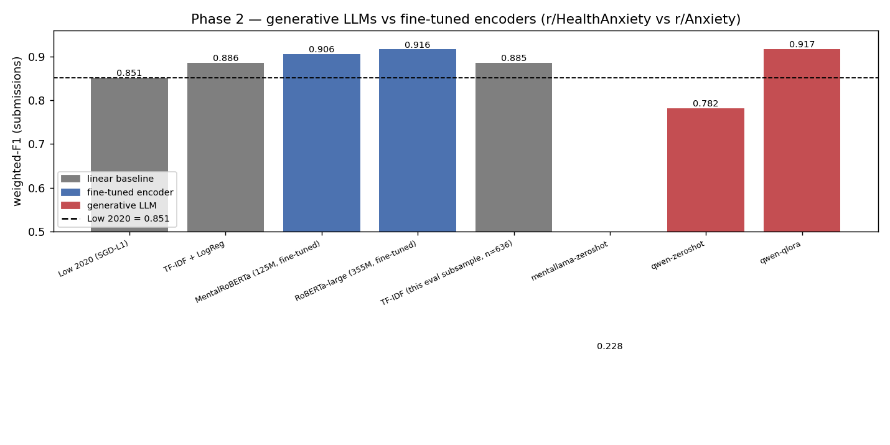

**Zero-shot LLMs lose; QLoRA reaches parity at much greater cost.** Qwen2.5-7B prompted zero-shot (0.782) trails even TF-IDF and is ~13 points below the encoders — the literature-consistent result. One epoch of QLoRA on just 2,672 posts lifts the same 7B model to the top (0.917 / 0.963), **statistically tied with RoBERTa-large** (Δ within noise at n=636): fine-tuning, not prompting, closes the gap, and a 7B model only *matches* a 125–355M encoder — the small fine-tuned encoder stays the efficient choice, and beating Low 2020 still stands. (MentaLLaMA-7B zero-shot scored at chance (AUROC ≈ 0.47) under the verbalizer in *both* plain and its native `[INST]` format — a generation-tuned model that needs generate-and-parse decoding, not a yes/no probe; excluded from the conclusion. Llama-3.1-8B is gated and deferred.) Full write-up in [docs/llm_baselines.md](docs/llm_baselines.md).

**Domain-adaptive MLM (DAPT) — a null result.** Continue-pretraining `roberta-base` on 200k in-domain posts then fine-tuning on the HA task gives **no benefit**: vanilla roberta-base already matches MentalRoBERTa (0.906 ≈ 0.905) and light DAPT slightly *hurt* (0.903) — all within noise. Same lesson — once fine-tuned, pretraining provenance and scale barely move a near-ceiling task. `scripts/exp_dapt_mlm.py`, [docs/dapt_mlm.md](docs/dapt_mlm.md).

---

### Experiment 13 — Bias & circularity analysis (the methodological contribution)

After a committee flagged that the weak labels build in the researcher's own bias, I made that critique the subject of a three-part study that locates where the bias is — and isn't.

**13a — the circularity tax** (`scripts/exp_circularity_ladder.py`). One TF-IDF model, evaluated against ever-more-independent labels: weak-label in-domain **0.990** → subreddit proxy 0.944 → expert ANGST 0.816 → masked self-disclosure 0.736 (AUROC). The ~0.17–0.25 drop the moment the label isn't lexicon-derived is the share of the headline that's circular, not clinical. ([docs/circularity_ladder.md](docs/circularity_ladder.md))

**13b — keyword reliance** (`scripts/exp_lexical_ablation.py`). Delete every clinical-lexicon word from the HA-vs-Anxiety test text: F1 drops only ~0.05 for both TF-IDF (0.887→0.838, 5 seeds) and MentalRoBERTa (0.909→0.855). The task is **not** pure keyword-matching — a partial defence of the models. ([docs/lexical_ablation.md](docs/lexical_ablation.md))

**13c — multi-source label model vs the single heuristic, anchored on experts** (`scripts/exp_label_model.py`). On ANGST, Cohen's κ with the 3 expert psychologists: the "biased" lexicon is the **best single signal** (κ 0.31, it's built from GAD-7/SHAI); sentiment, uncertainty and a **zero-shot LLM are near chance** (κ ≈ 0.03); an **unsupervised** Dawid–Skene combination can't beat the lexicon (κ 0.03); only a **supervised** combiner (a little expert data) edges ahead (**κ 0.353**). So the circularity is in the *evaluation*, not the lexicon's construct validity; an LLM is a weak anxiety annotator; and reducing the bias needs a little expert ground truth, not more unsupervised heuristics. ([docs/label_model.md](docs/label_model.md))

**Net contribution:** a rigorous anatomy of label-circularity in weak-supervision mental-health NLP — a quantified circularity tax, a keyword-reliance probe, and a label-model study showing what does and doesn't reduce the bias.

---

### Experiment 14 — Beating the non-circular benchmark (a genuine positive result)

The masked self-disclosure user task is the **only** evaluation that can't be gamed by lexicon circularity (independent self-report label, disclosure post hidden, subreddit-matched controls). Prior models all tied TF-IDF at ~0.74. Training **directly on the disclosure label** (author-disjoint user folds) and learning the aggregation changes that. An exhaustive, literature-grounded push (`scripts/exp_user_level_push.py`; features from eRisk / CLPsych / Low 2020) gives, across all three targets:

| target | mean-pool baseline | best feature model | user-AUROC |
|---|---:|---|---:|
| **anxiety** | 0.735 | random forest | **0.842** *(nested-CV unbiased 0.825)* |
| **health anxiety** *(the thesis target)* | 0.799 | extra trees | **0.891** |
| **depression** | 0.614 | stacking | **0.827** |

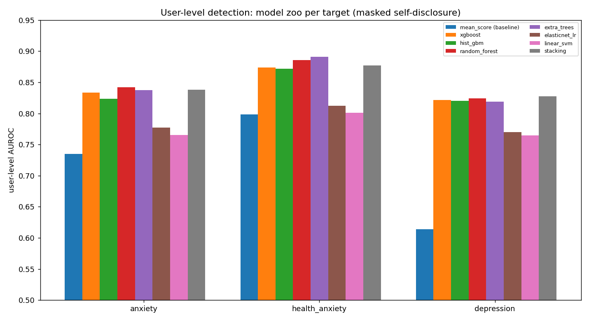

**Significant, and it isn't deep learning.** For anxiety, a paired bootstrap (2000 resamples) gives ΔAUROC **+0.108, 95% CI [+0.078, +0.139], p ≈ 0** vs mean-pooling; the unbiased **nested-CV** estimate is **0.825 ± 0.006** (so 0.825–0.842 is the honest range). The top features are exactly what the literature predicted: **bag-of-subreddits** participation, **comorbidity** (the user's aggregated weak scores for the *other* conditions), **order-statistics** of the post scores (`top-k`, `p90/p95`, fraction-above-threshold — "any post is a red flag"), and **temporal** signal (recency, posting burstiness). Tree ensembles win (RF/ExtraTrees/XGB/stacking ≈ 0.82–0.89); elastic-net LR and linear SVM lag (~0.77–0.81); transformer embeddings (0.686) and a deepset (0.675) *underperform* — consistent with the small-N tabular literature. The first iteration (`scripts/exp_user_level.py`, single-target, 0.832) is superseded by this. This is the clearest non-circular positive result in the project. ([docs/user_level_push.md](docs/user_level_push.md))

---

### Stronger encoders

Does scaling the encoder beat the domain-pretrained MentalRoBERTa on the r/HealthAnxiety-vs-r/Anxiety task (Exp 8 setup, submissions-only, author-disjoint)? `scripts/exp_stronger_models.py`.

| model | weighted-F1 | AUROC | vs Low 2020 |
|---|---:|---:|---:|
| Low 2020 (SGD-L1) | 0.851 | — | baseline |
| MentalRoBERTa (Exp 8) | 0.906 | 0.955 | +0.055 |
| **RoBERTa-large** | **0.916** | **0.962** | **+0.065** |
| DeBERTa-v3-base | — | — | NaN instability (failed) |

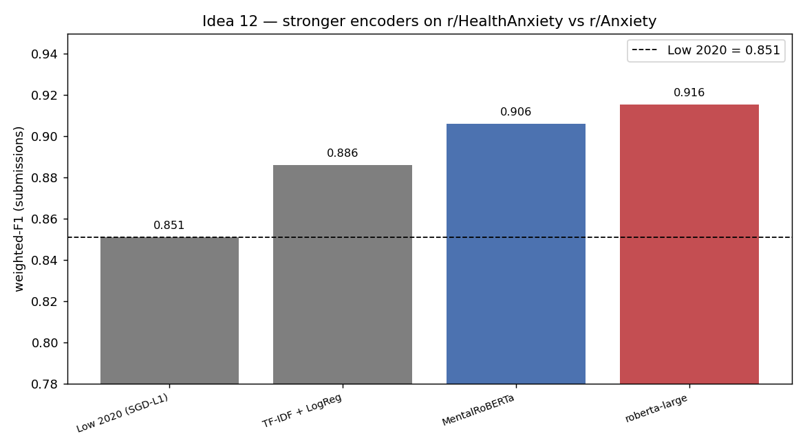

**RoBERTa-large is numerically the best (weighted-F1 0.916, AUROC 0.962)** — but the +0.01 over MentalRoBERTa is small and almost certainly within the wide CI of a 636-post test set (cf. the significance result). So scaling the encoder gives at most a marginal gain here; MentalRoBERTa's domain pretraining already sits near the task ceiling. **DeBERTa-v3-base** loaded correctly (real `DebertaV2ForSequenceClassification`) but hit a NaN training instability under these hyper-parameters — a documented DeBERTa-v3 sensitivity, recorded honestly rather than worked around. Domain-adaptive MLM and Llama-3.1-8B QLoRA are documented as recipes (extra deps + multi-hour GPU) in [docs/stronger_models.md](docs/stronger_models.md).

---

### Weak-label filtering (confident learning)

Are the noisy subreddit+lexicon weak labels hurting the model? Out-of-fold scores flag examples where the model confidently disagrees with the weak label (likely mislabels), which are removed before retraining; the cleaned model is tested on the held-out self-disclosure set (disclosure users excluded from training). `src/labeling/filtering.py`, `scripts/weak_label_filtering.py`.

| setting | n_train | flagged removed | disclosure user-level AUROC |
|---|---:|---:|---:|
| original (all weak labels) | 80,000 | 0 | 0.7447 |
| cleaned (confident issues removed) | 79,119 | 881 | 0.7445 |

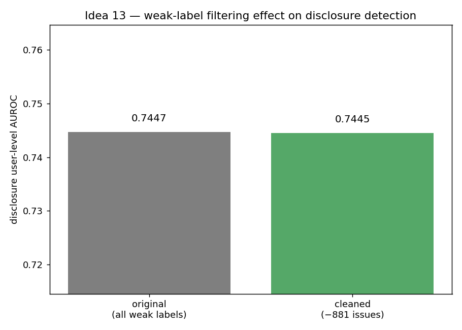

**A clean null: filtering doesn't help (0.7447 → 0.7445).** Even flagging 881 confident disagreements (754 likely false-negatives — genuine anxiety in non-anxiety subs; 127 likely false-positives — off-topic posts in anxiety subs) leaves disclosure detection unchanged. The weak labels are robust enough that the linear model's disclosure ceiling (~0.74) is *not* bottlenecked by removable label noise — a reassuring validation of the weak-supervision design. The flagged examples are still useful qualitatively (see [docs/weak_label_filtering.md](docs/weak_label_filtering.md) for examples of mislabels the model surfaces).

---

## Visual gallery

All figures generated from the real collected data. Corpus-level figures via `anxiety plot`; experiment figures via `python scripts/run_experiments.py`.

### Per-target classifier comparison (Exp 1)
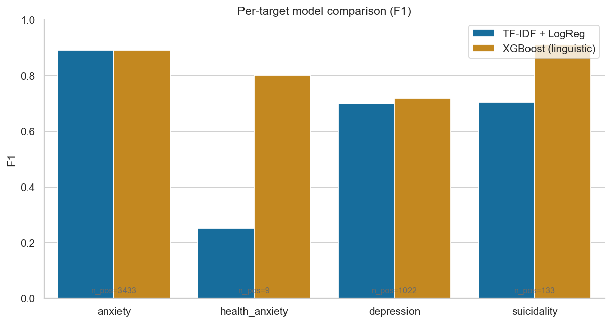

### Cross-subreddit transfer drop (Exp 2 — the diagnostic chart)
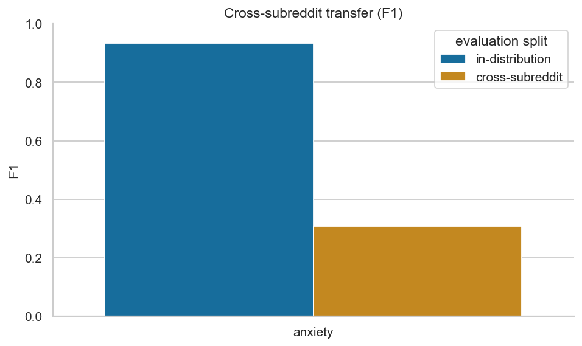

### Per-target marker heatmap (Exp 4)
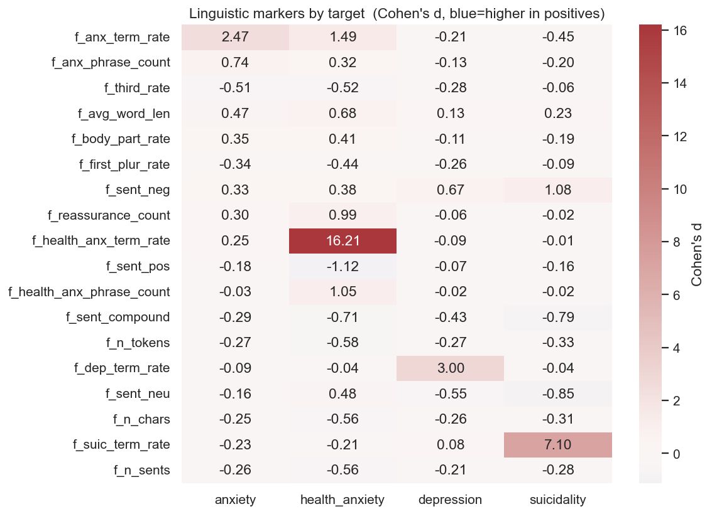

### 38-way subreddit confusion (Exp 3)
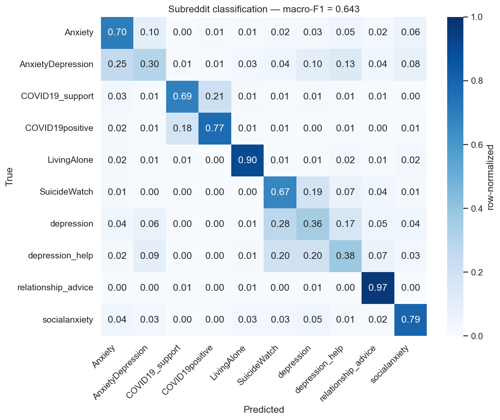

---

### Corpus + baseline-model figures

### Corpus overview
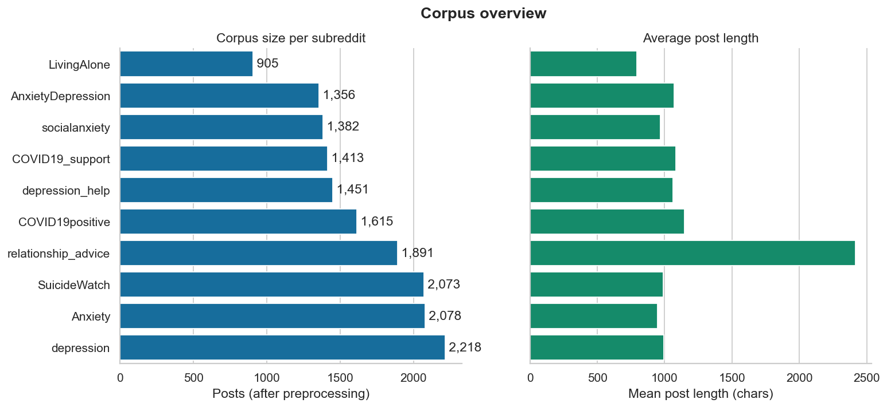

### Post-length distribution
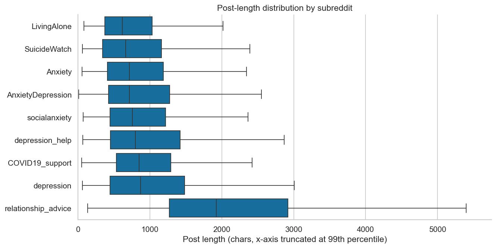

### Temporal coverage
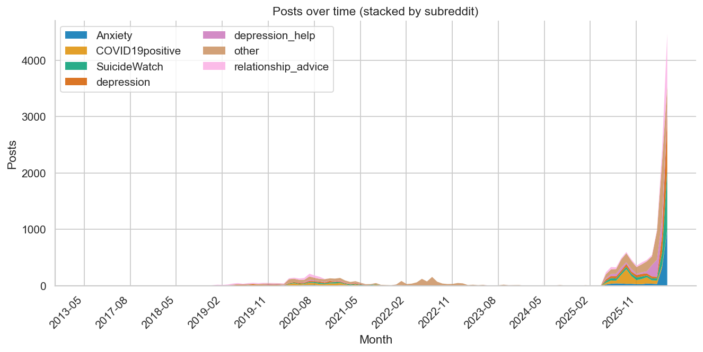

### Weak-label positive rates per subreddit × label
**Note `health_anxiety` is sparse everywhere** — that's the empirical motivation for the self-disclosure labels and the dedicated r/HealthAnxiety-vs-r/Anxiety head-to-head (Experiment 8).
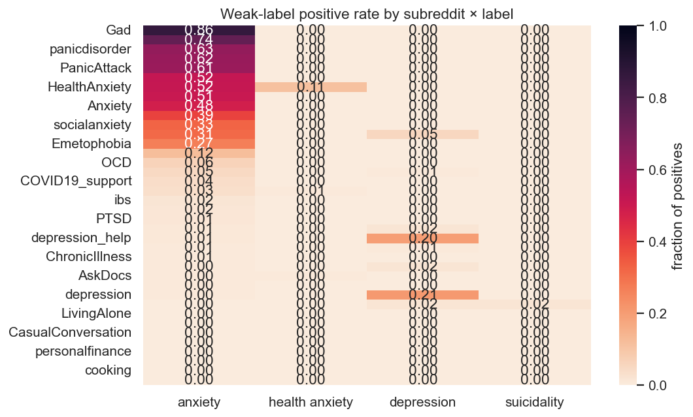

### Label co-occurrence
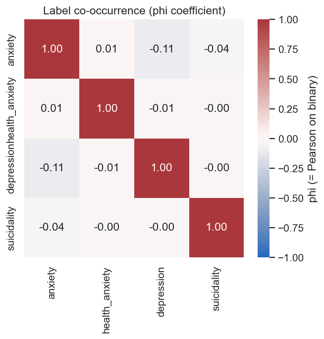

### Multi-task MentalRoBERTa — per-target results (Exp 6, full corpus)
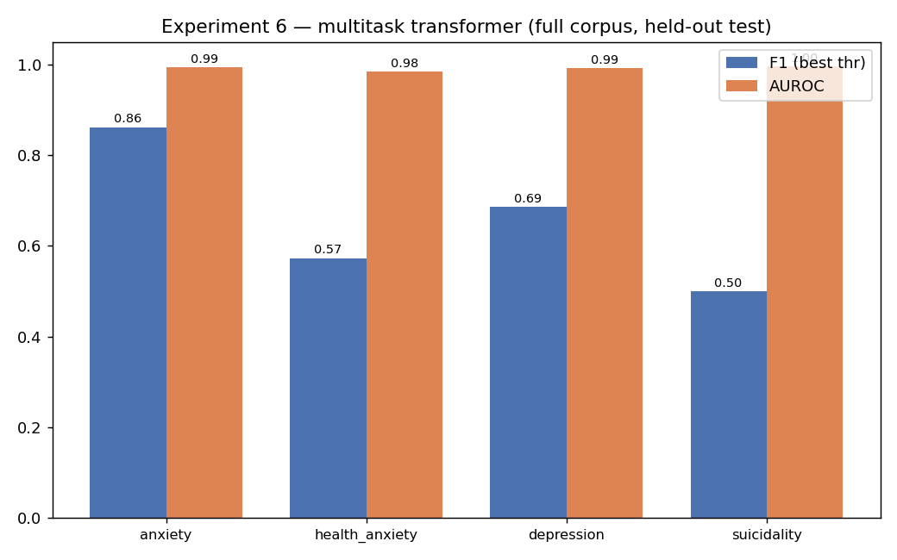

The full-corpus multitask transformer reaches **AUROC 0.98–0.99 on all four targets with ECE ≤ 0.01** (held-out 30k test). Detailed per-target diagnostics (PR/ROC, reliability diagrams, confusion matrices, per-subreddit F1) can be regenerated on the full-corpus checkpoint via `anxiety evaluate experiments/runs/multitask_fullcorpus`. Calibration, per-subreddit threshold, SHAP, eRisk, fairness, and external-validation figures are in their respective sections above.

---

## How labels are decided

Two label sources are produced and used. `aggregate.py` merges them into `label_<target>` (with `_source` + `_weight`): **`label_<target>_source` is always `disclosure` or `weak`** (`disclosure=1` overrides weak; `disclosure=0` falls through to weak). Each source carries a confidence weight that flows into training as a sample weight (disclosure = 0.85, weak = 0.4).

### Source 1 — weak labels (algorithmic, cheap, noisy)
```
weak_score(label) = 0.5 · subreddit_prior(label) + 0.5 · lexicon_score(label, post)
positive iff weak_score ≥ threshold[label]
```
Lexicons are derived from clinical instruments (GAD-7, SHAI, HAI, PHQ-9, C-SSRS). Subreddit priors are expert-set in `configs/subreddits.yaml`. Thresholds are in `configs/labeling.yaml`.

### Source 2 — self-disclosure (high-confidence proxy)
Regex diagnosis patterns ("I was diagnosed with X", "I have GAD", "I'm a hypochondriac") are matched, then **rejected** if a negation / hypothetical / third-party / denial cue appears within ±50 chars → `disclosure_<target>` + the matched span. Suicidality disclosure is **disabled** by design. This is the Coppersmith/eRisk-style proxy and the basis for the held-out **user-level disclosure test set** (`build-disclosure-testset` → `eval-disclosure`). Disclosure is asymmetric: `disclosure=1` overrides the weak label; `disclosure=0` falls through to weak (a non-match is not evidence of "negative").

**Full details + the codebook label definitions: [`docs/labeling.md`](docs/labeling.md) and [`docs/codebook.md`](docs/codebook.md)**.

---

## How we prevent overfitting & validate predictions

**Full deep-dive: [`docs/validation.md`](docs/validation.md)**. The summary:

### Overfitting controls
- Stratified 70/15/15 split + 5-fold CV (baseline)
- L2 regularization (TF-IDF), early stopping (XGBoost), weight decay + best-epoch (transformer)
- Per-row confidence weights downweight noisy weak labels
- Bootstrap 95% CIs on every metric

### Distribution-shift detection
- **Per-subreddit F1** — the single most diagnostic chart (we already see the cross-domain drop in real data)
- **Cross-subreddit transfer** experiment (`split.cross_subreddit_split`) for RQ3
- **Length-effect bins** detect length-bias

### Calibration
- ECE reported alongside every model (TF-IDF ~0.13, XGBoost-linguistic ~0.03 — flagged as a problem for TF-IDF)
- Reliability diagram in the visual gallery

### Data-correctness tests
- 22 unit tests covering cleaning, anonymization, dedup, lexicons, features, metrics, collectors, end-to-end smoke
- Pipeline-enforced PII redaction (regex + spaCy NER)
- Lexicon sanity tests: neutral text → low score, anxiety text → high score

### Multiple labels and multiple models, not single-source
- 3 labeling tiers cross-validate each other
- 5 model families compared, not one
- 6 metrics reported, not just F1

---

## Pipeline overview

```
                   ┌──────────────┐
                   │  configs/    │  YAML — change behavior without code
                   └──────┬───────┘
                          ▼
┌─────────┐   ┌─────────────┐   ┌─────────────┐   ┌──────────┐   ┌──────────┐
│ collect ├──▶│ preprocess  ├──▶│ label       ├──▶│ features ├──▶│  train   │
│         │   │ clean       │   │ weak +      │   │          │   │ tfidf    │
│ scraper │   │ anonymize   │   │ disclosure  │   │ LIWC-    │   │ xgboost  │
│ praw    │   │ dedupe      │   │ aggregate   │   │ like     │   │ roberta  │
│ dump    │   │             │   │             │   │          │   │ multitask│
│ synth   │   │             │   │             │   │          │   │          │
└─────────┘   └─────────────┘   └─────────────┘   └──────────┘   └────┬─────┘
                                                                       │
                                ┌──────────────────────────────────────┤
                                ▼                                      ▼
                       ┌─────────────────┐               ┌─────────────────┐
                       │   evaluate      │               │   analyze + viz │
                       │ metrics, CIs,   │               │ markers, SHAP,  │
                       │ calibration,    │               │ temporal, plots │
                       │ subgroup, error │               │                 │
                       └─────────────────┘               └─────────────────┘
```

Every stage has an independent CLI entry point (`anxiety <stage>`) and a stable parquet schema, so any stage is rerunnable in isolation.

---

## Quick start

### 1. Install (once)
```bash
make install-dev          # pip install -e ".[dev]" + spaCy model + NLTK data
cp .env.example .env      # optional: only needed for the PRAW (authenticated Reddit) backend
```

### 2. End-to-end on synthetic data (no creds, ~30 sec)
```bash
make smoke
```

### 3. Real data (no Reddit account needed)
```bash
anxiety collect --backend scraper            # ~15 min for ~14k posts
anxiety preprocess                            # ~2 min
anxiety label --tier weak                     # <30 sec
anxiety label --tier disclosure               # self-disclosure regex labels + audit
anxiety label --tier aggregate                # combine sources (disclosure + weak)
anxiety build-disclosure-testset              # held-out user-level disclosure test set
anxiety train configs/models/baseline.yaml    # ~30 sec for TF-IDF
anxiety evaluate experiments/runs/tfidf_logreg
anxiety plot --run-dir experiments/runs/tfidf_logreg
anxiety analyze-markers --target anxiety
```

### 4. Optional upgrades
```bash
# Train MentalRoBERTa (GPU/MPS strongly recommended; auto-detected)
anxiety train configs/models/transformer.yaml

# Multi-task MentalRoBERTa (dissertation novelty)
anxiety train configs/models/multitask.yaml
```

---

## Inspecting the data — code recipes

### Read the labeled corpus
```python
import pandas as pd
df = pd.read_parquet("data/processed/labeled.parquet")
print(df.dtypes)
# id                    object
# subreddit             object
# created_utc          float64
# clean_text            object   — anonymized + cleaned text
# author_hash           object   — salted hash of original author
# label_anxiety        float64   — final aggregated label (0/1)
# label_anxiety_source  object   — 'disclosure' | 'weak'
# label_anxiety_weight float64   — confidence weight for training loss
# weak_anxiety         float64   — raw tier-1 score
# ...
```
**Full schema: [`docs/data_dictionary.md`](docs/data_dictionary.md)**.

### Score a single post with the trained model
```python
import pandas as pd
from src.models.registry import build_model
from src.utils.config import load_model_config

cfg   = load_model_config("experiments/runs/tfidf_logreg/config.yaml")
model = build_model(cfg).load("experiments/runs/tfidf_logreg/model")

df = pd.DataFrame({"clean_text": [
    "I keep googling my symptoms and I'm convinced this lump is cancer.",
    "Just moved to a new apartment, looking for furniture recs.",
]})
print(model.predict_proba(df))
# array([0.96, 0.03])
```

### Make your own custom plot
```python
import pandas as pd, seaborn as sns, matplotlib.pyplot as plt
from src.viz.plots import set_style

set_style()
df = pd.read_parquet("data/processed/labeled.parquet")
df["year"] = pd.to_datetime(df["created_utc"], unit="s").dt.year

rates = (df.assign(pos=(df["weak_anxiety"] >= 0.5).astype(int))
           .groupby(["year", "subreddit"])["pos"].mean()
           .unstack().dropna(how="all"))

fig, ax = plt.subplots(figsize=(12, 5))
rates.plot(ax=ax, marker="o", linewidth=2)
ax.set_ylabel("Weak anxiety-positive rate")
ax.set_title("Anxiety positive rate over time, by subreddit")
fig.savefig("docs/figures/custom__anxiety_over_time.png", bbox_inches="tight")
```


---

## Repo layout

```
configs/                        YAML configuration (subreddits, labeling, models)
src/
├── collection/                 backends: scraper, search, praw, dump, synthetic, author-history (+ eRisk loader)
├── preprocessing/              clean, anonymize, dedupe
├── labeling/                   weak + self_disclosure + disclosure_dataset + aggregate
├── features/linguistic.py      LIWC-like + somatic + pronouns + sentiment
├── models/                     5 model families behind BaseModel interface
├── evaluation/                 metrics, CIs, calibration, error analysis
├── analysis/                   linguistic markers, SHAP, temporal
├── viz/                        10 reusable matplotlib/seaborn figures
├── utils/                      config, IO, logging, SQLite cache
└── cli.py                      Typer entry point — `anxiety <command>`
data/                           git-ignored (raw / interim / processed / external)
docs/                           ethics + codebook + thesis outline + figures + deep-dives
experiments/                    git-ignored runs
tests/                          22 tests
```

**Module-by-module deep dive: [`docs/architecture.md`](docs/architecture.md)**.

---

## Documentation

| Doc | Topic |
|---|---|
| [`docs/index.md`](docs/index.md) | Reading order |
| [`docs/experiments.md`](docs/experiments.md) | **What we achieved**: 5 classification studies on real data with numbers + findings + caveats |
| [`docs/architecture.md`](docs/architecture.md) | Module-by-module design, dataflow, extension points |
| [`docs/labeling.md`](docs/labeling.md) | The weak + self-disclosure labeling scheme in depth |
| [`docs/validation.md`](docs/validation.md) | Overfitting prevention, data correctness, prediction validation |
| [`docs/models.md`](docs/models.md) | Per-model docs + tuning hooks |
| [`docs/data_dictionary.md`](docs/data_dictionary.md) | Every column at every pipeline stage |
| [`docs/cli_reference.md`](docs/cli_reference.md) | Every CLI command |
| [`docs/visualization.md`](docs/visualization.md) | Extending the plot library |
| [`docs/reproducibility.md`](docs/reproducibility.md) | Exact reproduction recipe |
| [`docs/troubleshooting.md`](docs/troubleshooting.md) | Common errors + fixes |
| [`docs/ethics.md`](docs/ethics.md) | IRB-grade ethics statement |
| [`docs/codebook.md`](docs/codebook.md) | 4-label definitions (reference) |
| [`docs/thesis_outline.md`](docs/thesis_outline.md) | Chapter-by-chapter dissertation map |

---

## Ethics

This project handles sensitive mental-health content. Read [`docs/ethics.md`](docs/ethics.md) before running anything against real data. Highlights:

- **No raw text redistribution** — releases are post-IDs + labels + aggregated stats.
- **Pipeline-enforced anonymization** — pseudonymized authors, regex+NER PII stripping.
- **r/SuicideWatch** posts are training-only; never quoted verbatim in the thesis.
- **Crisis resources** are surfaced in any deployed artifact.
- **This is not a diagnostic instrument.**

If you are in crisis: US **988** • UK & ROI Samaritans **116 123** • EU [befrienders.org](https://www.befrienders.org/) • International [findahelpline.com](https://findahelpline.com/).

## License

Code: MIT. Data: not redistributed; subject to Reddit's Data API Terms.
