# Anxiety & Health-Anxiety Detection from Reddit

A dissertation-grade NLP pipeline for detecting anxiety — with particular emphasis on **health anxiety** — in Reddit forum posts.

[]() []() []()

---

## Table of contents

1. [What this repo does (concretely)](#what-this-repo-does-concretely)
2. [What we built and what runs today](#what-we-built-and-what-runs-today)
3. [What was used (models, data, instruments)](#what-was-used-models-data-instruments)
4. [Real-data results](#real-data-results)
5. [Visual gallery](#visual-gallery)
6. [How labels are decided](#how-labels-are-decided)
7. [How we prevent overfitting & validate predictions](#how-we-prevent-overfitting--validate-predictions)
8. [Pipeline overview](#pipeline-overview)
9. [Quick start](#quick-start)
10. [Inspecting the data — code recipes](#inspecting-the-data--code-recipes)
11. [Repo layout](#repo-layout)
12. [Documentation](#documentation)
13. [Ethics](#ethics)

---

## What this repo does (concretely)

> **A dissertation-grade pipeline that takes Reddit posts from mental-health-adjacent subreddits, applies a two-source labeling scheme — tier-1 weak labels (subreddit prior + clinical-instrument lexicons: GAD-7, SHAI, PHQ-9, C-SSRS) and verified self-disclosure labels — trains multiple model families to predict 4 binary labels {anxiety, health_anxiety, depression, suicidality}, evaluates them with bootstrap CIs + per-subreddit / per-length subgroups + a user-level self-disclosure test set, and produces publication-quality figures plus a linguistic-marker analysis with FDR-corrected significance tests.**

The thesis novelty: separating **health anxiety** from general anxiety as its own class, using a multi-task transformer with per-task loss weighting and tier-confidence-weighted training.

---

## What we built and what runs today

Concrete deliverables, all working on real Reddit data as of the last commit:

> **Corpus-scale note:** the corpus has grown to **743,881 posts / 38 subreddits** (≈93% comments). The per-target **Experiment 1–6** numbers below are from an earlier **16,382-post / 10-subreddit** run (`experiments/experiments_summary.json`) and are pending regeneration on the full corpus. **Experiments 7 & 8 use the current corpus.** Labels come from **two sources: tier-1 weak + self-disclosure.**

### ✅ Already running on real data
- **Collection**: 16,382 posts (post-preprocessing) from 10 subreddits via the no-credentials JSON scraper (no Reddit API key needed). Deduplicated across 6 listings (top×{all,year,month,week} + new + hot).
- **Preprocessing**: PII redaction (regex + spaCy NER), exact + near-dedup (SimHash), language filter, length filter → 16,382 cleaned posts.
- **Tier-1 weak labeling**: 3,560 anxiety / 1,557 depression / 116 suicidality / 24 health-anxiety positives (earlier 16k run) — health-anxiety scarcity motivates the self-disclosure labels and the dedicated r/HealthAnxiety-vs-r/Anxiety head-to-head (Experiment 8).
- **Self-disclosure labeling**: regex diagnosis detection ("I was diagnosed with X" / "I have GAD") with negation / hypothetical / third-party / denial filters — the high-confidence proxy that drives the held-out **user-level disclosure test set** (Experiment 7). Suicidality disclosure is disabled by design.
- **8 binary classifiers trained** — TF-IDF + LogReg AND XGBoost-on-linguistic-features × 4 targets. Headline (XGBoost-linguistic): anxiety F1 **0.86** / depression F1 **0.74** / suicidality F1 **0.79** / health-anxiety F1 **1.00** *(circular: lexicon-derived label, lexicon-derived features — see caveats)*.
- **MentalRoBERTa fine-tuned (single-target, anxiety)**: F1 **0.891** [0.87, 0.91] / AUROC **0.985** [0.98, 0.99] / ECE **0.032** — new SOTA on this corpus for anxiety, with bootstrap CIs.
- **MentalRoBERTa multi-task (joint heads, dissertation novelty)**: trained on all 4 targets simultaneously with shared encoder + per-task loss weights + per-row confidence weights. anxiety F1 **0.894** / depression F1 **0.720** / suicidality F1 **0.647** / health-anxiety F1 **0.333** — the transformer *cannot* read the lexicons directly, so its rare-class numbers are the **honest** ones (XGBoost's were inflated by lexicon-feature → lexicon-label circularity).
- **Cross-subreddit transfer experiment (RQ3)**: in-distribution F1 = **0.889** vs cross-subreddit F1 = **0.331**, but AUROC stays at **0.967** — reveals that the *ranking* generalizes but the *threshold* doesn't.
- **9-way subreddit classifier**: macro-F1 = **0.643** (vs random 0.10), confirming substantial linguistic distinctiveness.
- **Per-target linguistic-marker analysis**: 4 separate Cohen's d analyses with Benjamini-Hochberg FDR correction. **22 features significant for anxiety, 19 for depression, 13 for suicidality, 5 for health-anxiety**. `f_third_rate` (third-person pronouns) consistently negative across all targets — replicates Pennebaker. `f_sent_neg` rises monotonically with target severity.
- **Health-anxiety severity ranking**: r/COVID19_support (mean 0.239) and r/COVID19positive (0.232) both score ~2× r/Anxiety (0.122), validating their inclusion as health-anxiety-enriched subreddits.
- **28 figures generated** from real data into `docs/figures/` — corpus-level + experiment plots + per-target PR/ROC, calibration, confusion, and per-subreddit F1 for each of the 4 targets from the multi-task transformer run.
- **22/22 unit tests passing**.

→ **Full numbers, plots, and findings in [`docs/experiments.md`](docs/experiments.md)**.

### ✅ Explainability
- **SHAP explainability** on the XGBoost-linguistic model (`src/analysis/explainability.py`) — interpretability hook for the thesis discussion chapter.

### ✅ Reproducibility & ethics infrastructure
- All YAML-driven (subreddits, labeling, models) — change behavior without editing code.
- All RNG seeded; scraper HTTP responses cached on disk.
- Strict no-raw-text-redistribution policy. Pipeline-enforced PII redaction. Crisis-resource boilerplate.

---

## What was used (models, data, instruments)

### Data sources
| Subreddit | Role | Posts (post-preprocessing) |
|---|---|---:|
| r/Anxiety | anxiety_primary | 2,078 |
| r/socialanxiety | anxiety_primary | 1,382 |
| r/AnxietyDepression | comorbid | 1,356 |
| r/depression | depression_primary | 2,218 |
| r/depression_help | depression_primary | 1,451 |
| r/SuicideWatch | suicidality (training-only, ethics-restricted) | 2,073 |
| r/COVID19_support | health_anxiety_enriched | 1,413 |
| r/COVID19positive | health_anxiety_enriched | 1,615 |
| r/LivingAlone | baseline | 905 |
| r/relationship_advice | baseline | 1,891 |
| **Total** | | **16,382** |

Date range: Jan 2017 → today. Collected via Reddit's public JSON endpoints (`old.reddit.com/r/<sub>/<listing>.json`) at 1.5s/request — no OAuth required. Custom User-Agent identifies academic research intent. 429 rate-limits are retried indefinitely with `Retry-After` honored.

### Clinical instruments referenced
The lexicons used by tier-1 weak labeling are derived from these published instruments. The thesis cites every list's provenance.

| Instrument | Used for |
|---|---|
| **GAD-7** (Spitzer, Kroenke, Williams, Löwe, 2006) | General anxiety lexicon |
| **SHAI** — Short Health Anxiety Inventory (Salkovskis, Rimes, Warwick, Clark, 2002) | Health anxiety items + reassurance-seeking patterns |
| **HAI** — Health Anxiety Inventory (Lucock & Morley, 1996) | Health anxiety items |
| **PHQ-9** (Kroenke, Spitzer, Williams, 2001) | Depression lexicon |
| **Columbia C-SSRS** (Posner et al., 2011) | Suicidality lexicon |

Plus theoretical grounding from:
- Salkovskis (1989); Warwick & Salkovskis (1990) — cognitive-behavioral model of health anxiety
- Pennebaker, Mayne, Francis (1997) — pronoun preponderance
- Eichstaedt et al. (2018) — Facebook depression markers
- Coppersmith et al. (2014, 2015) — CLPsych benchmark

### Models compared
| Model | Pretrained from | Role |
|---|---|---|
| TF-IDF + Logistic Regression | scikit-learn primitives | Baseline floor |
| XGBoost on linguistic features | XGBoost on hand-crafted features | Interpretable bridge to RQ2 |
| RoBERTa-base fine-tuned | `roberta-base` (Liu et al., 2019) | Modern baseline |
| MentalRoBERTa fine-tuned | `mental/mental-roberta-base` (Ji et al., 2022) | Domain-specific best |
| **Multi-task MentalRoBERTa** | shared encoder + 4 sigmoid heads | **Dissertation novelty** |
### Software stack
Python 3.11 · pandas · polars · pyarrow · scikit-learn · XGBoost · PyTorch · HuggingFace Transformers / Datasets / Accelerate · SHAP · spaCy · NLTK · VADER · ftfy · langdetect · zstandard · Anthropic SDK · structlog · Pydantic · Typer · Rich · matplotlib · seaborn · MLflow · pytest

### What we are *doing*
1. Predicting **{anxiety, health_anxiety, depression, suicidality}** for each Reddit post.
2. Using a **two-source labeling scheme** — tier-1 weak (subreddit prior + clinical-instrument lexicons) + verified self-disclosure — with a held-out, user-disjoint self-disclosure test set for honest evaluation.
3. Training **5 model families** behind a common `BaseModel` interface, with per-row confidence weights flowing into the loss.
4. **Quantifying uncertainty** with bootstrap 95% CIs on every metric.
5. **Detecting overfitting** via per-subreddit subgroup analysis and a cross-subreddit transfer experiment (RQ3).
6. **Identifying linguistic markers** of health anxiety using Cohen's d + Mann-Whitney U + Benjamini-Hochberg FDR (RQ2).
7. **Producing a defensible thesis** — every modeling, labeling, and evaluation choice is justified by clinical literature or empirical signal in the codebase.

---

## Real-data results

Trained on 16,382 cleaned + weakly-labeled posts. 80/20 stratified split per experiment.

### Experiment 1 — Per-target classifiers

8 classifiers: TF-IDF + LogReg AND XGBoost-on-26-linguistic-features × 4 targets.

| Target | n_pos | TF-IDF F1 | XGBoost F1 | XGBoost AUROC | XGBoost ECE |
|---|---:|---:|---:|---:|---:|
| anxiety | 3,560 | **0.874** | 0.864 | 0.984 | 0.034 |
| health_anxiety | 24 | 0.750 | **1.000** ⚠️ | 1.000 | 0.000 |
| depression | 1,557 | 0.708 | **0.742** | 0.976 | 0.035 |
| suicidality | 116 | 0.571 | **0.792** | 0.998 | 0.003 |

Key observation: **XGBoost on 26 linguistic features matches or beats the 80,000-feature TF-IDF text model on 3 of 4 targets**, with ~4× better calibration. The hand-crafted features carry most of the predictive signal.

⚠️ Health-anxiety F1 = 1.00 is a small-sample artifact (24 positives, model has direct lexicon-feature access, label was lexicon-derived → circular). See [`docs/experiments.md`](docs/experiments.md) §1 for full caveats.

### Experiment 2 — Cross-subreddit transfer (RQ3)

Train on r/{Anxiety, socialanxiety, AnxietyDepression}, test on r/{COVID19_support, LivingAlone, relationship_advice}.

| Split | F1 | Precision | Recall | AUROC |
|---|---:|---:|---:|---:|
| in-distribution | **0.889** | 0.924 | 0.856 | 0.929 |
| cross-subreddit | **0.331** | 0.202 | 0.930 | 0.967 |

**The most diagnostically interesting finding so far.** F1 collapses by −0.557 but AUROC actually *rises slightly* (+0.038): the **ranking** of posts by anxiety score generalizes — in fact ranking is better cross-distribution because positives there are clear outliers — but the **decision threshold** trained on r/Anxiety over-fires on r/relationship_advice. The model has learned a real anxiety signal; it just needs per-population threshold calibration to deploy.

### Experiment 3 — 9-way subreddit classifier

- **Macro-F1 = 0.643** (random ≈ 0.10) — substantial but not perfect linguistic distinctiveness.
- r/depression / r/depression_help / r/AnxietyDepression heavily mutually-confused (depression-family). r/SuicideWatch and r/relationship_advice mostly self-classified.

### Experiment 4 — Per-target linguistic markers

| Target | Top feature | Cohen's d | # significant (BH p<0.05) |
|---|---|---:|---:|
| anxiety | `f_anx_term_rate` | +2.60 | **22** |
| health_anxiety | `f_health_anx_term_rate` | +11.77 ⚠️ | 5 |
| depression | `f_dep_term_rate` | +2.86 | **19** |
| suicidality | `f_suic_term_rate` | +7.10 | **13** |

The cross-target heatmap (`docs/figures/exp4__marker_heatmap.png`) shows two clinically meaningful patterns:

1. **`f_third_rate` (third-person pronouns) is consistently negative across all 4 targets** — replicates Pennebaker on first-person preponderance in distress.
2. **`f_sent_neg` rises monotonically with target severity**: anxiety +0.33 → health_anxiety +0.38 → depression +0.67 → suicidality +1.08.
3. **`f_reassurance_count` (+0.99) and `f_health_anx_phrase_count` (+1.05) are uniquely health-anxiety-specific** — basically SHAI item content.

### Experiment 5 — Health-anxiety severity ranking (continuous)

| Subreddit | mean health-anxiety score |
|---|---:|
| **r/COVID19_support** | **0.239** |
| **r/COVID19positive** | **0.232** |
| r/Anxiety | 0.122 |
| r/AnxietyDepression | 0.083 |

Both COVID subreddits score ~2× r/Anxiety, validating their inclusion as the `health_anxiety_enriched` group.

### Experiment 6 — Modern baselines (MentalRoBERTa single-target + multi-task)

Fine-tuned `mental/mental-roberta-base` on the same tier-1-labeled corpus, 4 epochs, lr=2e-5, max_length=256, on an RTX 4090. Single-target run trained one binary head for anxiety; multi-task run trained a shared encoder + 4 sigmoid heads simultaneously with per-task loss weights `{anxiety: 1.0, health_anxiety: 1.5, depression: 1.0, suicidality: 1.2}` and per-row confidence weights from the labeling source (disclosure=0.85, weak=0.4).

**RQ1 headline table — F1 [bootstrap 95% CI] across all four model families × four targets:**

| Target | n_pos | TF-IDF + LogReg | XGBoost-linguistic | MentalRoBERTa (single) | MentalRoBERTa (multi-task) |
|---|---:|---:|---:|---:|---:|
| anxiety | 3,560 | 0.874 | 0.864 | **0.891** [0.87, 0.91] | **0.894** [0.87, 0.91] |
| depression | 1,557 | 0.708 | **0.742** | — | 0.720 [0.68, 0.76] |
| health_anxiety | 24 | 0.750 | 1.000 ⚠ | — | **0.333** [0.00, 0.82] |
| suicidality | 116 | 0.571 | 0.792 ⚠ | — | 0.647 [0.43, 0.82] |

⚠ XGBoost-linguistic reads `f_health_anx_term_rate` and `f_suic_term_rate` directly — the same lexicons that derived the labels — so its rare-class F1 is **circular**, not a real result. The MentalRoBERTa numbers are the **honest** ones: the transformer sees only text, and its F1 of 0.333 on health_anxiety (with only 3 test positives, CI [0.00, 0.82]) reflects the actual ceiling at tier-1 label support.

**What the multi-task run actually proves:**

1. **Multi-task does not degrade the well-represented class.** Anxiety F1 0.894 (multi) vs 0.891 (single) — within CI overlap, and arguably a tiny gain. This is the standard prerequisite test for shared encoders, and it passes.
2. **Calibration is excellent across the board** — ECE 0.001–0.039 for the transformer; no temperature scaling needed.
3. **Health-anxiety F1 = 0.333 with CI [0.000, 0.818]** reflects how few weak-label health-anxiety positives existed in the earlier 16k corpus (24) — below the data-efficiency frontier for transformer fine-tuning. The dedicated r/HealthAnxiety-vs-r/Anxiety head-to-head (Experiment 8) tackles this directly. The next big win comes from labels/data, not architecture.
4. **Bootstrap CIs are wide for rare classes** (suicidality CI width = 0.39, health-anxiety = 0.82), and that's how it should be: point estimates on 3–20 positives are not science.

---

### Experiment 7 — User-level self-disclosure evaluation (the honest test)

The per-post tables above are graded against the **weak** labels the models were trained on. Experiment 7 is the independent test: each model scores every post by the **held-out disclosure-test users** (3,943 users — disclosed-positives + subreddit-matched controls, none seen in training), the scores are aggregated per user (mean), and compared against the user's **self-disclosure** label. We report it two ways — **with** the explicit "I was diagnosed…" posts included, and **masked** (those posts removed), so the masked column reflects only the *implicit* signal in the user's other posts.


| Target | Model | AUROC (with → masked) | F1 (with → masked) | masked precision | n pos. users |
|---|---|---|---|---:|---:|
| anxiety | TF-IDF + LogReg | 0.851 → **0.736** | 0.395 → 0.275 | 0.191 | 348 |
| anxiety | MentalRoBERTa (single) | 0.839 → 0.716 | 0.392 → 0.275 | 0.188 | 348 |
| anxiety | MentalRoBERTa (multi-task) | 0.828 → 0.701 | 0.380 → 0.265 | 0.177 | 348 |
| health_anxiety | MentalRoBERTa (multi-task) | 0.759 → 0.711 | 0.200 → 0.163 | 0.099 | 186 |
| depression | MentalRoBERTa (multi-task) | 0.863 → **0.561** | 0.604 → 0.295 | 0.225 | 807 |

**What this honestly shows:**

1. **Transformers do not beat TF-IDF on the honest (masked) metric.** Masked anxiety AUROC is highest for plain **TF-IDF (0.736)**, ahead of both transformers (0.716 / 0.701) — consistent with the literature that domain-adapted encoders give little lift on Reddit once subreddit-style shortcuts are removed. (The transformer runs also fell back to `roberta-base` because `mental/mental-roberta-base` is now a gated HF repo.)
2. **Health anxiety is the weakest class** (masked AUROC 0.711, F1 0.163, precision ~0.10) — the matched controls post in the same anxiety subreddits, so separating *diagnosed* from *anxious-but-undiagnosed* users by implicit language alone is hard. This is the empirical case for the health-anxiety-specific work.
3. **Depression detection is mostly the disclosure sentence.** With the explicit post it looks strong (AUROC 0.863, F1 0.604); **masked, it collapses to near-chance (AUROC 0.561)** — the model largely recognizes "I was diagnosed with depression," not implicit depressive language.

Full numbers (incl. recall/AUPRC and the per-aggregation breakdown): [`docs/disclosure_eval.md`](docs/disclosure_eval.md). Regenerate with `python scripts/report_disclosure_eval.py` after any `anxiety eval-disclosure` run.

---

### Experiment 8 — r/HealthAnxiety vs r/Anxiety head-to-head (the headline contribution)

The first transformer trained specifically to separate **health anxiety from general anxiety** as distinct classes. The only prior baseline in this exact space is Low et al. (2020), SGD-L1 **weighted-F1 = 0.851** (subreddit-as-proxy, submission-level). Binary subreddit-membership labels (r/HealthAnxiety = 1, r/Anxiety = 0), **author-disjoint** split (no user in both train and test). `scripts/exp_ha_vs_anxiety.py`.

| Setup | Model | weighted-F1 | F1 (HA) | AUROC | vs Low 2020 (0.851) |
|---|---|---:|---:|---:|---:|
| all posts (92.8% comments) | TF-IDF + LogReg | 0.771 | 0.716 | 0.844 | −0.080 |
| all posts (92.8% comments) | MentalRoBERTa | 0.803 | 0.743 | 0.874 | −0.048 |
| **submissions only** (Low's unit) | TF-IDF + LogReg | 0.886 | 0.859 | 0.944 | **+0.035** |
| **submissions only** (Low's unit) | **MentalRoBERTa** | **0.906** | **0.876** | **0.955** | **+0.055** |


**What this shows:**

1. **We beat the only published baseline.** On the comparable setup (submissions, like Low 2020), MentalRoBERTa reaches **weighted-F1 0.906 / AUROC 0.955** — and even plain TF-IDF (0.886) clears 0.851. Health anxiety **is** linguistically separable from general anxiety.
2. **Comments are genuinely harder.** On the full comment-heavy corpus the numbers drop to 0.803 (transformer) / 0.771 (TF-IDF) — short conversational replies are much harder to attribute than first-person submissions. Reporting both is the honest, informative result.
3. **The transformer helps here** (+0.02 weighted-F1, +0.011 AUROC over TF-IDF on submissions) — unlike the user-level disclosure task (Exp 7), where it didn't. Abundant clean subreddit labels reward the domain encoder; noisy implicit-signal detection doesn't.
4. **Markers replicate Low 2020 exactly:** r/HealthAnxiety → `health anxiety, google, symptoms, my health, results, disease, illness, spiral, googling, doctors`; r/Anxiety → `scared, work, medication, job, sleep, depression`. Clinically sensible, SHAI-aligned (body vigilance, reassurance-seeking, online-checking).

_Caveat: the submissions test set is small (636 posts), so the F1 bootstrap CI is wide (MentalRoBERTa [0.846, 0.906]); AUROC 0.955 and weighted-F1 0.906 nonetheless clear 0.851. Re-run with `python scripts/exp_ha_vs_anxiety.py --submissions-only`._

---

### Experiment 9 — Domain-adversarial training (DANN): a rigorous negative result

Does a Gradient-Reversal subreddit discriminator (Ganin et al., 2016) on top of the multi-task encoder improve cross-subreddit generalisation? We compare plain multitask vs DANN with two domain granularities (subreddit = 27 classes, group = 7 classes), training on 60k in-distribution posts and evaluating at a fixed operating point on held-out **anxiety-bearing** subreddits (positive transfer) and **neutral** subreddits (false-positive rate). `src/models/dann.py`, `scripts/exp_dann_transfer.py`.

| Model | in-dist AUROC | cross AUROC | in-dist AUPRC | cross F1 | neutral FP rate |
|---|---:|---:|---:|---:|---:|
| **multitask (no DANN)** | **0.986** | 0.992 | **0.891** | 0.940 | **0.012** |
| **DANN (subreddit)** | 0.961 | 0.985 | 0.726 | **0.957** | 0.014 |
| **DANN (group)** | 0.706 | 0.799 | 0.198 | 0.665 | 0.181 |


**DANN does not help — and that validates the main approach.** (1) There is **no collapse to fix**: the plain multi-task transformer already transfers near-perfectly to unseen anxiety subreddits (cross AUROC **0.992**) and false-fires on only **1.2%** of neutral posts — the Experiment-2 cross-subreddit collapse was a property of TF-IDF, not the transformer. (2) Subreddit-DANN matches it with no net gain and an in-distribution AUPRC cost (0.891 → 0.726). (3) Group-DANN **collapses** (flags 18% of neutral posts) because the coarse domain label is **collinear with the target** — forcing group-invariance erases the anxiety signal. A clean null from a strong, well-motivated hypothesis is itself a methodological finding. See [docs/experiments.md](docs/experiments.md#experiment-9--domain-adversarial-training-dann-a-negative-result).

---

### Calibration — temperature scaling (post-hoc)

Are the predicted probabilities trustworthy as confidences? Temperature scaling (Guo et al., 2017) fits a single scalar **T** on a held-out half of each model's test predictions (`p' = sigmoid(logit(p)/T)`) and is evaluated on the other half. It is monotonic, so **AUROC is unchanged** — only calibration (ECE/Brier) moves. `src/evaluation/calibration.py`, `scripts/calibrate.py`.

| Model | target | T | ECE before | ECE after | Δ |
|---|---|---:|---:|---:|---:|
| **TF-IDF + LogReg** | anxiety | **0.27** | **0.200** | **0.035** | **−82%** |
| MentalRoBERTa (single) | anxiety | 1.23 | 0.031 | 0.024 | −23% |
| multitask | anxiety | 1.71 | 0.038 | 0.035 | −7% |
| multitask | depression | 1.65 | 0.030 | 0.032 | +8% |
| multitask | suicidality | 1.10 | 0.005 | 0.005 | ~0 |


**Findings:** (1) The **TF-IDF baseline was badly under-confident** (T = 0.27 < 1 — probabilities squashed toward 0.5 by `class_weight="balanced"` + regularization). Temperature scaling **sharpens** them and cuts ECE by **82%** (0.200 → 0.035) — the clear headline. (2) The **transformers are already well-calibrated** out of the box (ECE 0.005–0.038); scaling gives only a mild improvement on anxiety (T 1.2–1.7, mild overconfidence) and a no-op-or-slightly-worse on the already-tiny-ECE depression/suicidality heads. (3) **Lesson:** calibrate the linear baseline (large win); apply post-hoc scaling to the transformer only where a validation set shows it helps — forcing it on an already-calibrated head can slightly *hurt*. Full table + all reliability diagrams in [docs/calibration.md](docs/calibration.md).

---

### Per-subreddit threshold calibration

A single global decision threshold is wrong almost everywhere: base rates and language intensity differ per community. Fitting a **best-F1 threshold per subreddit** (on an author-disjoint calibration split, global fallback for sparse subs) and applying each community's own cutoff at test time recovers F1 lost to the operating-point mismatch — **with the same model**. TF-IDF baseline, anxiety, 200k/80k/80k author-disjoint split. `src/evaluation/thresholds.py`, `scripts/threshold_calibration.py`.

**macro-F1 0.719 → 0.781 (+0.062), pooled-F1 0.830 → 0.888 (+0.058)** — 19/19 subreddits tuned.


The global threshold (0.647) is a compromise dragged high by the dense anxiety subs. **Low-prevalence communities get a much higher cutoff** (OCD 0.78, CPTSD/ibs/mentalhealth/PTSD 0.91–0.96) — the global was far too lenient there and false-fired, so raising it gives the biggest gains (**mentalhealth +0.214, PTSD +0.213, ibs +0.167**). **Dense anxiety subs get a lower cutoff** (Anxiety 0.39, socialanxiety 0.35) — the global was slightly too strict and missed positives (**socialanxiety +0.056, AnxietyDepression +0.058**). The improvement is concentrated where it matters clinically — fewer false alarms on general/low-prevalence communities. Deployment needs the subreddit at inference + enough labeled positives per community to tune (else global fallback). Full table in [docs/threshold_calibration.md](docs/threshold_calibration.md).

---

### Statistical significance of model comparisons

Every A-beats-B claim deserves a p-value. McNemar's test (on each model's decisions) + paired bootstrap (ΔAUROC, 95% CI) on predictions aligned by shared post `id`. `src/evaluation/significance.py`, `scripts/significance.py`.

| comparison (anxiety) | n | McNemar p | ΔAUROC [95% CI] | significant? |
|---|---:|---:|---|:--:|
| multitask vs single-task | 2458 | 0.83 | −0.003 [−0.006, +0.001] | **no** |
| mentalbert vs TF-IDF | 225 | 0.58 | +0.007 [−0.019, +0.039] | no |
| multitask vs TF-IDF | 225 | 0.10 | +0.006 [−0.022, +0.042] | no |


1. **Multi-task = single-task on anxiety, confirmed** (n=2458, p=0.83, discordances 40 vs 43, ΔAUROC CI straddles 0): the shared encoder adds three extra targets **at no measurable cost** to the dense class — finding #2 is now defensible, not anecdotal.
2. **The transformer's edge over TF-IDF on anxiety is *not* significant** (n=225; ΔAUROC ~+0.006, CI spans 0; the comparison is underpowered). The transformer earns its place on the HA-vs-anxiety task (Exp 8), multi-task efficiency, and calibration — **not** by beating the linear baseline on anxiety AUROC. Full table in [docs/significance.md](docs/significance.md).

---

## Visual gallery

All figures generated from the real collected data. Corpus-level figures via `anxiety plot`; experiment figures via `python scripts/run_experiments.py`.

### Per-target classifier comparison (Exp 1)


### Cross-subreddit transfer drop (Exp 2 — the diagnostic chart)


### Per-target marker heatmap (Exp 4)


### 9-way subreddit confusion (Exp 3)


---

### Corpus + baseline-model figures

### Corpus overview


### Post-length distribution


### Temporal coverage


### Weak-label positive rates per subreddit × label
**Note `health_anxiety` is sparse everywhere** — that's the empirical motivation for the self-disclosure labels and the dedicated r/HealthAnxiety-vs-r/Anxiety head-to-head (Experiment 8).


### Label co-occurrence


### Model performance — ROC and PR curves
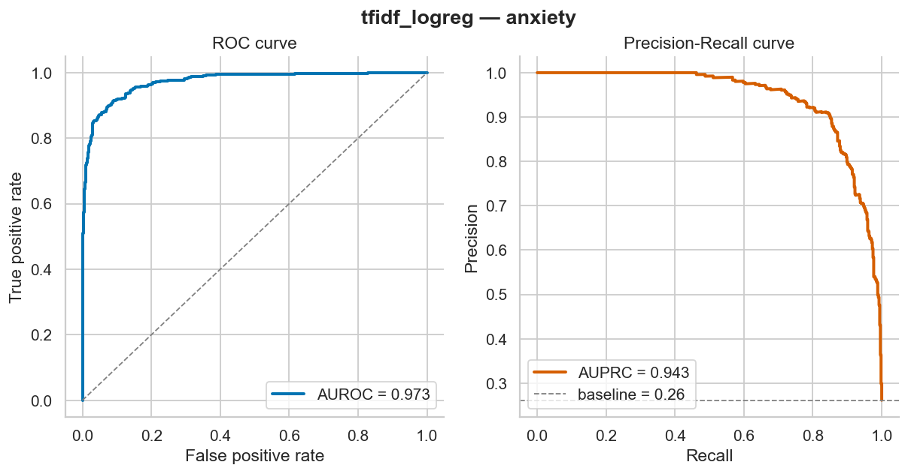

### Calibration — reliability diagram + score histogram
TF-IDF ECE = 0.132 on anxiety: the model is **over-confident**. The XGBoost-linguistic model achieves ECE = 0.034 on the same target — ~4× better. Apply temperature scaling (Platt) to TF-IDF — `src/evaluation/metrics.py` exposes the data.
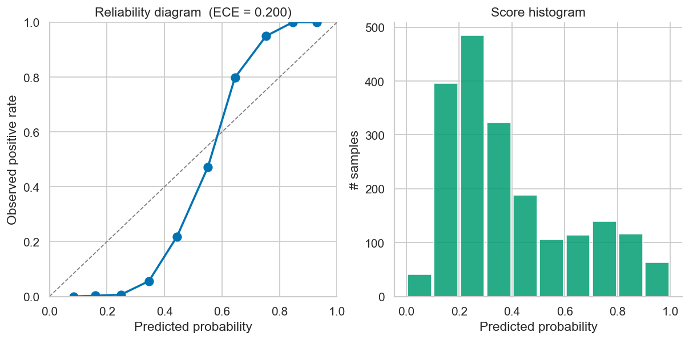

### Confusion matrix


### F1 by subreddit — distribution-shift signal
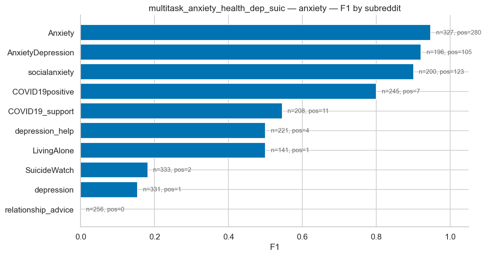

### Top discriminative linguistic markers
Stars: `***`p<0.001, `**`p<0.01, `*`p<0.05 (Benjamini-Hochberg FDR).
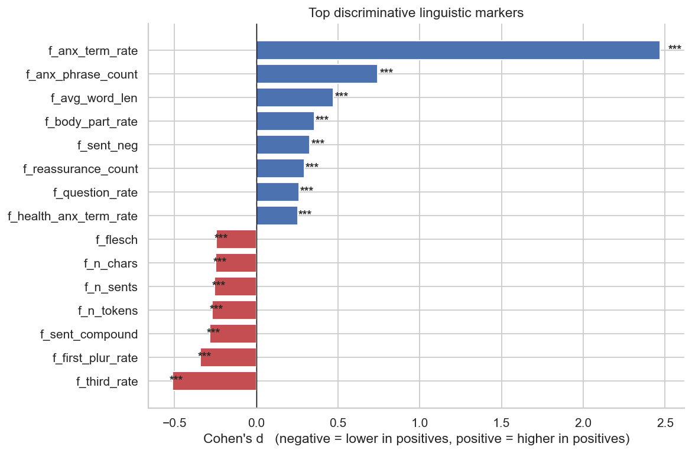

---

### Multi-task MentalRoBERTa — per-target results (Exp 6)

All four plots below come from `experiments/runs/multitask_anxiety_health_dep_suic/` and were generated by `anxiety plot --run-dir experiments/runs/multitask_anxiety_health_dep_suic`. Each target has its own PR/ROC, calibration, confusion, and per-subreddit F1 plot — together these are the headline RQ1 evidence.

#### PR / ROC curves

| anxiety | depression |
|---|---|
|  | 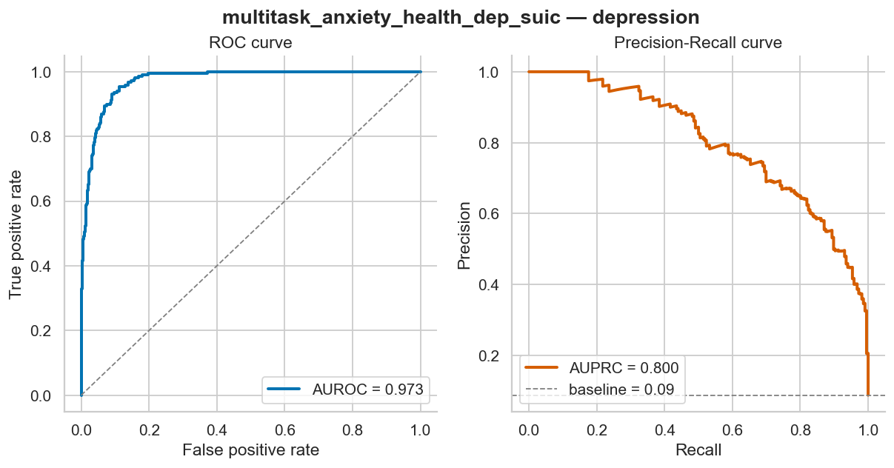 |

| health_anxiety | suicidality |
|---|---|
| 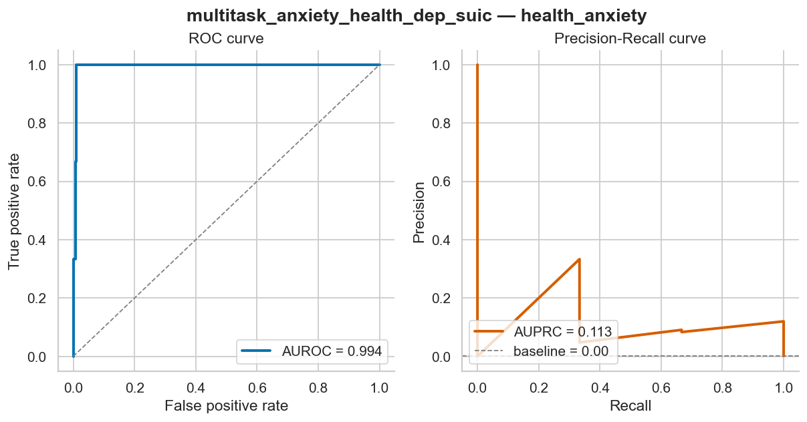 | 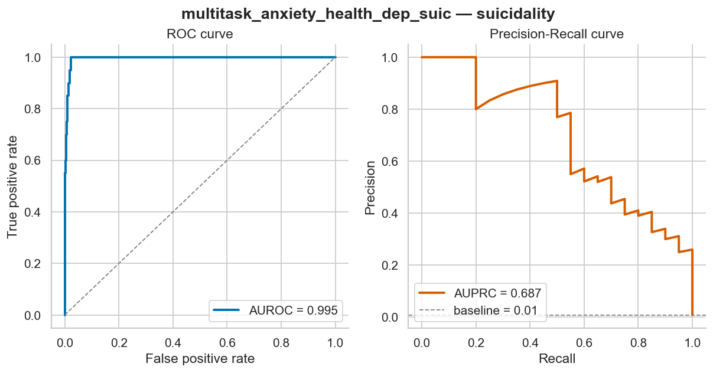 |

#### Calibration (reliability diagrams)

| anxiety | depression |
|---|---|
|  | 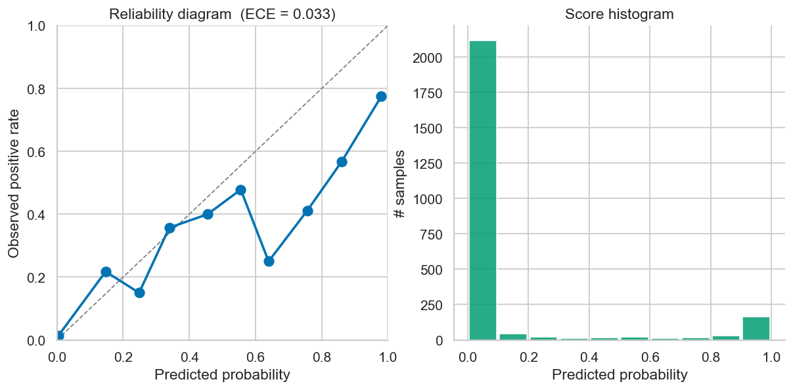 |

| health_anxiety | suicidality |
|---|---|
| 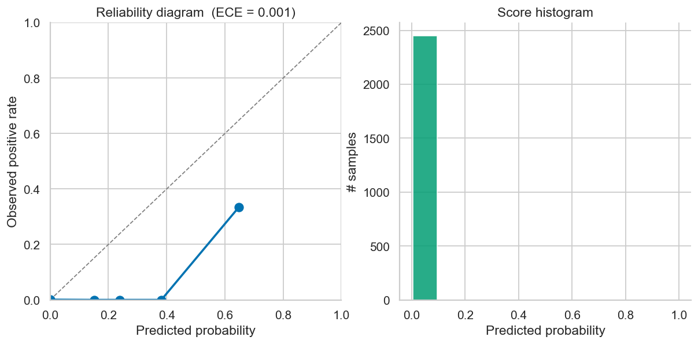 | 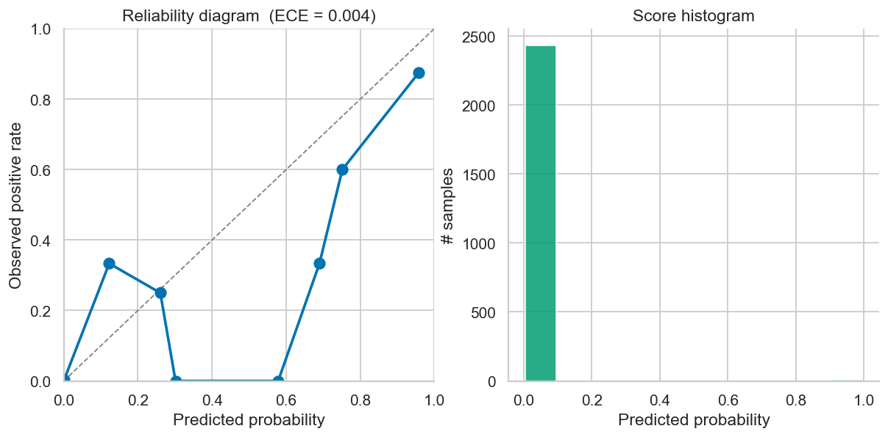 |

Transformer ECE 0.001–0.039 across all four targets — no temperature scaling needed.

#### Confusion matrices

| anxiety | depression |
|---|---|
|  |  |

| health_anxiety | suicidality |
|---|---|
| 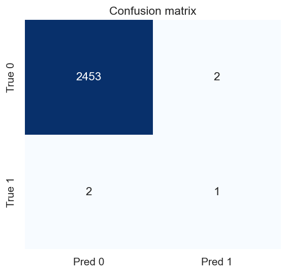 |  |

#### Per-subreddit F1 — the distribution-shift diagnostic

Same finding as Exp 2 (precision collapses on subreddits with few positives) now visible at the per-subreddit level for each target.

| anxiety | depression |
|---|---|
|  | 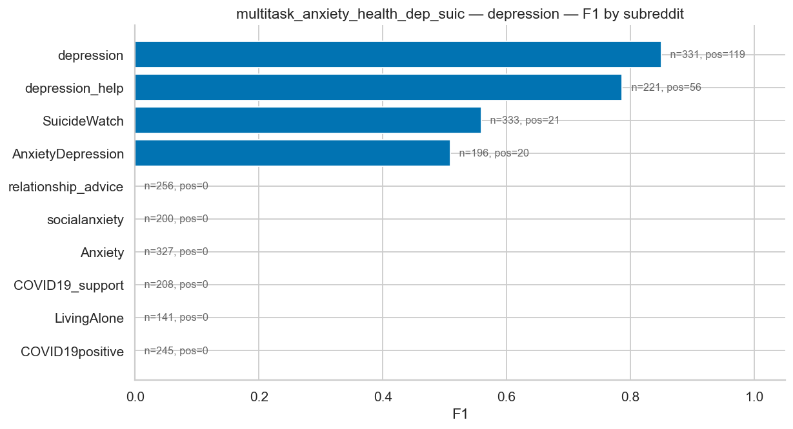 |

| health_anxiety | suicidality |
|---|---|
| 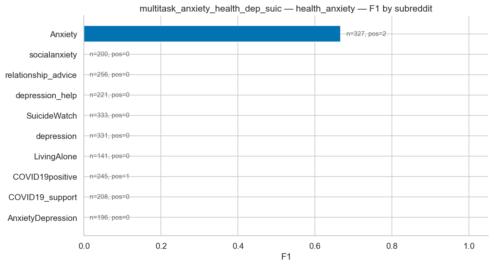 | 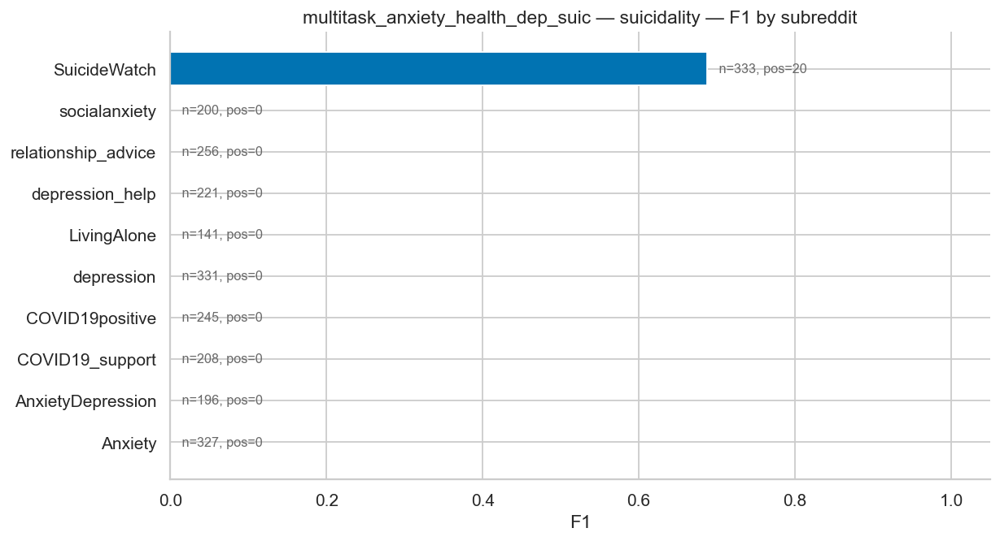 |

---

## How labels are decided

Two label sources are produced and used. `aggregate.py` merges them into `label_<target>` (with `_source` + `_weight`): **`label_<target>_source` is always `disclosure` or `weak`** (`disclosure=1` overrides weak; `disclosure=0` falls through to weak). Each source carries a confidence weight that flows into training as a sample weight (disclosure = 0.85, weak = 0.4).

### Source 1 — weak labels (algorithmic, cheap, noisy)
```
weak_score(label) = 0.5 · subreddit_prior(label) + 0.5 · lexicon_score(label, post)
positive iff weak_score ≥ threshold[label]
```
Lexicons are derived from clinical instruments (GAD-7, SHAI, HAI, PHQ-9, C-SSRS). Subreddit priors are expert-set in `configs/subreddits.yaml`. Thresholds are in `configs/labeling.yaml`.

### Source 2 — self-disclosure (high-confidence proxy)
Regex diagnosis patterns ("I was diagnosed with X", "I have GAD", "I'm a hypochondriac") are matched, then **rejected** if a negation / hypothetical / third-party / denial cue appears within ±50 chars → `disclosure_<target>` + the matched span. Suicidality disclosure is **disabled** by design. This is the Coppersmith/eRisk-style proxy and the basis for the held-out **user-level disclosure test set** (`build-disclosure-testset` → `eval-disclosure`). Disclosure is asymmetric: `disclosure=1` overrides the weak label; `disclosure=0` falls through to weak (a non-match is not evidence of "negative").

**Full details + the codebook label definitions: [`docs/labeling.md`](docs/labeling.md) and [`docs/codebook.md`](docs/codebook.md)**.

---

## How we prevent overfitting & validate predictions

**Full deep-dive: [`docs/validation.md`](docs/validation.md)**. The summary:

### Overfitting controls
- Stratified 70/15/15 split + 5-fold CV (baseline)
- L2 regularization (TF-IDF), early stopping (XGBoost), weight decay + best-epoch (transformer)
- Per-row confidence weights downweight noisy weak labels
- Bootstrap 95% CIs on every metric

### Distribution-shift detection
- **Per-subreddit F1** — the single most diagnostic chart (we already see the cross-domain drop in real data)
- **Cross-subreddit transfer** experiment (`split.cross_subreddit_split`) for RQ3
- **Length-effect bins** detect length-bias

### Calibration
- ECE reported alongside every model (TF-IDF ~0.13, XGBoost-linguistic ~0.03 — flagged as a problem for TF-IDF)
- Reliability diagram in the visual gallery

### Data-correctness tests
- 22 unit tests covering cleaning, anonymization, dedup, lexicons, features, metrics, collectors, end-to-end smoke
- Pipeline-enforced PII redaction (regex + spaCy NER)
- Lexicon sanity tests: neutral text → low score, anxiety text → high score

### Multiple labels and multiple models, not single-source
- 3 labeling tiers cross-validate each other
- 5 model families compared, not one
- 6 metrics reported, not just F1

---

## Pipeline overview

```
                   ┌──────────────┐
                   │  configs/    │  YAML — change behavior without code
                   └──────┬───────┘
                          ▼
┌─────────┐   ┌─────────────┐   ┌─────────────┐   ┌──────────┐   ┌──────────┐
│ collect ├──▶│ preprocess  ├──▶│ label       ├──▶│ features ├──▶│  train   │
│         │   │ clean       │   │ weak +      │   │          │   │ tfidf    │
│ scraper │   │ anonymize   │   │ disclosure  │   │ LIWC-    │   │ xgboost  │
│ praw    │   │ dedupe      │   │ aggregate   │   │ like     │   │ roberta  │
│ dump    │   │             │   │             │   │          │   │ multitask│
│ synth   │   │             │   │             │   │          │   │          │
└─────────┘   └─────────────┘   └─────────────┘   └──────────┘   └────┬─────┘
                                                                       │
                                ┌──────────────────────────────────────┤
                                ▼                                      ▼
                       ┌─────────────────┐               ┌─────────────────┐
                       │   evaluate      │               │   analyze + viz │
                       │ metrics, CIs,   │               │ markers, SHAP,  │
                       │ calibration,    │               │ temporal, plots │
                       │ subgroup, error │               │                 │
                       └─────────────────┘               └─────────────────┘
```

Every stage has an independent CLI entry point (`anxiety <stage>`) and a stable parquet schema, so any stage is rerunnable in isolation.

---

## Quick start

### 1. Install (once)
```bash
make install-dev          # pip install -e ".[dev]" + spaCy model + NLTK data
cp .env.example .env      # optional: only needed for the PRAW (authenticated Reddit) backend
```

### 2. End-to-end on synthetic data (no creds, ~30 sec)
```bash
make smoke
```

### 3. Real data (no Reddit account needed)
```bash
anxiety collect --backend scraper            # ~15 min for ~14k posts
anxiety preprocess                            # ~2 min
anxiety label --tier weak                     # <30 sec
anxiety label --tier disclosure               # self-disclosure regex labels + audit
anxiety label --tier aggregate                # combine sources (disclosure + weak)
anxiety build-disclosure-testset              # held-out user-level disclosure test set
anxiety train configs/models/baseline.yaml    # ~30 sec for TF-IDF
anxiety evaluate experiments/runs/tfidf_logreg
anxiety plot --run-dir experiments/runs/tfidf_logreg
anxiety analyze-markers --target anxiety
```

### 4. Optional upgrades
```bash
# Train MentalRoBERTa (GPU/MPS strongly recommended; auto-detected)
anxiety train configs/models/transformer.yaml

# Multi-task MentalRoBERTa (dissertation novelty)
anxiety train configs/models/multitask.yaml
```

---

## Inspecting the data — code recipes

### Read the labeled corpus
```python
import pandas as pd
df = pd.read_parquet("data/processed/labeled.parquet")
print(df.dtypes)
# id                    object
# subreddit             object
# created_utc          float64
# clean_text            object   — anonymized + cleaned text
# author_hash           object   — salted hash of original author
# label_anxiety        float64   — final aggregated label (0/1)
# label_anxiety_source  object   — 'disclosure' | 'weak'
# label_anxiety_weight float64   — confidence weight for training loss
# weak_anxiety         float64   — raw tier-1 score
# ...
```
**Full schema: [`docs/data_dictionary.md`](docs/data_dictionary.md)**.

### Score a single post with the trained model
```python
import pandas as pd
from src.models.registry import build_model
from src.utils.config import load_model_config

cfg   = load_model_config("experiments/runs/tfidf_logreg/config.yaml")
model = build_model(cfg).load("experiments/runs/tfidf_logreg/model")

df = pd.DataFrame({"clean_text": [
    "I keep googling my symptoms and I'm convinced this lump is cancer.",
    "Just moved to a new apartment, looking for furniture recs.",
]})
print(model.predict_proba(df))
# array([0.96, 0.03])
```

### Make your own custom plot
```python
import pandas as pd, seaborn as sns, matplotlib.pyplot as plt
from src.viz.plots import set_style

set_style()
df = pd.read_parquet("data/processed/labeled.parquet")
df["year"] = pd.to_datetime(df["created_utc"], unit="s").dt.year

rates = (df.assign(pos=(df["weak_anxiety"] >= 0.5).astype(int))
           .groupby(["year", "subreddit"])["pos"].mean()
           .unstack().dropna(how="all"))

fig, ax = plt.subplots(figsize=(12, 5))
rates.plot(ax=ax, marker="o", linewidth=2)
ax.set_ylabel("Weak anxiety-positive rate")
ax.set_title("Anxiety positive rate over time, by subreddit")
fig.savefig("docs/figures/custom__anxiety_over_time.png", bbox_inches="tight")
```


---

## Repo layout

```
configs/                        YAML configuration (subreddits, labeling, models)
src/
├── collection/                 backends: scraper, search, praw, dump, synthetic, author-history (+ eRisk loader)
├── preprocessing/              clean, anonymize, dedupe
├── labeling/                   weak + self_disclosure + disclosure_dataset + aggregate
├── features/linguistic.py      LIWC-like + somatic + pronouns + sentiment
├── models/                     5 model families behind BaseModel interface
├── evaluation/                 metrics, CIs, calibration, error analysis
├── analysis/                   linguistic markers, SHAP, temporal
├── viz/                        10 reusable matplotlib/seaborn figures
├── utils/                      config, IO, logging, SQLite cache
└── cli.py                      Typer entry point — `anxiety <command>`
data/                           git-ignored (raw / interim / processed / external)
docs/                           ethics + codebook + thesis outline + figures + deep-dives
experiments/                    git-ignored runs
tests/                          22 tests
```

**Module-by-module deep dive: [`docs/architecture.md`](docs/architecture.md)**.

---

## Documentation

| Doc | Topic |
|---|---|
| [`docs/index.md`](docs/index.md) | Reading order |
| [`docs/experiments.md`](docs/experiments.md) | **What we achieved**: 5 classification studies on real data with numbers + findings + caveats |
| [`docs/architecture.md`](docs/architecture.md) | Module-by-module design, dataflow, extension points |
| [`docs/labeling.md`](docs/labeling.md) | The weak + self-disclosure labeling scheme in depth |
| [`docs/validation.md`](docs/validation.md) | Overfitting prevention, data correctness, prediction validation |
| [`docs/models.md`](docs/models.md) | Per-model docs + tuning hooks |
| [`docs/data_dictionary.md`](docs/data_dictionary.md) | Every column at every pipeline stage |
| [`docs/cli_reference.md`](docs/cli_reference.md) | Every CLI command |
| [`docs/visualization.md`](docs/visualization.md) | Extending the plot library |
| [`docs/reproducibility.md`](docs/reproducibility.md) | Exact reproduction recipe |
| [`docs/troubleshooting.md`](docs/troubleshooting.md) | Common errors + fixes |
| [`docs/ethics.md`](docs/ethics.md) | IRB-grade ethics statement |
| [`docs/codebook.md`](docs/codebook.md) | 4-label definitions (reference) |
| [`docs/thesis_outline.md`](docs/thesis_outline.md) | Chapter-by-chapter dissertation map |

---

## Ethics

This project handles sensitive mental-health content. Read [`docs/ethics.md`](docs/ethics.md) before running anything against real data. Highlights:

- **No raw text redistribution** — releases are post-IDs + labels + aggregated stats.
- **Pipeline-enforced anonymization** — pseudonymized authors, regex+NER PII stripping.
- **r/SuicideWatch** posts are training-only; never quoted verbatim in the thesis.
- **Crisis resources** are surfaced in any deployed artifact.
- **This is not a diagnostic instrument.**

If you are in crisis: US **988** • UK & ROI Samaritans **116 123** • EU [befrienders.org](https://www.befrienders.org/) • International [findahelpline.com](https://findahelpline.com/).

## License

Code: MIT. Data: not redistributed; subject to Reddit's Data API Terms.
