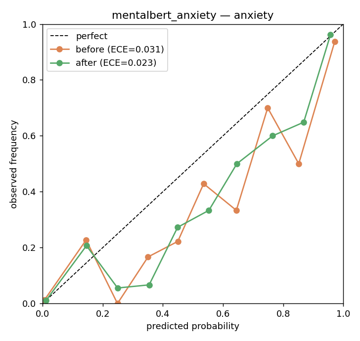
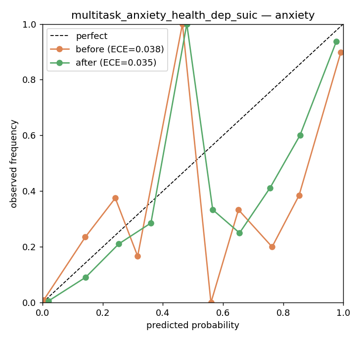
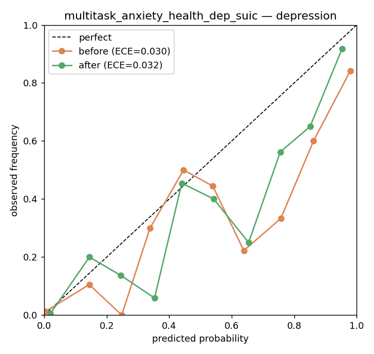
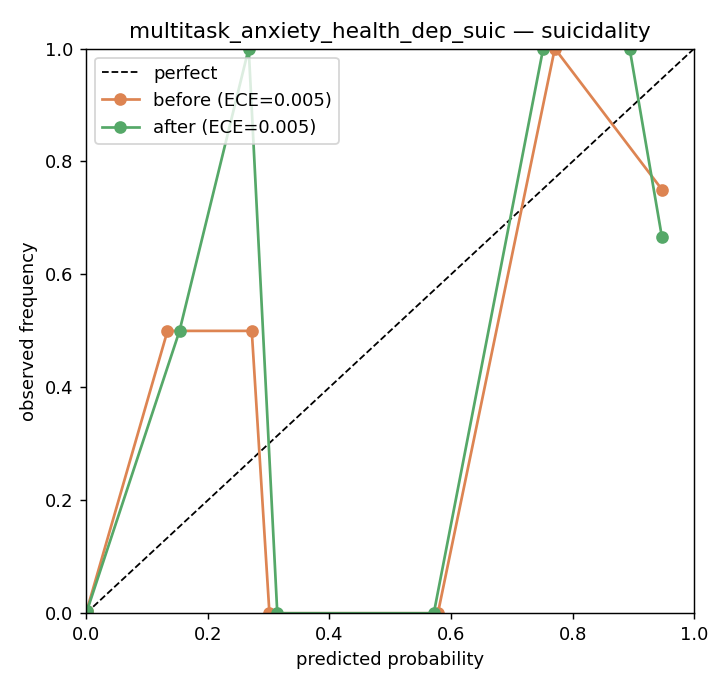

# Probability calibration — temperature scaling

Post-hoc calibration (Guo et al., 2017): a single scalar **T** rescales the logits (`p' = sigmoid(logit(p)/T)`), fit by NLL on a held-out half of each model's test predictions and evaluated on the other half. The transform is monotonic, so **AUROC is unchanged** — only ECE/Brier improve. **T > 1 ⇒ the model was overconfident.**

_Regenerate: `python scripts/calibrate.py`_

| model | target | n_test | n_pos | temperature | ece_before | ece_after | ece_reduction_% | brier_before | brier_after | auroc |
|---|---|---|---|---|---|---|---|---|---|---|
| mentalbert_anxiety | anxiety | 1229 | 267 | 1.226 | 0.0306 | 0.0235 | 23.3 | 0.0411 | 0.0401 | 0.9849 |
| multitask_anxiety_health_dep_suic | anxiety | 1229 | 267 | 1.712 | 0.038 | 0.0352 | 7.3 | 0.0424 | 0.0387 | 0.986 |
| multitask_anxiety_health_dep_suic | depression | 1229 | 108 | 1.647 | 0.0302 | 0.0324 | -7.6 | 0.0358 | 0.0337 | 0.9789 |
| multitask_anxiety_health_dep_suic | suicidality | 1229 | 10 | 1.095 | 0.0052 | 0.0053 | -1.9 | 0.0056 | 0.0055 | 0.9938 |
| tfidf_logreg | anxiety | 986 | 258 | 0.267 | 0.1998 | 0.0349 | 82.5 | 0.0975 | 0.0548 | 0.9717 |

## Reliability diagrams (before vs after)

### mentalbert_anxiety — anxiety

### multitask_anxiety_health_dep_suic — anxiety

### tfidf_logreg — anxiety

### multitask_anxiety_health_dep_suic — depression

### multitask_anxiety_health_dep_suic — suicidality

