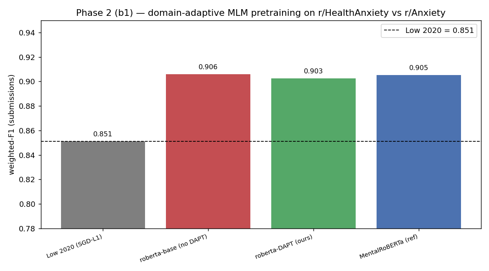

# Phase 2 (b1) — domain-adaptive MLM pretraining (DAPT)

Continue masked-LM pretraining of `roberta-base` on the 744k-post corpus (disclosure-test authors excluded), then fine-tune on the submissions-only, author-disjoint r/HealthAnxiety-vs-r/Anxiety task. Does in-domain MLM close the gap from generic RoBERTa to the domain-pretrained MentalRoBERTa? Baseline: Low 2020 = 0.851. `scripts/exp_dapt_mlm.py`.

_Regenerate: `python scripts/exp_dapt_mlm.py`_

| model | pretrained | weighted_f1 | auroc | f1 | note |
|---|---|---|---|---|---|
| Low 2020 (SGD-L1) | - | 0.851 | None |  | published baseline |
| roberta-base (no DAPT) | roberta-base | 0.9059 | 0.9584 | 0.8837 | this run |
| roberta-DAPT (ours) | checkpoints/roberta-dapt | 0.9026 | 0.9545 | 0.8789 | this run |
| MentalRoBERTa (ref) | mental/mental-roberta-base | 0.9052 | 0.9575 | 0.8785 | this run |

## Interpretation — a null result

**Domain-adaptive MLM gave no benefit here, for an instructive reason.** (1) Vanilla `roberta-base` already **matches** MentalRoBERTa (0.9059 vs 0.9052 weighted-F1; 0.958 vs 0.958 AUROC) — on this fine-tuned task there was no domain gap for DAPT to close. (2) DAPT *slightly hurt* (0.9026 < 0.9059 base). All three encoders sit within noise of each other on n=636.

This mirrors the generative-LLM finding ([llm_baselines.md](llm_baselines.md)): once the model is **fine-tuned on the task**, its pretraining provenance — generic RoBERTa, in-domain DAPT, domain-pretrained MentalRoBERTa, even 355M RoBERTa-large — barely moves the needle; everyone bumps the ~0.92 Reddit-binary ceiling. **Fine-tuning, not the pretraining corpus, is what matters.**

**Caveats (this was a time-boxed DAPT):** 200k docs, 1 epoch, block size 256, lr 5e-5. A heavier DAPT (full 744k corpus, multiple epochs) might recover a small gain, and a larger/noisier downstream task (where the encoder can't already saturate) is where in-domain pretraining usually helps most — neither holds here. The honest signal is that **light DAPT does not help this near-ceiling task.**