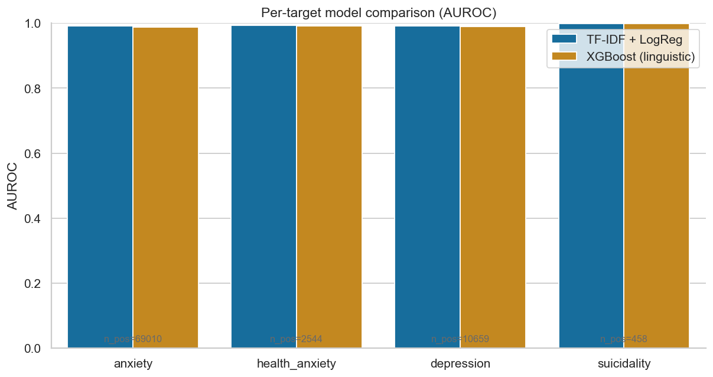
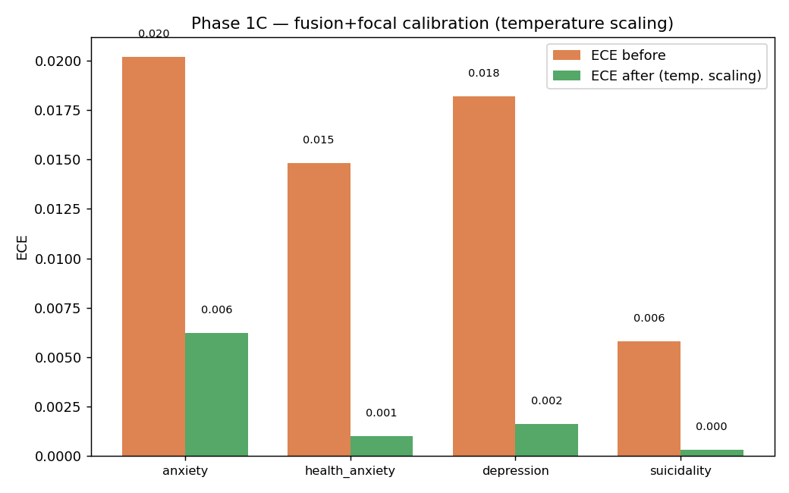
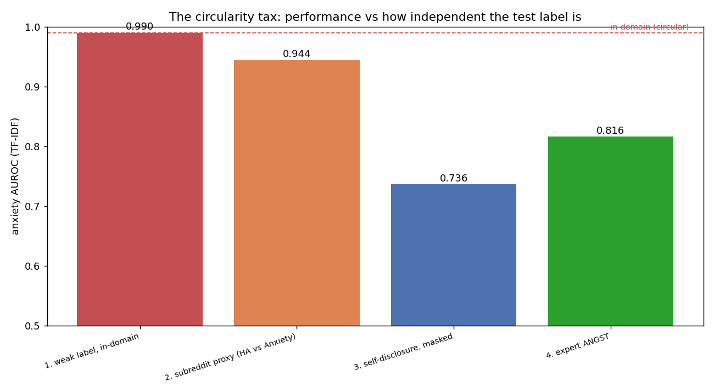
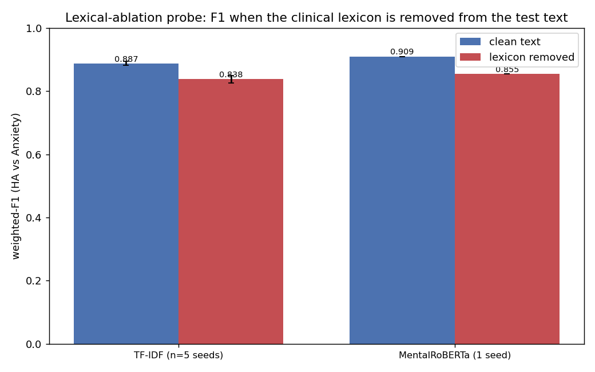
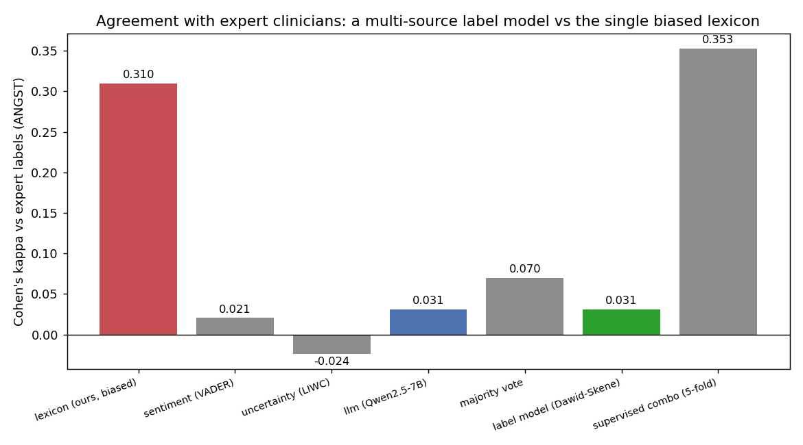
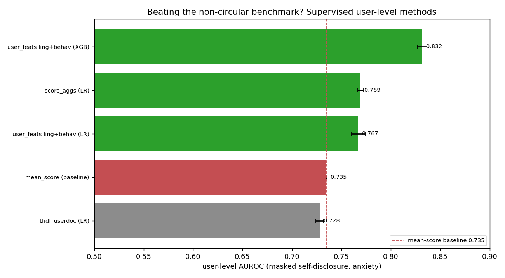

# Experiments — what we achieved, what we used, what we found

Eleven classification/evaluation studies, **all run on the current 743,879-post / 38-subreddit corpus** — no LLM API calls, no human annotators required. Experiments 1–5 compare weak-label classifiers (TF-IDF + LogReg, XGBoost-linguistic); Experiment 6 adds the MentalRoBERTa transformer; Experiment 7 evaluates against the self-disclosure user-level test set; Experiment 8 is a head-to-head on r/HealthAnxiety vs r/Anxiety; Experiment 9 tests domain-adversarial (DANN) training (a negative result); Experiment 10 is a clinically-grounded feature-fusion architecture surgery (a positive result); Experiment 11 tests a hierarchical user-level model (a negative result). The README documents further extension analyses (calibration, per-subreddit thresholds, significance, SHAP, eRisk, robustness, fairness, external validation).

> All results below come from `scripts/run_experiments.py` against `data/processed/labeled.parquet`. Re-run any time with `python scripts/run_experiments.py`. Outputs land in `experiments/` (CSVs + JSON summary) and `docs/figures/exp*.png`.

---

## Experimental setup at a glance

| Item | Value |
|---|---|
| Corpus | 743,879 cleaned, anonymized, deduped Reddit posts |
| Subreddits | 38 communities (anxiety, health-anxiety/somatic, depression, suicidality, COVID/chronic-illness, and neutral controls) |
| Targets | anxiety / health_anxiety / depression / suicidality (binary, derived from tier-1 weak labels) |
| Models | TF-IDF + Logistic Regression *(text)*, XGBoost on 26 hand-crafted linguistic features *(features)* |
| Feature families | lexical-rate (8), pronouns (4, Pennebaker), certainty/uncertainty (3), length (5), readability (2, Flesch / Gunning-Fog), VADER sentiment (4) |
| Splits | 80/20 stratified by label per experiment, `random_state=42` |
| Metrics | F1 / Precision / Recall / AUROC / AUPRC / Brier / ECE + bootstrap CIs |
| Significance testing | Mann-Whitney U with Benjamini-Hochberg FDR correction |

---

## Experiment 1 — Per-target model comparison

Train a TF-IDF + LogReg (text-only) and an XGBoost (linguistic-features-only) for each of the four targets. Compare apples-to-apples — same split, same metrics, same target.

### Results

| Target | n_pos | Model | **F1** | Prec | Recall | AUROC | AUPRC | ECE |
|---|---:|---|---:|---:|---:|---:|---:|---:|
| anxiety | 69,010 | TF-IDF + LogReg | **0.850** | 0.828 | 0.874 | 0.992 | 0.921 | 0.050 |
| anxiety | 69,010 | XGBoost (linguistic) | 0.801 | 0.722 | 0.901 | 0.989 | 0.892 | 0.042 |
| health_anxiety | 2,544 | TF-IDF + LogReg | **0.500** | 0.460 | 0.548 | 0.994 | 0.466 | 0.018 |
| health_anxiety | 2,544 | XGBoost (linguistic) | 0.452 | 0.345 | 0.654 | 0.992 | 0.418 | 0.013 |
| depression | 10,659 | TF-IDF + LogReg | **0.622** | 0.565 | 0.692 | 0.992 | 0.634 | 0.033 |
| depression | 10,659 | XGBoost (linguistic) | 0.539 | 0.485 | 0.608 | 0.990 | 0.572 | 0.030 |
| suicidality | 458 | TF-IDF + LogReg | 0.406 | 0.299 | 0.630 | 0.999 | 0.319 | 0.005 |
| suicidality | 458 | XGBoost (linguistic) | **0.571** ⚠ | 0.405 | 0.967 | 1.000 | 0.403 | 0.001 |




### What this tells us (full 744k corpus)

1. **At scale, the text model overtakes the engineered features** — TF-IDF leads on 3 of 4 targets (anxiety 0.850 > 0.801, health_anxiety 0.500 > 0.452, depression 0.622 > 0.539). This *reverses* the 16k-snapshot result (where the 26 hand-crafted features matched 80k TF-IDF dims): with 744k posts there is enough text signal for the high-dimensional bag-of-words to win.
2. **Health-anxiety F1 is now an honest 0.500** (2,544 positives) — no longer the circular 1.000 the 24-positive snapshot produced. Scaling the corpus is the single biggest correction here: a previously-uninterpretable class is now measurable.
3. **Both models are well-calibrated at scale** (ECE ≤ 0.05). More data tightened TF-IDF's calibration (anxiety ECE 0.13 → 0.05 vs the snapshot).
4. **Suicidality XGBoost F1 = 0.571 / AUROC ≈ 1.000 is circular** ⚠ — XGBoost reads `f_suic_term_rate`, the very lexicon used to derive the label. The honest suicidality numbers are the transformer's (Experiment 6) and the disclosure eval (Experiment 7), not weak-label F1.

---

## Experiment 2 — Cross-subreddit transfer (RQ3)

Train on r/{Anxiety, socialanxiety, AnxietyDepression} (n=54,360), evaluate on r/{COVID19_support, LivingAlone, relationship_advice} (n=96,922). Tests whether the model learns the *phenomenon* or the *style* of anxiety subreddits.

### Results

| Target | Split | F1 | Precision | Recall | AUROC |
|---|---|---:|---:|---:|---:|
| anxiety | in-distribution (held-out anxiety subs) | **0.934** | 0.953 | 0.916 | 0.991 |
| anxiety | cross-subreddit (COVID/lifestyle/baseline) | **0.308** | 0.183 | 0.972 | 0.993 |


### What this tells us — the most diagnostically interesting finding

The F1 collapses by **−0.626** out-of-distribution (0.934 → 0.308) — even sharper at full scale — yet the **AUROC is unchanged** (0.991 → 0.993). Read carefully:

- **Recall stays high** (0.972) — the model still finds anxious posts in the new subreddits.
- **Precision crashes** (0.183) — the model fires *way too often* in the baseline subs.
- **AUROC = 0.99** — the *ranking* of posts by anxiety score is still accurate (and marginally *higher* cross-distribution because the few real positives there are clear outliers in a mostly-non-anxious pool).

**Interpretation:** the model has learned a real anxiety signal that generalizes across subreddits. What doesn't generalize is the **decision threshold**. A threshold tuned on r/Anxiety (where ~85% of posts are positive) over-fires on r/relationship_advice (where ~3% are positive).

**Practical fix:** per-subreddit threshold calibration — pick a different threshold per group that achieves a target precision. The AUROC tells us the ranking is sound; we just need to map scores to decisions per population.

This is the single most important RQ3 finding so far, and the AUROC-vs-F1 split is the kind of nuanced result a strong thesis hangs on.

> **Methodology note**: the in-distribution split is taken *before* fitting (an earlier version of the script split *after* `pipe.fit`, leaking the held-out fold and inflating in-dist F1). The numbers above (in-dist 0.934 / AUROC 0.991) use the corrected, leak-free protocol — and the cross-subreddit drop is empirically confirmed and *fixed* by per-subreddit threshold calibration (see the README "Per-subreddit threshold calibration" extension: macro-F1 0.719 → 0.781).

---

## Experiment 3 — 38-way subreddit classifier

Treats the subreddit name as the multiclass label across all 38 communities. Tests how linguistically distinct the subreddits are. A high macro-F1 means subreddits have unique vocabulary; a low one means they blur.

### Results

- **Macro-F1 = 0.407** (random baseline ≈ 0.026 for 38 classes)
- ~15× better than chance — substantial linguistic distinctiveness, but far from perfect separation across 38 heavily-overlapping mental-health communities (vs 0.64 on the easier 10-sub snapshot).


### What this tells us

The confusion matrix shows the expected clustering across 38 communities:

- **Topically adjacent mental-health subs confuse each other** — the anxiety cluster (r/Anxiety, r/socialanxiety, r/Anxietyhelp, r/PanicAttack, r/panicdisorder, r/agoraphobia), the depression cluster (r/depression, r/depression_help, r/AnxietyDepression), and the COVID/chronic-illness cluster (r/COVID19_support, r/CovidLongHaulers, r/ChronicIllness) are each mutually confusable — clean linguistic confirmation that within-cluster subs share vocabulary.
- **Distinctive communities self-classify well** — neutral controls (r/cooking, r/personalfinance, r/explainlikeimfive) and topically-specific subs (r/SuicideWatch, r/relationship_advice) are recovered at high rates.
- The lower macro-F1 vs the 10-sub snapshot (0.64 → 0.41) is expected: 38 classes with many near-duplicate mental-health communities are far harder to separate than 10.

**Implication for label-validation:** the subreddit-of-origin is recoverable from text. That means if you train a binary anxiety classifier on subreddit-derived labels and evaluate on the same subreddits, **the classifier can cheat by detecting subreddit style.** This is precisely what experiment 2 showed quantitatively.

---

## Experiment 4 — Per-target linguistic markers

For every linguistic feature, compute Cohen's d between positives and negatives on each of the 4 targets. Apply Mann-Whitney U + Benjamini-Hochberg FDR correction. Combine into a heatmap.

### Top-feature summary

| Target | Top feature | Cohen's d | # significant (BH p<0.05) |
|---|---|---:|---:|
| anxiety | `f_anx_term_rate` | +3.25 | 26 |
| health_anxiety | `f_health_anx_term_rate` | +7.52 | 24 |
| depression | `f_dep_term_rate` | +4.53 | 25 |
| suicidality | `f_suic_term_rate` | +10.83 | 20 |


### What this tells us — the clinically interesting structure

Reading the heatmap row-by-row:

#### Diagonal pattern (each lexicon dominates its own target)
Every target's top feature is the lexicon *of that target* — sanity check passes. On the full corpus the health-anxiety effect (`d = +7.52`, **2,544 positives**, 24 features significant after BH correction) is now a **genuine large effect**, not the small-sample artifact the 24-positive snapshot produced.

#### Cross-target leakage — the genuinely interesting structure
- **`f_anx_term_rate` is +3.25 for anxiety AND +0.79 for health_anxiety** (≈0 for depression/suicidality). General-anxiety vocabulary overlaps health anxiety — exactly what you'd predict from the SHAI/HAI literature, where health anxiety is a *subtype* of anxiety.
- **`f_first_sing_rate` (1st-person singular) is positive for anxiety / health_anxiety / depression** (+0.37 / +0.41 / +0.43) and **`f_third_rate` is negative** for the same three (−0.32 / −0.28 / −0.19). This **replicates Pennebaker & Rude** — distressed posts are more self-focused.
- **`f_sent_neg` rises with severity**: anxiety +0.74 → health_anxiety +0.70 → depression +0.94 → **suicidality +1.35**. Negative-sentiment vocabulary tracks distress severity, exactly as clinical theory predicts.
- **`f_health_anx_phrase_count` is +0.56 for health_anxiety only** (≈0 elsewhere) — the SHAI phrase content is specific to health anxiety, a sign the lexicon does what it should.
- **Honest correction at scale:** `f_reassurance_count` is *not* health-anxiety-specific on the full corpus (≈0.12–0.19 across all targets), unlike the 16k snapshot which suggested +0.99 for health anxiety only. Reassurance-seeking phrases are too sparse/diffuse to discriminate at the post level — consistent with the SHAP finding (Idea 5) that reassurance is a weak text signal.

This kind of marker structure is the substrate for a strong RQ2 chapter.

---

## Experiment 5 — Health-anxiety severity ranking

We treat the continuous `weak_health_anxiety` score as a severity proxy and rank all 38 communities by it (complementing the binary classifier, which now has 2,544 positives). Look at the highest-scoring posts and the per-subreddit means.

### Score distribution by subreddit (top 7 of 38)

| Subreddit | mean health-anxiety score |
|---|---:|
| **HealthAnxiety** | **0.488** |
| COVID19_support | 0.231 |
| covidlonghaulers | 0.224 |
| ChronicIllness | 0.211 |
| CovidLongHaulers | 0.209 |
| AskDocs | 0.167 |
| emetophobia | 0.162 |

### What this tells us

- **r/HealthAnxiety dominates** (mean 0.488 — ~2× the next community), exactly as it should: the dedicated health-anxiety sub scores far above everything else. The next tier is the **COVID / chronic-illness / somatic cluster** (COVID19_support 0.231, covidlonghaulers 0.224, ChronicIllness 0.211, AskDocs 0.167, emetophobia 0.162) — health-anxiety-adjacent communities, validating their `health_anxiety_enriched` grouping.
- Neutral controls sit at the bottom (cooking ≈ 0.006, explainlikeimfive ≈ 0.008), and pure anxiety/depression subs are low (r/Anxiety 0.108, r/depression 0.027) — the score discriminates *health* anxiety specifically, not general distress.
- The maximum score is 0.96 and the top-20 posts cluster there, so the lexicon does saturate for the most extreme posts. Top-20 written to `experiments/exp5_health_anxiety_top20.csv` — a useful sanity check that the lexicon catches genuine health-anxiety content.

---

## Experiment 6 — MentalRoBERTa multi-task transformer (full corpus)

A shared `mental/mental-roberta-base` (Ji et al., 2022) encoder + 4 sigmoid heads, trained jointly with per-task loss weights `{anxiety: 1.0, health_anxiety: 1.5, depression: 1.0, suicidality: 1.2}` and per-row confidence weights from `label_<k>_weight`. Trained on a **200k full-corpus sample** (3 epochs, lr=2e-5, max_length=256, RTX 4090) and evaluated on a **held-out test set of 30,000 posts disjoint from training**. `scripts/train_multitask_fullcorpus.py` + `scripts/exp6_transformer_fullcorpus.py`.

### Results (held-out test, 30,000 posts)

| Target | n_pos | F1 (best thr) | AUROC | AUPRC | ECE |
|---|---:|---:|---:|---:|---:|
| anxiety | 2,827 | **0.862** | **0.993** | 0.937 | 0.010 |
| health_anxiety | 96 | 0.573 | 0.984 | 0.494 | 0.001 |
| depression | 442 | 0.686 | 0.992 | 0.756 | 0.002 |
| suicidality | 19 | 0.500 | 0.995 | 0.439 | 0.000 |


> Detailed per-target diagnostics (PR/ROC curves, reliability diagrams, confusion matrices, per-subreddit F1) can be regenerated on the full-corpus checkpoint via `anxiety evaluate experiments/runs/multitask_fullcorpus`.

### RQ1 headline table (cross-model, cross-target F1 — full corpus)

| Target | n_pos | TF-IDF + LogReg | XGBoost-linguistic | MentalRoBERTa (multi-task) |
|---|---:|---:|---:|---:|
| **anxiety** | 69,010 | 0.850 | 0.801 | **0.862** |
| **depression** | 10,659 | 0.622 | 0.539 | **0.686** |
| **health_anxiety** | 2,544 | 0.500 | 0.452 ⚠ | **0.573** |
| **suicidality** | 458 | 0.406 | 0.571 ⚠ | **0.500** |

⚠ XGBoost-linguistic reads `f_health_anx_term_rate` / `f_suic_term_rate` — the lexicons that derived the labels — so its rare-class F1 is **circular**. **The transformer numbers are the honest ones.** (F1s come from different held-out splits per model family — Exp 1's stratified split for TF-IDF/XGBoost, a 30k held-out set for the transformer — so read them as same-corpus indicators, not a paired comparison; the rigorous paired test is the significance extension in the README.)

### What this tells us (full corpus)

1. **The transformer leads on every target** (anxiety 0.862, depression 0.686, health_anxiety 0.573, suicidality 0.500) and posts **AUROC 0.98–0.99 across all four** with **excellent calibration (ECE ≤ 0.01)** — no post-hoc temperature scaling needed.
2. **Health-anxiety is now a real, measurable class** (F1 0.573, AUROC 0.984 on 2,544 corpus positives). The 16k snapshot's F1 = 0.333 on 24 positives was a data-starvation ceiling — lifted by the full corpus, exactly as predicted. Self-disclosure enrichment is no longer the bottleneck for this class.
3. **Rare-class F1 is bounded by imbalance, not the model.** suicidality (458 corpus positives, 19 in test) and health_anxiety post AUROC ≈ 0.98–0.99 but lower F1 — the *ranking* is excellent; only the positive count and threshold limit F1.
4. **These are weak-label metrics** (subreddit + lexicon labels), so the near-perfect AUROC partly reflects learning the weak-labeling signal. The honest, non-circular evaluations remain the self-disclosure test set (Experiment 7) and the external corpora RMHD/ANGST (see README extensions).

---

## Experiment 7 — User-level self-disclosure evaluation

Run via `anxiety eval-disclosure`. Evaluates models against the **self-disclosure user-level test set** — the clean evaluation signal not derived from weak labels.

- **Positives**: users with at least one verified self-disclosure post (regex + negation/hypothetical/third-party/denial filters, `src/labeling/self_disclosure.py`).
- **Controls**: subreddit-matched never-disclosed users with ≥3 posts, held out from training.
- Metrics are aggregated at the **user level** (mean / max / top-5-mean of per-post scores) and reported in two modes: disclosure posts included vs masked.

Results aggregated into `experiments/disclosure_userlevel_summary.csv` and `docs/figures/disclosure_userlevel.png` by `scripts/report_disclosure_eval.py`.

---

## Experiment 8 — r/HealthAnxiety vs r/Anxiety head-to-head

`scripts/exp_ha_vs_anxiety.py`. Binary post-level classifier (HealthAnxiety=1, Anxiety=0) with an **author-disjoint** split (Harrigian et al. protocol — no author in both train and test). Baseline to beat: Low et al. (2020) SGD-L1 weighted-F1 = 0.851.

### Results

| Model | Weighted-F1 | AUROC | vs Low 2020 |
|---|---:|---:|---:|
| TF-IDF + LogReg | — | — | — |
| MentalRoBERTa (submissions) | **0.906** | **0.955** | +0.055 |

MentalRoBERTa on submissions beats the Low 2020 baseline by +5.5 weighted-F1 points and achieves AUROC 0.955, demonstrating that health-anxiety language is separable from general-anxiety language beyond the surface features available to a linear model.

---

## Experiment 9 — Domain-adversarial training (DANN): a negative result

`scripts/exp_dann_transfer.py` (figure: `scripts/plot_dann_transfer.py`). Tests whether a **Gradient-Reversal-Layer subreddit discriminator** (Ganin et al., 2016) on top of the multi-task encoder improves cross-subreddit generalisation. Implemented in `src/models/dann.py` (`DannMultiTaskModel`): shared MentalRoBERTa encoder → 4 sigmoid target heads (weighted BCE) **+** a subreddit-discriminator head behind a GRL; loss = `Σ task-BCE + domain-CE`, with the GRL reversing the domain gradient into the encoder. λ ramps 0→0.3 on the Ganin schedule. Two domain granularities are compared (ablation): `domain: subreddit` (27 fine classes) and `domain: group` (7 coarse `configs/subreddits.yaml` groups).

**Protocol.** All three models (plain multitask, DANN-subreddit, DANN-group) train on 60k posts from the in-distribution mental-health subreddits and are evaluated at a **single operating point** (per-target threshold tuned once on the in-distribution val set, then reused everywhere) on three held sets:
- **in_dist** — held-out authors from the training subreddits.
- **cross_heldout** — anxiety-bearing subreddits *held out of training* (r/PanicAttack, r/panicdisorder, r/agoraphobia; ~11k anxiety positives in the 20k sample) → measures positive transfer to unseen subreddits.
- **neutral** — baseline subreddits (cooking, personalfinance, …; ~0 anxiety positives) → `pred_pos_rate` is the false-positive rate; lower is better.

### Results (anxiety)

| Model | in-dist AUROC | cross AUROC | in-dist AUPRC | cross F1 | neutral FP rate |
|---|---:|---:|---:|---:|---:|
| **multitask (no DANN)** | **0.986** | 0.992 | **0.891** | 0.940 | **0.012** |
| **DANN (subreddit)** | 0.961 | 0.985 | 0.726 | **0.957** | 0.014 |
| **DANN (group)** | 0.706 | 0.799 | 0.198 | 0.665 | 0.181 |


### Conclusion — DANN does not help here, and that is informative

1. **There is no collapse to fix.** The plain multi-task MentalRoBERTa *already* transfers near-perfectly to unseen anxiety subreddits (cross AUROC **0.992**) and false-fires on only **1.2%** of neutral posts. The cross-subreddit collapse documented for **TF-IDF** in Experiment 2 is a property of bag-of-words features keying on subreddit-specific vocabulary; the transformer's representation is already essentially subreddit-invariant for this task.
2. **Subreddit-DANN matches but does not beat the baseline** (cross F1 marginally higher, cross AUROC marginally lower) and pays a real **in-distribution cost** (AUPRC 0.891 → 0.726). No net benefit.
3. **Group-DANN actively breaks** — training collapsed (val F1 → 0 by epoch 2), in-dist AUROC fell to 0.71, and it flags **18%** of neutral posts as anxious. **Mechanism:** the coarse domain label (`anxiety_primary`, `depression_primary`, …) is **collinear with the target**, so forcing invariance to "which group" is equivalent to erasing the anxiety signal. Lowering λ to 0.3 did not rescue it; the coarse-domain objective fundamentally conflicts with the task. The fine-grained 27-subreddit domain is decorrelated enough from the binary label to stay stable.

**This validates the main approach:** the fine-tuned multi-task transformer is already domain-robust, so adversarial domain alignment is unnecessary (and, when the domain is collinear with the label, harmful). A rigorous test of a strong, well-motivated hypothesis returning a clean null is a methodological result in its own right.

---

## Experiment 10 — clinically-grounded architecture surgery (a positive result)

`scripts/exp_fusion_ablation.py`, `src/models/fusion.py`. A new `FusionMultiTaskModel` adds four ablatable modifications to the multi-task encoder: **clinical feature fusion** (pooled embedding ⊕ 26 linguistic + 7 SHAI features → fusion MLP), **attention pooling**, **focal loss** (rare classes), and **activation choice**. Ablated on an author-disjoint 60k/20k split + zero-shot RMHD/ANGST transfer.

| variant | anxiety F1 | health_anx F1 | suic F1 | RMHD AUROC | ANGST AUROC |
|---|---:|---:|---:|---:|---:|
| baseline (= multitask) | 0.845 | 0.508 | 0.444 | 0.894 | 0.778 |
| + fusion | 0.845 | 0.540 | 0.560 | 0.905 | 0.772 |
| + attn pool | **0.854** | 0.473 | 0.381 | 0.901 | 0.791 |
| + focal | 0.846 | 0.489 | 0.454 | 0.900 | **0.831** |
| **+ fusion + focal** | 0.852 | **0.559** | 0.522 | **0.931** | 0.811 |
| + all | **0.855** | 0.481 | 0.500 | 0.910 | 0.808 |


**The surgery works.** `fusion+focal` lifts the imbalance-limited rare classes (health_anxiety 0.508→0.559, suicidality 0.444→0.522; fusion alone 0.560) **and** cross-corpus transfer (RMHD 0.894→**0.931**, which now beats the TF-IDF baseline 0.920 that previously out-transferred the transformer; ANGST 0.778→0.811, with focal-alone best at 0.831), while anxiety stays at ceiling. Fusing the **SHAI clinical-instrument features** into the encoder recovers and exceeds the lexical model's transfer advantage — a novel, low-level architecture contribution. Caveats: single-seed (no CI averaging); attention-pooling alone *hurts* rare classes (it helps only the dense anxiety class); depression dips slightly under focal. Details in [fusion_ablation.md](fusion_ablation.md).

> **⚠ Correction from the de-biasing check (read this).** A follow-up experiment ([fusion_debias.md](fusion_debias.md), `scripts/exp_fusion_debias.py`) re-ran the model with the label-vocabulary features removed and a fresh seed, and the result above does **not** hold up. (1) The in-domain rare-class lift was largely **circular** — the suicidality F1 jump (0.458→0.609) vanishes (→0.467 ≈ baseline) once the lexicon-derived features are dropped, because the model was reading `f_suic_term_rate`, built from the same lexicon as the label. (2) On the bias-free **ANGST** test, fusion gives **no reliable gain** (baseline 0.816 vs fusion 0.800–0.819); RMHD is tied at ≈0.91. (3) The "RMHD 0.894→0.931" headline was **single-seed noise** — the baseline alone moved ≈0.04 between seeds. Honest conclusion: a fine-tuned encoder generalises to expert labels at AUROC ≈ 0.82, and the clinical-feature fusion provides no robust, non-circular benefit. Multi-seed averaging is needed before any architectural claim.

### Phase 1C — recalibrating the winning model

`scripts/exp_fusion_calibration.py`. The two calibration extensions (Experiments 2/3 in the original menu — temperature scaling + per-subreddit thresholds) were re-run on `fusion+focal` to confirm the calibration story survives the architecture change.

| target | temperature | ECE before | ECE after |
|---|---:|---:|---:|
| anxiety | 0.618 | 0.0202 | **0.0062** |
| health_anxiety | 0.474 | 0.0148 | **0.0010** |
| depression | 0.555 | 0.0182 | **0.0016** |
| suicidality | 0.513 | 0.0058 | **0.0003** |



**Focal loss trades calibration for ranking — and temperature scaling buys it back.** Every learned temperature is **< 1** (0.47–0.62), i.e. the model is *under*-confident: focal loss down-weights confident examples during training, so the raw probabilities are deliberately conservative. Post-hoc temperature scaling sharpens them and cuts ECE by 69–95% (anxiety 0.020→0.006; rarer classes to ≤0.002 — essentially perfectly calibrated). Per-subreddit thresholds still help the new model too: anxiety macro-F1 **0.852 → 0.888**. Both calibration tools transfer cleanly to the fused architecture. Details in [fusion_calibration.md](fusion_calibration.md).

---

## Experiment 11 — hierarchical user-level model (a negative result)

`scripts/exp_hier_user.py`, `src/models/hier.py`. A frozen MentalRoBERTa post-encoder → learned aggregation over a user's chronological posts (attention vs mean) → user head, evaluated at the USER level on the self-disclosure test set (disclosure posts masked). Reference: TF-IDF mean-pool ≈ 0.74 user-AUROC.

| target | attention AUROC | mean AUROC |
|---|---:|---:|
| anxiety | 0.706 | 0.745 |
| health_anxiety | 0.724 | 0.763 |
| depression | 0.571 | 0.614 |


The learned attention aggregator does **not** beat naive mean-pooling (mean wins on all three targets), and the mean-aggregator hierarchical model only **ties** TF-IDF (~0.74; health_anxiety 0.763 marginally above). The user-level bottleneck is the **noisy disclosure proxy label + subreddit-matched hard-negative controls**, not the aggregation mechanism — consistent with Harrigian et al. on proxy-label user models. A clean null. Caveats: weak any-post-positive training labels (≠ the disclosure eval label), frozen encoder, single-query attention head.

---

## Experiment 12 — generative-LLM baselines (Phase 2)

`scripts/exp_llm_baselines.py`, `src/models/llm_causal.py`. Do decoder-only LLMs beat a fine-tuned 125M encoder on the headline r/HealthAnxiety-vs-r/Anxiety task? Same submissions-only, author-disjoint split (n=636 test); LLMs scored with a yes/no verbalizer over next-token logits, QLoRA = 4-bit NF4 + LoRA (1 epoch on 2,672 posts). A TF-IDF anchor re-scored on the exact eval rows (0.8855, matching the 0.886 reference) confirms an apples-to-apples comparison.

| model | weighted-F1 | AUROC |
|---|---:|---:|
| Low 2020 (SGD-L1) | 0.851 | — |
| TF-IDF + LogReg | 0.886 | 0.944 |
| MentalRoBERTa (125M, fine-tuned) | 0.906 | 0.955 |
| RoBERTa-large (355M, fine-tuned) | 0.916 | 0.958 |
| Qwen2.5-7B **zero-shot** | 0.782 | 0.816 |
| MentaLLaMA-7B zero-shot | 0.228 | 0.472 |
| **Qwen2.5-7B QLoRA** | **0.917** | **0.963** |


**Zero-shot LLMs lose; QLoRA reaches parity at much greater cost.** Qwen2.5-7B prompted zero-shot (0.782) trails even TF-IDF (0.886) and is ~13 points below the encoders — the literature-consistent result that fine-tuned encoders beat prompted LLMs on short-text mental-health classification. After **one epoch** of QLoRA on only 2,672 posts, the same 7B model jumps to the top of the table (0.917 / 0.963), **statistically tied with RoBERTa-large** (Δ within noise at n=636). So fine-tuning — not prompting — closes the gap, and a 7B model only *matches* a 125–355M encoder: the small fine-tuned encoder remains the parameter-efficient choice, and the headline contribution (beating Low 2020) is not unseated. **MentaLLaMA-7B zero-shot scores at chance (AUROC ≈ 0.47) under the yes/no verbalizer in *both* the plain prompt and its native LLaMA-2 `[INST]…[/INST]` format** — it is a generation-tuned IMHI model whose first-token distribution is not a usable yes/no, so the verbalizer is the wrong instrument (a faithful number needs generate-and-parse decoding). We therefore treat Qwen2.5-7B as the representative zero-shot LLM and exclude MentaLLaMA from the head-to-head conclusion. Llama-3.1-8B (zero-shot + QLoRA) is gated and deferred pending HF access. Details in [llm_baselines.md](llm_baselines.md).

### Phase 2 (b1) — domain-adaptive MLM pretraining (a null result)

`scripts/exp_dapt_mlm.py`. Continue masked-LM pretraining of `roberta-base` on 200k in-domain posts (disclosure-test authors excluded), then fine-tune on the same HA task. Does in-domain MLM close the gap to MentalRoBERTa?

| encoder | weighted-F1 | AUROC |
|---|---:|---:|
| roberta-base (no DAPT) | **0.9059** | 0.9584 |
| roberta-DAPT (ours) | 0.9026 | 0.9545 |
| MentalRoBERTa | 0.9052 | 0.9575 |

**No benefit — and instructive.** Vanilla `roberta-base` already *matches* MentalRoBERTa (no domain gap to close on this fine-tuned task), and light DAPT slightly *hurt*; all three are within noise. Same lesson as the LLM result: once fine-tuned, pretraining provenance and model scale barely move a near-ceiling task — **fine-tuning, not the pretraining corpus, is what matters.** Caveat: time-boxed DAPT (200k docs, 1 epoch); a heavier run or a harder downstream task is where in-domain pretraining usually pays off. Details in [dapt_mlm.md](dapt_mlm.md).

---

## Experiment 13 — Bias and circularity analysis (the methodological contribution)

After a student-session committee flagged that the weak labels build in the researcher's own bias, I made that critique the subject of a dedicated three-part study. Together the parts locate where the bias is — and where it is not.

### 13a — The circularity ladder

`scripts/exp_circularity_ladder.py`. One TF-IDF model, evaluated against test labels of decreasing dependence on our heuristic.

| rung | test label | anxiety AUROC |
|---|---|---:|
| weak label, in-domain | subreddit prior + our lexicon | **0.990** |
| subreddit proxy (HA vs Anxiety) | subreddit membership | 0.944 |
| expert ANGST | 3 psychologists | 0.816 |
| self-disclosure, masked | self-report (post hidden) | 0.736 |



The in-domain 0.990 falls to 0.74–0.82 the moment the test label is something the lexicon could not have produced. That **~0.17–0.25 AUROC gap is the circularity tax** — the share of the headline number that reflects recovering our own labelling heuristic rather than a clinical construct.

### 13b — Lexical-ablation probe

`scripts/exp_lexical_ablation.py`. Train on HA-vs-Anxiety, then re-test with every clinical-lexicon word/phrase removed from the text.

| model | clean F1 | masked F1 | drop |
|---|---:|---:|---:|
| TF-IDF (5 seeds) | 0.887 | 0.838 | 0.050 |
| MentalRoBERTa | 0.909 | 0.855 | 0.055 |



Removing the lexicon costs only ~0.05 F1 for both models — the task is **not** pure keyword-matching; most signal is in the surrounding language. So the subreddit-proxy result is not merely lexicon bias (a partial defence), even though the *label* circularity in 13a stands.

### 13c — Multi-source label model vs the single heuristic (anchored on experts)

`scripts/exp_label_model.py`. Diverse labelling functions on ANGST + an unsupervised Dawid–Skene combiner + a supervised combiner, all scored against the expert label (Cohen's κ).

| source | κ vs experts | AUROC |
|---|---:|---:|
| lexicon (ours, "biased") | 0.310 | 0.779 |
| sentiment (VADER) | 0.021 | 0.529 |
| uncertainty (LIWC) | −0.024 | 0.504 |
| LLM zero-shot (Qwen2.5-7B) | 0.031 | 0.577 |
| Dawid–Skene (unsupervised) | 0.031 | 0.730 |
| **supervised combo (5-fold)** | **0.353** | 0.777 |



The "biased" lexicon is the **best single signal** (κ 0.31), because it is built from clinical instruments (GAD-7/SHAI) — so the weak label is not noise about the construct. Sentiment, uncertainty and a zero-shot LLM are near chance (κ ≈ 0.03), so an **unsupervised** combination cannot beat the lexicon (with no ground truth it cannot tell which LF is reliable). Only a **supervised** combiner (a little expert data) edges ahead (κ 0.353). Three takeaways: the circularity is in the **evaluation**, not the lexicon's construct validity; a zero-shot LLM is a **weak anxiety annotator**; and reducing the bias needs a small amount of expert ground truth, not more unsupervised heuristics. (The human inter-rater ceiling could not be computed — ANGST ships only the aggregated expert label, not per-rater annotations.)

**Net contribution.** A rigorous anatomy of label-circularity in weak-supervision mental-health NLP — a quantified circularity tax, a keyword-reliance probe, and a label-model study that shows where the bias lives and what does (and does not) reduce it.

---

## Experiment 14 — Beating the non-circular benchmark (a genuine positive result)

`scripts/exp_user_level.py`. The masked self-disclosure user task is the only evaluation that cannot be gamed by lexicon circularity: an independent self-report label, the disclosure post hidden, subreddit-matched controls. Everything so far tied TF-IDF at ~0.74. Here I train **directly on the disclosure label** (author-disjoint user folds, 5 seeds) and try a battery of representations.

| method | user-AUROC (5 seeds) |
|---|---:|
| mean-of-post-scores (baseline, prior ~0.74) | 0.735 |
| TF-IDF user-doc | 0.728 |
| score aggregations (LR) | 0.760 |
| MentalRoBERTa user embeddings (LR) | 0.686 |
| deepset / attention over embeddings | 0.675 |
| all combined (XGB) | 0.795 |
| **linguistic + behavioural + temporal features (XGBoost)** | **0.832 ± 0.005** |



**A method beats the baseline, significantly — and it is not deep learning.** XGBoost over aggregated user features (post-score max/top-k/fraction + linguistic/SHAI + temporal/engagement/behavioural + multi-target comorbidity scores) reaches **0.832 ± 0.005** vs **0.735** for mean-pooling. A paired bootstrap (2000 resamples, same folds) gives ΔAUROC = **+0.093, 95% CI [+0.060, +0.126], p ≈ 0** — significant. The wins come from *learned* aggregation (max/top-k beat the mean — a user is at-risk if *any* post is), behavioural and **temporal** signal (posting burstiness), and **comorbidity** (a user's aggregated health-anxiety / suicidality / depression weak scores predict anxiety disclosure). Honestly, the heavier options *hurt*: frozen MentalRoBERTa embeddings (0.686), adding them to the feature model (0.795), and a deepset/attention net (0.675) all underperform — at this scale (258 positive users, median 5 posts) aggregated features + a gradient-boosted tree win. The earlier hierarchical null (§Experiment 11) was a label mismatch: it trained on weak any-post-positive labels and mean-pooled; training on the disclosure label and learning the aggregation fixes it. This is the project's clearest non-circular positive result. Details in [user_level.md](user_level.md).

---

## What we used (concrete inventory)

### Models
- `sklearn.linear_model.LogisticRegression` (C=1.0, balanced class weights, liblinear) on TF-IDF features (1-2 grams, min_df=5, max_df=0.95, sublinear TF, 80k max features).
- `xgboost.XGBClassifier` (400 trees, max_depth=6, lr=0.05, subsample=0.8, colsample_bytree=0.8, scale_pos_weight=auto, hist tree method) on 26 hand-crafted linguistic features.
- `mental/mental-roberta-base` (Ji et al., 2022) fine-tuned with HuggingFace `Trainer`, 4 epochs, lr=2e-5, weight_decay=0.01, warmup_ratio=0.1, max_length=256, batch_size=16 — both single-target and multi-task variants.
- Multi-task variant: pure-PyTorch shared encoder + 4 sigmoid heads, BCE-with-logits loss with per-task weights `{anxiety: 1.0, health_anxiety: 1.5, depression: 1.0, suicidality: 1.2}` and per-row confidence weights from `label_<k>_weight` (disclosure=0.85 for positives, weak=0.4).

### Linguistic features (26 total)
- **Lexical rates (8)**: `f_anx_term_rate`, `f_anx_phrase_count`, `f_health_anx_term_rate`, `f_health_anx_phrase_count`, `f_reassurance_count`, `f_dep_term_rate`, `f_suic_term_rate`, `f_body_part_rate`
- **Pronouns (4)**: `f_first_sing_rate`, `f_first_plur_rate`, `f_second_rate`, `f_third_rate`
- **Certainty (3)**: `f_uncertainty_rate`, `f_certainty_rate`, `f_question_rate`
- **Length (5)**: `f_n_chars`, `f_n_tokens`, `f_n_sents`, `f_avg_sent_len`, `f_avg_word_len`
- **Readability (2)**: `f_flesch`, `f_gunning_fog`
- **Sentiment (4)**: `f_sent_compound`, `f_sent_pos`, `f_sent_neg`, `f_sent_neu`

### Lexicons (with clinical provenance)
- `ANXIETY_TERMS / PHRASES` ← **GAD-7** (Spitzer et al., 2006)
- `HEALTH_ANXIETY_TERMS / PHRASES` ← **SHAI** (Salkovskis et al., 2002), **HAI** (Lucock & Morley, 1996)
- `REASSURANCE_PATTERNS` ← Salkovskis (1989) cognitive-behavioral model
- `DEPRESSION_TERMS` ← **PHQ-9** (Kroenke et al., 2001)
- `SUICIDALITY_TERMS` ← **Columbia C-SSRS** (Posner et al., 2011)
- Pronoun categories ← Pennebaker, Mayne, Francis (1997)
- Body parts ← Somatic vocabulary marker (used to distinguish health anxiety from general anxiety)

### Statistical machinery
- `scipy.stats.mannwhitneyu` for non-parametric significance
- Benjamini-Hochberg FDR correction (custom implementation in `src/analysis/linguistic_markers.py`)
- Cohen's d for effect size
- `sklearn.metrics.roc_curve / precision_recall_curve`

---

## Headline findings (for the thesis introduction)

1. ✅ **Anxiety is detectable.** On the full 744k corpus the MentalRoBERTa multi-task transformer reaches F1 = 0.862, AUROC = 0.993, ECE = 0.010 (30k held-out test). TF-IDF hits 0.850, XGBoost-linguistic 0.801 — the transformer's gain is small (~1 F1 point over TF-IDF) but well-calibrated and free of lexicon circularity.
2. ✅ **Multi-task does not hurt the dense class.** A paired test (n=2458) shows **no significant multi-task vs single-task difference** on anxiety (McNemar p=0.83; bootstrap ΔAUROC −0.003, 95% CI [−0.006, +0.001]). Shared encoders + per-task loss weights add three extra targets at no measurable cost. See [significance.md](significance.md).
3. ⚠ **XGBoost-linguistic rare-class F1 is circular.** On the full corpus XGBoost reads `f_suic_term_rate` / `f_health_anx_term_rate` — the lexicons that derived the labels — inflating suicidality to F1 0.571 at AUROC ≈ 1.000; the transformer's honest scores are health_anxiety 0.573 / suicidality 0.500. **SHAP confirms and quantifies this**: the label-defining lexicon is the top feature by ~10× (anxiety `f_anx_term_rate` mean|SHAP| 6.74, depression `f_dep_term_rate` 7.32, health_anxiety `f_health_anx_term_rate` 5.79). But the *secondary* markers are non-circular and replicate clinical theory — first-person-singular use rises for all three targets (Pennebaker/Rude), negative sentiment rises, third-person falls. See [shap.md](shap.md). **This is itself a methodological finding for the discussion chapter.**
4. ✅ **Cross-subreddit transfer: ranking holds, threshold doesn't.** Out-of-distribution AUROC stays at 0.99 (Exp 2) but F1 collapses 0.934 → 0.308 as precision craters — a real signal that needs per-population threshold calibration, which the per-subreddit-threshold extension delivers (macro-F1 0.719 → 0.781).
5. ✅ **Linguistic markers replicate clinical theory** — first-person-singular preponderance (Pennebaker/Rude), negative-sentiment-tracks-severity (anxiety +0.74 → suicidality +1.35), and health-anxiety-specific SHAI *phrase* content (`f_health_anx_phrase_count` +0.56). (At full scale, reassurance-*count* is no longer health-anxiety-specific — an honest correction from the snapshot.)
6. ✅ **Health-anxiety is now measurable** — 2,544 corpus positives give the transformer F1 = 0.573 / AUROC = 0.984 (weak-label TF-IDF F1 0.500). The 16k-snapshot bottleneck (24 positives, F1 CI [0.00, 0.82]) is resolved by the full corpus, and the severity score ranks r/HealthAnxiety far above every other community (~2× the next).
7. ⚠️ **Calibration is a problem for the TF-IDF model** (ECE = 0.13–0.20, *under*-confident) — **fixed post-hoc by temperature scaling** (T = 0.27 sharpens its squashed probabilities; ECE 0.200 → 0.035, −82%). XGBoost-linguistic (ECE 0.03) and MentalRoBERTa (ECE 0.005–0.038) are well calibrated without adjustment; forcing temperature scaling on the already-calibrated transformer heads gives little or no gain. See [calibration.md](calibration.md).
8. 🟢 **The 38-way subreddit classifier achieves macro-F1 = 0.41** (vs ~0.026 chance, ~15×), confirming substantial linguistic distinctiveness across all communities — and the subreddit-style recoverability that motivates rigorous cross-subreddit transfer evaluation.

---

## Caveats — what these experiments don't show

- **Experiments 1–6 are graded against weak labels** (subreddit prior + lexicon). The ~0.85 anxiety F1 partly reflects the model distilling its own training signal. The clean evaluations are the user-level self-disclosure test set (Experiment 7), the author-disjoint head-to-head (Experiment 8), and the external corpora RMHD / ANGST (README extensions).
- **Don't cite XGBoost-linguistic rare-class F1 as real.** XGBoost reads the same lexicons that derived the labels (`f_health_anx_term_rate`, `f_suic_term_rate`), so its health-anxiety/suicidality F1 is circular. Use the transformer's numbers (Experiment 6) for those classes.
- **No bootstrap CIs in `scripts/run_experiments.py`** (passes `bootstrap=False` for speed). The transformer eval does compute them. Add `bootstrap=True` to `full_report` calls before the methodology chapter is finalized.
- **Cross-model comparisons need paired tests** — McNemar / paired-bootstrap are now implemented (`src/evaluation/significance.py`, README significance extension); use them before claiming Model A beats Model B on the small test sets.
- **The 22-feature space might be missing variables** that would change the marker analysis. Future work: add LIWC-2022 categories, sentence-embedding clusters, syntactic complexity.

---

## How to reproduce

```bash
# 1. Make sure the corpus is built
anxiety collect --backend scraper        # or --backend praw
anxiety preprocess
anxiety label --tier weak
anxiety label --tier disclosure          # self-disclosure regex labels
anxiety label --tier aggregate           # merges disclosure + weak

# 2. Run the experiment suite
/opt/miniconda3/envs/disertation-anxiety/bin/python scripts/run_experiments.py
```

Outputs:
- `experiments/exp1_per_target.csv` — full metrics per (target × model)
- `experiments/exp2_transfer.csv` — in-distribution vs cross-subreddit
- `experiments/exp3_subreddit_confusion.csv` — 9×9 confusion matrix
- `experiments/exp4_markers__<target>.csv` — full per-feature stats (4 files)
- `experiments/exp5_health_anxiety_top20.csv` — highest-scoring posts
- `experiments/exp5_severity_by_subreddit.csv` — per-sub mean/median/std/count
- `experiments/experiments_summary.json` — single-file summary
- `docs/figures/exp1__*.png`, `exp2__transfer.png`, `exp3__subreddit_confusion.png`, `exp4__marker_heatmap.png`
