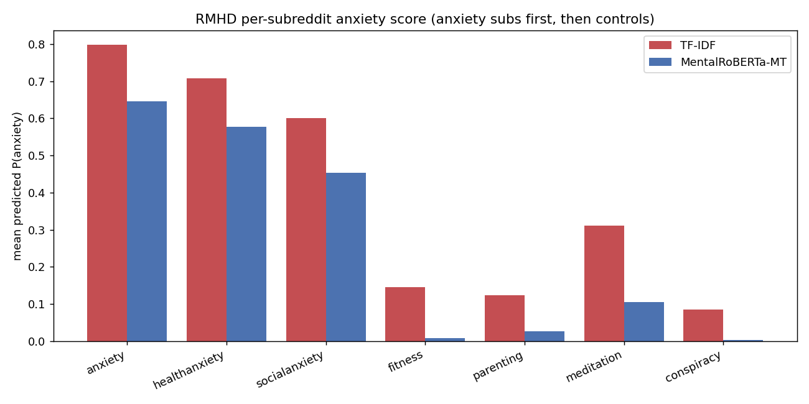

# External (cross-corpus) validation

Our anxiety models applied ZERO-SHOT to independent corpora: **RMHD** (Low 2020, subreddit labels) and **ANGST** (Hengle 2024, 3 expert-psychologist labels). TF-IDF trained on our corpus; transformer = saved MentalRoBERTa multi-task checkpoint. `src/evaluation/external.py`, `scripts/external_validation.py`.

_Regenerate: `python scripts/external_validation.py`_

| model | dataset | n | n_pos | auroc | auprc | f1@0.5 |
|---|---|---|---|---|---|---|
| TF-IDF | RMHD (Low 2020) | 20733 | 8619 | 0.9195 | 0.9086 | 0.8194 |
| TF-IDF | ANGST (experts) | 2872 | 701 | 0.8215 | 0.5185 | 0.6039 |
| MentalRoBERTa-MT | RMHD (Low 2020) | 20733 | 8619 | 0.8973 | 0.8912 | 0.7361 |
| MentalRoBERTa-MT | ANGST (experts) | 2872 | 701 | 0.7982 | 0.464 | 0.315 |

## RMHD per-subreddit mean predicted P(anxiety)

| model | subreddit | label | mean_anxiety_score |
|---|---|---|---|
| TF-IDF | anxiety | 1 | 0.7978 |
| TF-IDF | healthanxiety | 1 | 0.7085 |
| TF-IDF | socialanxiety | 1 | 0.6011 |
| TF-IDF | fitness | 0 | 0.1449 |
| TF-IDF | parenting | 0 | 0.1236 |
| TF-IDF | meditation | 0 | 0.3112 |
| TF-IDF | conspiracy | 0 | 0.0857 |
| MentalRoBERTa-MT | anxiety | 1 | 0.6456 |
| MentalRoBERTa-MT | healthanxiety | 1 | 0.5778 |
| MentalRoBERTa-MT | socialanxiety | 1 | 0.4534 |
| MentalRoBERTa-MT | fitness | 0 | 0.0083 |
| MentalRoBERTa-MT | parenting | 0 | 0.0261 |
| MentalRoBERTa-MT | meditation | 0 | 0.1055 |
| MentalRoBERTa-MT | conspiracy | 0 | 0.003 |

