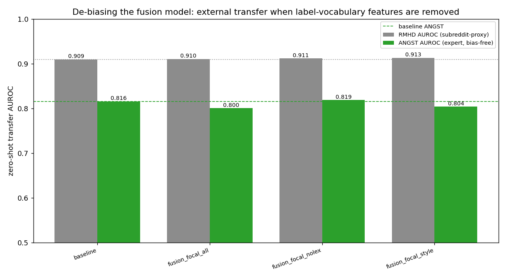

# De-biasing the fusion model (weak-label circularity check)

The fusion model's clinical features are computed from the same lexicons that build the weak labels, so its in-domain gains are partly circular. Here the winning `fusion+focal` model is re-run with the label-vocabulary features removed, and the headline is the EXTERNAL transfer — RMHD (subreddit-proxy) and **ANGST (expert psychologists, the only bias-free ground truth)**. `scripts/exp_fusion_debias.py`. Same author-disjoint split for all variants.

- `all` = 33 features · `no_label_lexicon` = 19 (drops 7 label term/phrase rates + 7 SHAI) · `style_only` = 18 (also drops the somatic body-part lexicon).

_Regenerate: `python scripts/exp_fusion_debias.py`_

| variant | n_fused_feats | anxiety_f1 | health_anxiety_f1 | suicidality_f1 | rmhd_auroc | angst_auroc |
|---|---|---|---|---|---|---|
| baseline | 0 | 0.838 | 0.5524 | 0.4583 | 0.9093 | 0.8157 |
| fusion_focal_all | 33 | 0.8508 | 0.4837 | 0.6087 | 0.9103 | 0.8004 |
| fusion_focal_nolex | 19 | 0.8496 | 0.528 | 0.4667 | 0.9115 | 0.8189 |
| fusion_focal_style | 18 | 0.8483 | 0.5503 | 0.4706 | 0.9129 | 0.8039 |

## Interpretation — the critique largely holds

This check was meant to show the fusion gain is independent of the label's vocabulary. It does **not**. Three honest findings:

1. **The in-domain rare-class lift was largely circular.** `fusion+focal (all)` raises suicidality F1 0.458 → 0.609, but with the label-vocabulary features removed (`no_label_lexicon`) it falls back to 0.467 (≈ baseline). That lift came from `f_suic_term_rate`, which is computed from the same lexicon that defines the suicidality label — exactly the circularity the weak-supervision critique warns about.
2. **On the bias-free test (ANGST, expert psychologists) fusion gives no reliable gain.** baseline 0.816 vs all 0.800 vs no-lexicon 0.819 vs style 0.804 — within noise. RMHD is tied at ≈0.91 for every variant. A plain fine-tuned encoder is as good as any fusion variant on the only ground truth the weak labels cannot contaminate.
3. **Single-seed instability.** An earlier ablation (`fusion_ablation.csv`) reported baseline ANGST 0.778 → fusion+focal 0.811; this run gives 0.816 → 0.800. The baseline alone moved ≈0.04 between seeds — larger than the effect previously attributed to the architecture. The earlier "fusion closes the transfer gap (RMHD 0.894→0.931)" headline does not reproduce.

**Conclusion.** The defensible claim is narrow: a fine-tuned encoder generalises to expert labels at AUROC ≈ 0.82, and the clinical-feature fusion provides no robust, non-circular benefit. Removing the circular features costs nothing on transfer, so the honest (non-circular) version of the model is the one to keep, but it does not beat a plain fine-tuned encoder on independent evaluation. Single-seed differences should not be over-read; multi-seed averaging is needed before any architectural claim.