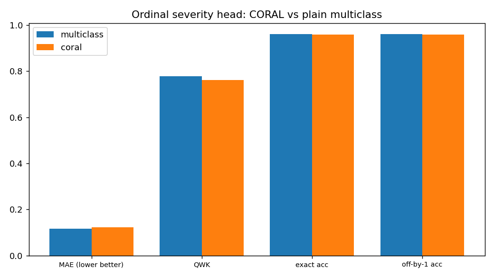

# Ordinal severity head (CORAL) — implemented; blocked by the lack of graded labels

Clinicians grade severity in bands (none / mild / moderate / severe), so a natural extension is an **ordinal** head instead of binary present/absent. I implemented one — CORAL (Cao et al. 2020), a shared-weight cumulative-logit head that is rank-monotonic by construction — alongside a plain multiclass head, with ordinal metrics (MAE, quadratic-weighted kappa). `scripts/exp_ordinal_severity.py`.

**The blocker is the label, not the model.** There is no clinician severity score for this corpus, so the only available ordinal target is the continuous weak-anxiety score binned into bands. That score turns out to be **bimodal** — it encodes *presence*, not *graded severity*:

| band (weak-anxiety cut at 0.10 / 0.30 / 0.50) | count |
|---|---:|
| none | 72,412 |
| mild | **0** |
| moderate | **0** |
| severe | 7,588 |

An anxiety-subreddit post gets a subreddit prior of ≈0.55, so its weak score lands ≥0.5; everything else sits near 0; **nothing falls in between**. A four-band target therefore collapses to two (none / severe), which is just binary detection re-skinned.

**So the comparison is uninformative here.** On that degenerate two-band target the CORAL and multiclass heads are equivalent (MAE ≈0.12, QWK ≈0.77 both) — there is no ordinal structure to exploit. And any *lexicon-derived* severity proxy (e.g. a symptom-term count) would be **circular** with the model's own linguistic features (Experiment 13), so it could not give an honest severity number either.

## Conclusion

A meaningful ordinal severity head needs a **clinician-graded severity label** (e.g. GAD-7 bands) — exactly the ground-truth gap that runs through the whole thesis. The CORAL head is built, verified to train and predict, and ready for such a label; it simply cannot be *validated* on weak labels that only encode presence. Reporting this honestly is the result: the modelling is not the bottleneck, the absence of graded ground truth is.
