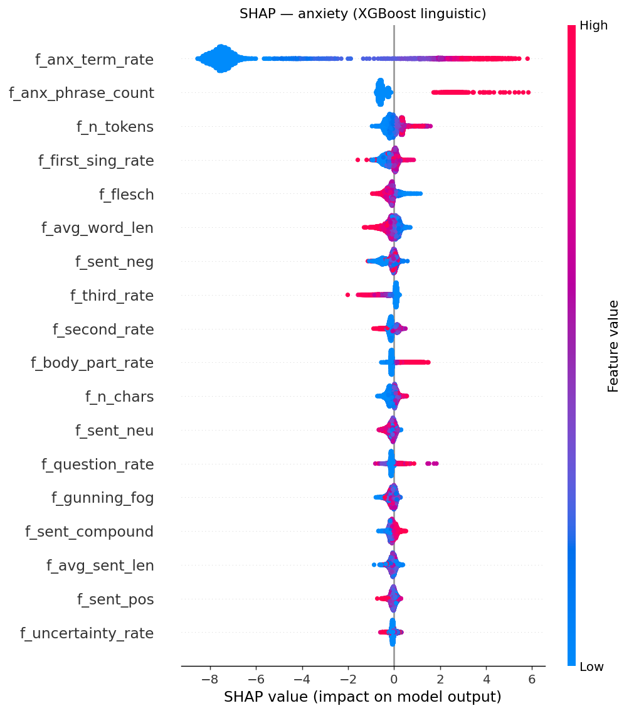
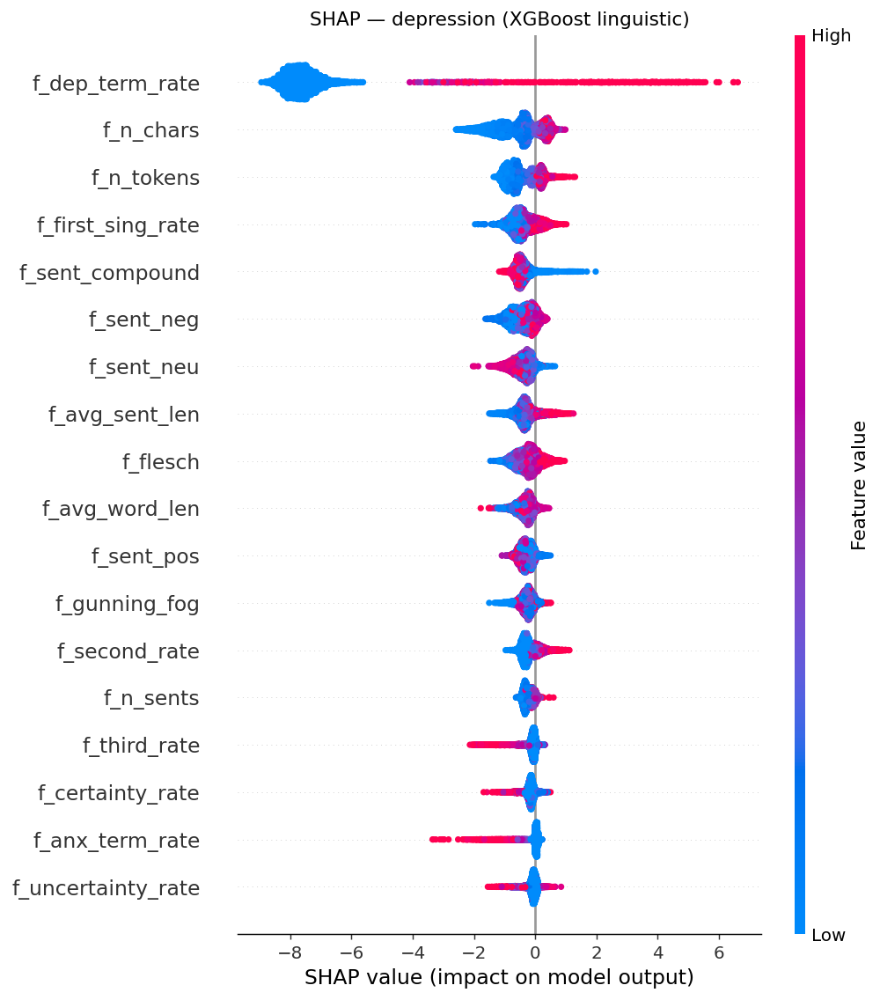

# SHAP — XGBoost linguistic model

Exact `TreeExplainer` SHAP values on the 26 hand-crafted linguistic features. **mean|SHAP|** ranks importance; **direction** is `↑` when a higher feature value pushes toward the positive class, `↓` otherwise. Author-disjoint split.

_Regenerate: `python scripts/shap_linguistic.py`_

## anxiety  (train positives: 5,681)

| rank | feature | mean&#124;SHAP&#124; | direction |
|---:|---|---:|:--:|
| 1 | f_anx_term_rate | 6.7413 | ↑ |
| 2 | f_anx_phrase_count | 0.6112 | ↑ |
| 3 | f_n_tokens | 0.2392 | ↑ |
| 4 | f_first_sing_rate | 0.2227 | ↑ |
| 5 | f_flesch | 0.2031 | ↓ |
| 6 | f_avg_word_len | 0.1932 | ↓ |
| 7 | f_sent_neg | 0.1923 | ↑ |
| 8 | f_third_rate | 0.1862 | ↓ |
| 9 | f_second_rate | 0.1567 | ↑ |
| 10 | f_body_part_rate | 0.1516 | ↑ |
| 11 | f_n_chars | 0.1501 | ↑ |
| 12 | f_sent_neu | 0.1348 | ↓ |

## depression  (train positives: 831)

| rank | feature | mean&#124;SHAP&#124; | direction |
|---:|---|---:|:--:|
| 1 | f_dep_term_rate | 7.3184 | ↑ |
| 2 | f_n_chars | 0.7055 | ↑ |
| 3 | f_n_tokens | 0.5516 | ↑ |
| 4 | f_first_sing_rate | 0.4647 | ↑ |
| 5 | f_sent_compound | 0.4546 | ↓ |
| 6 | f_sent_neg | 0.4337 | ↑ |
| 7 | f_sent_neu | 0.4296 | ↓ |
| 8 | f_avg_sent_len | 0.3993 | ↑ |
| 9 | f_flesch | 0.3482 | ↑ |
| 10 | f_avg_word_len | 0.3438 | ↑ |
| 11 | f_sent_pos | 0.3091 | ↓ |
| 12 | f_gunning_fog | 0.2905 | ↑ |

## health_anxiety  (train positives: 216)

| rank | feature | mean&#124;SHAP&#124; | direction |
|---:|---|---:|:--:|
| 1 | f_health_anx_term_rate | 5.7924 | ↑ |
| 2 | f_anx_term_rate | 1.2891 | ↑ |
| 3 | f_first_sing_rate | 0.7237 | ↑ |
| 4 | f_sent_neu | 0.6244 | ↓ |
| 5 | f_n_tokens | 0.5852 | ↑ |
| 6 | f_flesch | 0.4897 | ↑ |
| 7 | f_n_chars | 0.4767 | ↑ |
| 8 | f_avg_sent_len | 0.4702 | ↑ |
| 9 | f_avg_word_len | 0.4678 | ↓ |
| 10 | f_sent_pos | 0.4672 | ↓ |
| 11 | f_body_part_rate | 0.4563 | ↑ |
| 12 | f_sent_compound | 0.4462 | ↑ |
