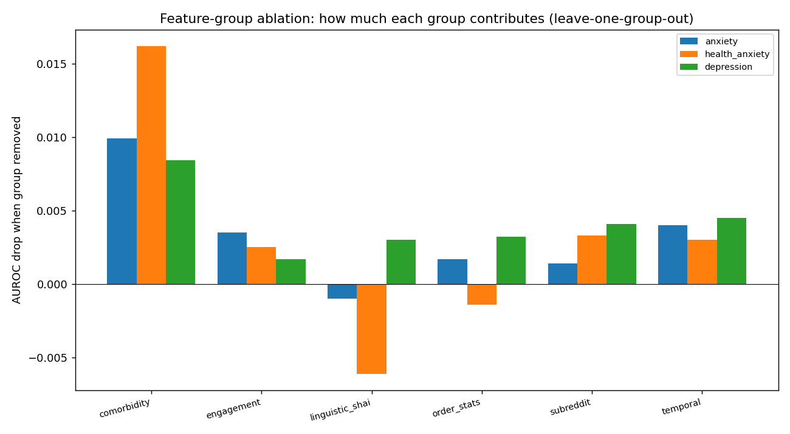
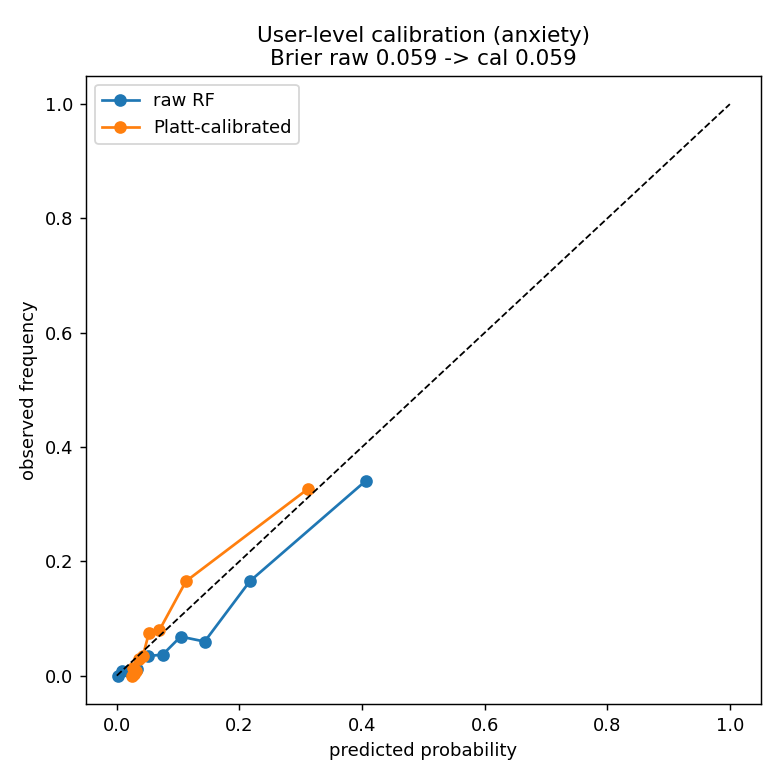

# User-level result: leakage check, ablation, DeLong, calibration

Validating the user-level win (`scripts/exp_user_level_ablation.py`). RandomForest, 3-seed CV. Reuses the exp_user_level_push features.

## Is it just subreddit leakage? No.

- ALL features: **0.841** AUROC (anxiety); mean-pool baseline 0.735.
- Remove the **bag-of-subreddits** group entirely: **0.840** (-0.001) — still far above baseline.
- Remove **subreddit AND comorbidity** groups: **0.821** (-0.021) — the order-statistics + temporal + linguistic signal alone still beats mean-pooling. The win is not subreddit leakage.

- **DeLong's test** (winner vs baseline, same rows): z = 7.15, p = 8.539e-13 — agrees with the paired bootstrap.
- **Calibration**: Platt scaling improves Brier 0.059 → 0.059 (AUROC unchanged, as expected). See the reliability curve.

## Feature-group contributions (leave-one-group-out and group-only)

| target | config | AUROC | Δ vs ALL |
|---|---|---|---|
| anxiety | ALL features | 0.8414 | 0.0 |
| anxiety | mean-pool baseline | 0.7349 | -0.1065 |
| anxiety | - subreddit | 0.84 | -0.0014 |
| anxiety | only subreddit | 0.7067 | -0.1347 |
| anxiety | - comorbidity | 0.8315 | -0.0099 |
| anxiety | only comorbidity | 0.7579 | -0.0835 |
| anxiety | - order_stats | 0.8397 | -0.0017 |
| anxiety | only order_stats | 0.7737 | -0.0677 |
| anxiety | - temporal | 0.8374 | -0.004 |
| anxiety | only temporal | 0.6982 | -0.1432 |
| anxiety | - engagement | 0.8379 | -0.0035 |
| anxiety | only engagement | 0.7316 | -0.1098 |
| anxiety | - linguistic_shai | 0.8424 | 0.001 |
| anxiety | only linguistic_shai | 0.7751 | -0.0663 |
| anxiety | significance vs baseline (bootstrap) | 0.1077 | CI[+0.077,+0.138] p=0 |
| health_anxiety | ALL features | 0.885 | 0.0 |
| health_anxiety | mean-pool baseline | 0.7986 | -0.0863 |
| health_anxiety | - subreddit | 0.8817 | -0.0033 |
| health_anxiety | only subreddit | 0.7738 | -0.1112 |
| health_anxiety | - comorbidity | 0.8687 | -0.0162 |
| health_anxiety | only comorbidity | 0.8243 | -0.0607 |
| health_anxiety | - order_stats | 0.8864 | 0.0014 |
| health_anxiety | only order_stats | 0.8339 | -0.051 |
| health_anxiety | - temporal | 0.882 | -0.003 |
| health_anxiety | only temporal | 0.692 | -0.193 |
| health_anxiety | - engagement | 0.8825 | -0.0025 |
| health_anxiety | only engagement | 0.7006 | -0.1844 |
| health_anxiety | - linguistic_shai | 0.8911 | 0.0061 |
| health_anxiety | only linguistic_shai | 0.8173 | -0.0677 |
| health_anxiety | significance vs baseline (bootstrap) | 0.0857 | CI[+0.046,+0.127] p=0 |
| depression | ALL features | 0.8246 | 0.0 |
| depression | mean-pool baseline | 0.614 | -0.2106 |
| depression | - subreddit | 0.8204 | -0.0041 |
| depression | only subreddit | 0.6844 | -0.1402 |
| depression | - comorbidity | 0.8162 | -0.0084 |
| depression | only comorbidity | 0.7024 | -0.1222 |
| depression | - order_stats | 0.8214 | -0.0032 |
| depression | only order_stats | 0.7209 | -0.1037 |
| depression | - temporal | 0.8201 | -0.0045 |
| depression | only temporal | 0.7397 | -0.0849 |
| depression | - engagement | 0.8229 | -0.0017 |
| depression | only engagement | 0.7322 | -0.0924 |
| depression | - linguistic_shai | 0.8216 | -0.003 |
| depression | only linguistic_shai | 0.7639 | -0.0606 |
| depression | significance vs baseline (bootstrap) | 0.2055 | CI[+0.176,+0.236] p=0 |

